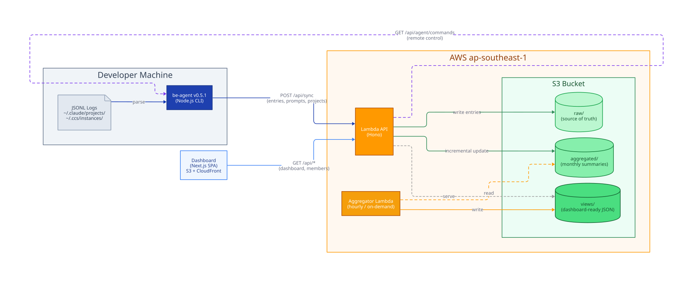

# CCUsage Monitor

Team monitoring system that tracks **Claude Code usage** across all developers. Each developer's machine runs a lightweight agent that parses local JSONL logs and pushes data to a serverless backend. A Next.js dashboard renders cost, token, and model breakdowns per member.

---

## System Architecture



### End-to-End Data Flow

```
1. be-agent  →  parses ~/.claude/projects/**/*.jsonl  (JSONL usage records)
2. be-agent  →  POST /api/sync  →  Lambda  →  S3 raw/
3. Lambda sync  →  updates  S3 aggregated/  (incremental pre-aggregation)
4. Aggregator Lambda (hourly / on-demand)  →  reads aggregated/  →  writes views/
5. Dashboard  →  GET /api/members/:id?year=N  →  Lambda  →  S3 views/
6. Dashboard  →  renders charts, tables, heat maps
```

### Three-Layer S3 Architecture

| Layer | Path prefix | Written by | Purpose |
|-------|-------------|------------|---------|
| **Raw** | `raw/` | sync endpoint | Source of truth — individual `UsageEntry` records |
| **Aggregated** | `aggregated/` | sync endpoint | Pre-computed per-month summaries (daily totals, model breakdown, project breakdown) |
| **Views** | `views/` | aggregator Lambda | Dashboard-ready JSON — no computation needed at read time |

Each layer can be fully rebuilt from the one above: `raw/ → aggregated/ → views/`

---

## Components

| Component | Tech | Location | Purpose |
|-----------|------|----------|---------|
| **be-agent** | Node.js CLI (ESM) | `be-agent/` | Parse JSONL, batch-push to Lambda, auto-update |
| **lambda-server** | Hono on AWS Lambda | `lambda-server/` | Store raw data, serve pre-computed views |
| **dashboard** | Next.js 15 static SPA | `dashboard/` | Visualise team usage, hosted on CloudFront |

---

## S3 Bucket Layout

```
S3 Bucket (ccusage-data-{stage})
│
├── raw/{memberId}/{year}-{month}.json          ← All usage entries (source of truth)
├── aggregated/{memberId}/{year}-{month}.json   ← Pre-computed monthly summaries
│
├── members/index.json                          ← Member registry (email → id mapping)
├── sync-logs/{year}-{month}/{memberId}.json    ← Sync audit trail per member
├── projects/{memberId}.json                    ← Project list with git remotes
├── prompts/{memberId}/{year}-{month}.json      ← Prompt text archive (ISMS audit)
├── commands/{memberId}/queue.json              ← Admin command queue for agents
│
└── views/                                      ← Aggregator output (dashboard reads)
    ├── dashboard.json                          ← Team-wide summary stats
    ├── members.json                            ← Member list with current/prev month
    └── members/{memberId}/{year}.json          ← Per-member yearly detail (monthly breakdown)

meta/last-processed.json                        ← Aggregation timestamp + duration
releases/version.json                           ← Latest agent version manifest
releases/ccusage-agent-*.tgz                    ← Agent binaries for auto-update
```

---

## API Endpoints

### Agent → Server
| Method | Path | Description |
|--------|------|-------------|
| `POST` | `/api/sync` | Receive entries, projects, prompts from agent (batched) |

### Dashboard → Server
| Method | Path | Description |
|--------|------|-------------|
| `GET` | `/api/dashboard` | Team summary from `views/dashboard.json` |
| `GET` | `/api/dashboard/model-distribution` | Model cost breakdown (subset) |
| `GET` | `/api/dashboard/meta` | Last aggregation run timestamp + duration |
| `GET` | `/api/members` | Member list from `views/members.json` |
| `GET` | `/api/members/:id?year=YYYY` | Member yearly detail from `views/members/{id}/{year}.json` |
| `GET` | `/api/members/:id/raw?year=&month=` | Raw usage records (inspection/debug) |

### Agent ↔ Server (remote control)
| Method | Path | Description |
|--------|------|-------------|
| `GET` | `/api/agent/version` | Latest version + presigned S3 download URL |
| `GET` | `/api/agent/commands?email=...` | Poll pending admin commands |
| `POST` | `/api/agent/commands/:commandId/ack` | Acknowledge command execution |

### Admin
| Method | Path | Description |
|--------|------|-------------|
| `POST` | `/api/admin/aggregate` | Trigger aggregator (`?force=true` for full rebuild) |
| `POST` | `/api/admin/commands` | Push command to agent queue (revoke-token, force-sync…) |
| `GET` | `/api/admin/commands/:memberId` | View command history |
| `GET` | `/api/admin/status` | System health |

### Registration (in-memory, no auth)
| Method | Path | Description |
|--------|------|-------------|
| `GET` | `/api/register` | List all registration items |
| `PUT` | `/api/register` | Replace entire registration list |
| `GET` | `/api/register/link?email=...` | Get dashboard link for email |
| `POST` | `/api/register/update` | Update link by data field match |

---

## be-agent (v0.5.1)

Lightweight CLI installed globally on each developer's machine.

### Data Discovery

Scans these directories automatically:
- `~/.claude/projects/*` — Native Claude Code
- `~/.config/claude/projects/*` — Alternative location
- `~/.ccs/instances/*/projects/*` — CCS multi-instance setups

### Commands

```bash
# First-time install (one-liner)
curl -fsSL <server-url>/install.sh | sh

# Or manual
npm install -g ./ccusage-agent-<version>.tgz
ccusage-agent setup --email user@example.com --interval 60

# Daily use
ccusage-agent sync              # Incremental sync (since last run)
ccusage-agent sync --force      # Full historical re-sync
ccusage-agent status            # Show config + sync state
ccusage-agent update            # Self-update from S3
ccusage-agent register          # Fetch dashboard registration link
ccusage-agent uninstall         # Remove launchd/systemd auto-start
```

### Auto-start

After `setup`, the agent runs on a configurable interval:
- **macOS**: `~/Library/LaunchAgents/com.ccusage.agent.plist` (launchd)
- **Linux**: `~/.config/systemd/user/ccusage-agent.service` (systemd)

Config lives at `~/.ccusage-agent/config.json`.

### Push Protocol

- Entries batched at **1000/request** (avoids API Gateway 10MB limit)
- Prompts batched at **500/request**
- Idempotent: deduplication by `request_id` on both client and server
- Retry with exponential backoff on 5xx

---

## lambda-server

Hono framework on AWS Lambda. Two Lambda functions per stage.

### Lambda Functions
- `ccusage-monitor-{stage}-api` — HTTP API (Hono routes, `lambda.ts`)
- `ccusage-monitor-{stage}-aggregator` — Aggregation job (`aggregator.ts`)

### Aggregation Logic

```
sync endpoint (write-time):
  incoming entries → raw/{memberId}/{year}-{month}.json
                   → aggregated/{memberId}/{year}-{month}.json  (incremental update)

aggregator Lambda (view-time):
  aggregated/ → views/dashboard.json
             → views/members.json
             → views/members/{memberId}/{year}.json  (all 12 months)
```

### Auth

JWT-based. Accounts stored in `lambda-server/src/data/users.json` (SHA-256 hashed passwords).

| Email | Role |
|-------|------|
| `nghia@techvify.com` | admin |
| `nghiapham@techvify.com` | admin |
| `user@techvify.com` | agent |
| `member@techvify.com` | member |

---

## dashboard

Next.js 15 SPA deployed as a **static export** to S3 + CloudFront. All routing uses flat routes + modals (no server-side rendering or dynamic route segments).

### Pages

| Route | View |
|-------|------|
| `/login` | Login form |
| `/` | Team dashboard — summary cards, daily trend, model/member distribution |
| `/members` | Member list (ranking / cards / treemap views) + detail modal |
| `/reports` | Reports page |

### Member Detail (Modal)

Clicking a member opens a `DataSheet` slide-over with:
- Year/month period selector with heat map preview
- Monthly summary: cost, tokens, requests, prompts
- Daily cost trend chart
- Model distribution pie chart
- Daily token usage by model (stacked bar)
- Project activity chart (**admin-only** — shows top 10 projects by request count)

### Data Flow (Frontend)

```
Period selector (year + month)
  → queryKey: [members, yearlyRaw, memberId, year]
  → GET /api/members/:id?year=YYYY
  → Response: { months: { "1": MonthlyData, ..., "12": MonthlyData } }
  → currentMonthData = months[selectedMonth + 1]
  → charts: trendData, modelData, dailyModelUsage, heatMapData, projectActivityData
```

### Environment Variables

| Variable | Purpose |
|----------|---------|
| `API_SERVER_URL` | Backend URL (server-side Next.js rewrites) |
| `NEXT_PUBLIC_API_URL` | Client-side API URL (static export mode) |
| `STATIC_EXPORT` | Set to `true` for S3/CloudFront build |

---

## AWS Resources

- **Region**: `ap-southeast-1`
- **AWS Profile**: `2026-pik`

| Resource | dev stage | jit stage |
|----------|-----------|-----------|
| Lambda API URL | `https://5kvqadz4mc.execute-api.ap-southeast-1.amazonaws.com` | `https://eu9i1zr4x6.execute-api.ap-southeast-1.amazonaws.com` |
| S3 Data Bucket | `ccusage-data-dev` | `ccusage-data-jit` |
| S3 Dashboard Bucket | `cc-usage-monitor-tvf` | `cc-usage-monitor-jit` |
| CloudFront Dist ID | `E1W8WZ55TBZY1P` | `E3W5CFHO5Z8UU2` |
| CloudFront Domain | `d1ohuii7czj4jp.cloudfront.net` | `dg2i6v0xgt3mw.cloudfront.net` |

---

## Development

```bash
# Lambda server (local)
cd lambda-server && pnpm dev          # Starts on :3003

# Dashboard (local, proxies /api/* to lambda-server)
cd dashboard && pnpm dev              # Starts on :3000
# Configure: dashboard/.env.local → API_SERVER_URL=http://localhost:3003

# Agent (local dry run)
cd be-agent && pnpm build
node dist/index.js sync --dry-run

# Type checks
cd lambda-server && pnpm typecheck
cd dashboard && pnpm typecheck
```

---

## Deploy

All scripts accept `--stage <dev|jit>`. Stage config is centralised in `scripts/stage-config.sh`.

```bash
# Deploy everything
./scripts/deploy.sh --stage dev

# Deploy specific modules
./scripts/deploy.sh --stage jit --only lambda
./scripts/deploy.sh --stage dev --only dashboard
./scripts/deploy.sh --stage jit --only agent
./scripts/deploy.sh --stage dev --only lambda,dashboard
```

### Trigger Aggregation (after data changes)

```bash
# dev
curl -X POST "https://5kvqadz4mc.execute-api.ap-southeast-1.amazonaws.com/api/admin/aggregate?force=true"

# jit
curl -X POST "https://eu9i1zr4x6.execute-api.ap-southeast-1.amazonaws.com/api/admin/aggregate?force=true"
```

### Agent Release

```bash
# 1. Bump version in be-agent/package.json, src/commands/update.ts, src/lib/pusher.ts
# 2. Publish (builds with stage-specific SERVER_URL baked in)
./scripts/publish-agent.sh --stage dev
./scripts/publish-agent.sh --stage jit
```

---

## Key Design Patterns

| Pattern | Where | How |
|---------|-------|-----|
| **Idempotent sync** | be-agent + lambda-server | Dedup by `request_id` — safe to re-sync |
| **ETag concurrency** | members/index.json | `IfMatch`/`IfNoneMatch` prevents lost updates |
| **Lazy route loading** | lambda-server | Hono lazy-loads route modules → faster cold start |
| **Batched uploads** | be-agent | 1000 entries/request, 500 prompts/request |
| **Presigned URLs** | agent downloads | 10-min expiry, no auth needed for S3 downloads |
| **Role-based UI** | dashboard | `useSession().role === 'admin'` gates admin-only charts |
| **Static export** | dashboard | No SSR, no API routes — pure SPA for CloudFront |
| **Dual API support** | dashboard adapters | Handles both Lambda and legacy PostgreSQL response shapes |
