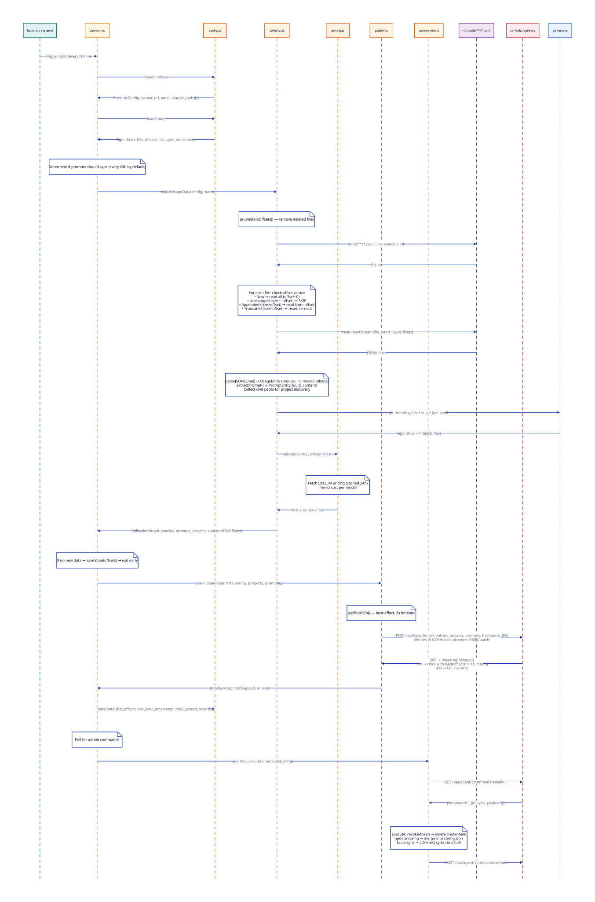
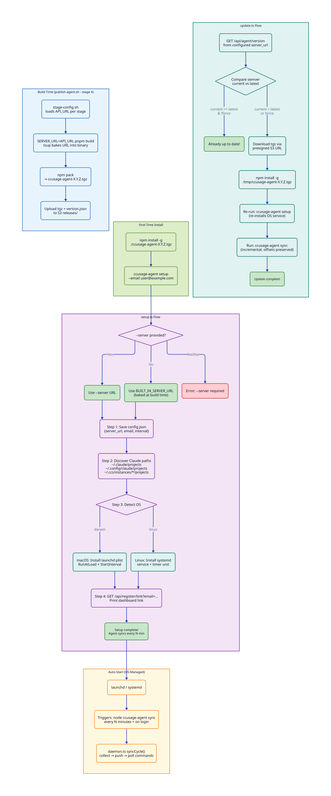
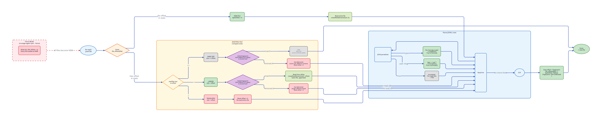

# be-agent Architecture

> Diagrams rendered with [D2](https://d2lang.com). Source files in `diagrams/*.d2`.
> Recompile: `d2 --layout elk diagrams/<name>.d2 diagrams/<name>.svg`

## 1. Module Architecture

All modules and their relationships — CLI entry, command handlers, libraries, daemon loop, filesystem, OS services, and server endpoints.

D2 source

See [`diagrams/01-module-architecture.d2`](diagrams/01-module-architecture.d2)

## 2. Sync Data Pipeline (Main Flow)

The complete sync cycle triggered by launchd/systemd: load config → collect from byte offsets → batch push → poll admin commands.

D2 source

See [`diagrams/02-sync-pipeline.d2`](diagrams/02-sync-pipeline.d2)

## 3. Setup & Update Lifecycle

Build-time URL injection, first-time setup (OS service install), auto-start scheduling, and self-update flow.

D2 source

See [`diagrams/03-setup-update-lifecycle.d2`](diagrams/03-setup-update-lifecycle.d2)

## 4. File Offset State Machine

How incremental file reading works: new files, unchanged (skip), appended (read from offset), truncated (reset), and force mode.

D2 source

See [`diagrams/04-file-offset-state-machine.d2`](diagrams/04-file-offset-state-machine.d2)

## 5. Data Payload Structure

How JSONL source lines are parsed into UsageEntry, PromptEntry, and ProjectInfo, then batched into the POST /api/sync payload.

D2 source

See [`diagrams/05-data-payload-structure.d2`](diagrams/05-data-payload-structure.d2)

