# Activity Diagrams

## CLI Command Execution Activity

### Main CLI Flow


<details>
<summary>View Mermaid Source</summary>

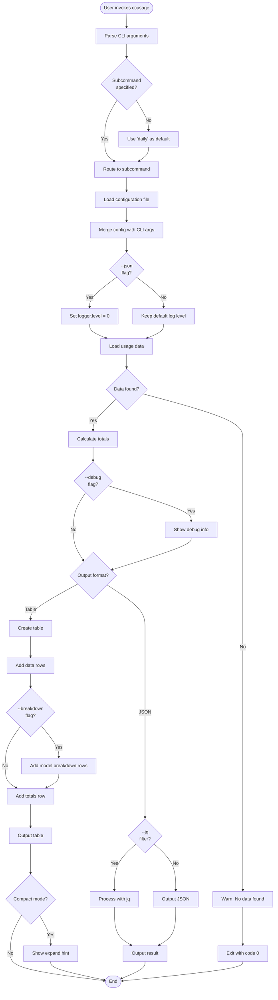

</details>

## Data Loading Activity

### JSONL File Processing


<details>
<summary>View Mermaid Source</summary>

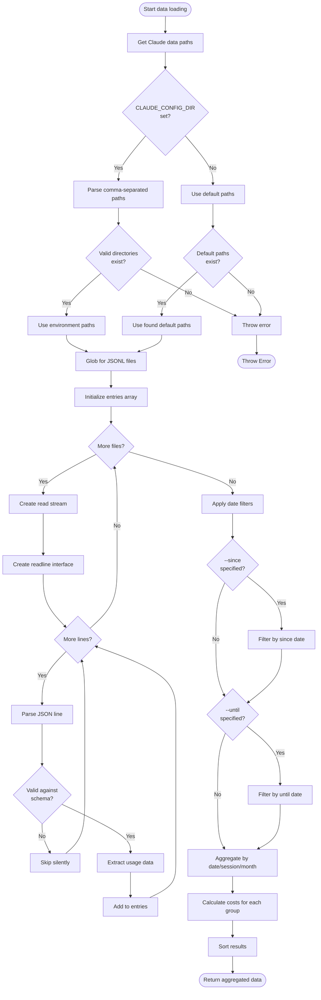

</details>

## Cost Calculation Activity

### Tiered Pricing Calculation


<details>
<summary>View Mermaid Source</summary>

```mermaid
flowchart TD
    START([Calculate cost]) --> GET_PRICING[Get model pricing]

    GET_PRICING --> CHECK_CACHE{Pricing<br/>cached?}

    CHECK_CACHE -->|Yes| USE_CACHE[Use cached pricing]
    CHECK_CACHE -->|No| CHECK_OFFLINE{Offline<br/>mode?}

    CHECK_OFFLINE -->|Yes| LOAD_OFFLINE[Load offline pricing]
    CHECK_OFFLINE -->|No| FETCH_ONLINE[Fetch from LiteLLM API]

    FETCH_ONLINE --> CHECK_RESPONSE{Response<br/>OK?}

    CHECK_RESPONSE -->|No| FALLBACK_OFFLINE[Fallback to offline]
    CHECK_RESPONSE -->|Yes| PARSE_RESPONSE[Parse JSON response]

    FALLBACK_OFFLINE --> LOAD_OFFLINE
    LOAD_OFFLINE --> CACHE_PRICING

    PARSE_RESPONSE --> VALIDATE_MODELS{Valid model<br/>entries?}
    VALIDATE_MODELS -->|Yes| CACHE_PRICING[Cache pricing data]
    VALIDATE_MODELS -->|No| SKIP_INVALID[Skip invalid entries]
    SKIP_INVALID --> CACHE_PRICING

    USE_CACHE --> LOOKUP_MODEL
    CACHE_PRICING --> LOOKUP_MODEL

    LOOKUP_MODEL[Lookup model pricing] --> TRY_DIRECT{Direct<br/>match?}

    TRY_DIRECT -->|Yes| FOUND_PRICING[Use pricing]
    TRY_DIRECT -->|No| TRY_PREFIX[Try with provider prefix]

    TRY_PREFIX --> CHECK_PREFIX{Match with<br/>prefix?}
    CHECK_PREFIX -->|Yes| FOUND_PRICING
    CHECK_PREFIX -->|No| TRY_FUZZY[Try fuzzy match]

    TRY_FUZZY --> CHECK_FUZZY{Fuzzy<br/>match?}
    CHECK_FUZZY -->|Yes| FOUND_PRICING
    CHECK_FUZZY -->|No| NO_PRICING[Return null]

    FOUND_PRICING --> CALC_INPUT[Calculate input token cost]

    CALC_INPUT --> CHECK_INPUT_TIERED{Input tokens<br/>> 200k?}

    CHECK_INPUT_TIERED -->|Yes| TIERED_INPUT[Apply tiered pricing]
    CHECK_INPUT_TIERED -->|No| BASE_INPUT[Apply base pricing]

    TIERED_INPUT --> CALC_OUTPUT
    BASE_INPUT --> CALC_OUTPUT

    CALC_OUTPUT[Calculate output token cost] --> CHECK_OUTPUT_TIERED{Output tokens<br/>> 200k?}

    CHECK_OUTPUT_TIERED -->|Yes| TIERED_OUTPUT[Apply tiered pricing]
    CHECK_OUTPUT_TIERED -->|No| BASE_OUTPUT[Apply base pricing]

    TIERED_OUTPUT --> CALC_CACHE_CREATE
    BASE_OUTPUT --> CALC_CACHE_CREATE

    CALC_CACHE_CREATE[Calculate cache creation cost] --> CALC_CACHE_READ[Calculate cache read cost]

    CALC_CACHE_READ --> SUM_COSTS[Sum all costs]
    SUM_COSTS --> RETURN_SUCCESS([Return Result.succeed])

    NO_PRICING --> RETURN_FAIL([Return Result.fail])
```

</details>

## MCP Server Request Handling Activity

### Tool Request Processing


<details>
<summary>View Mermaid Source</summary>

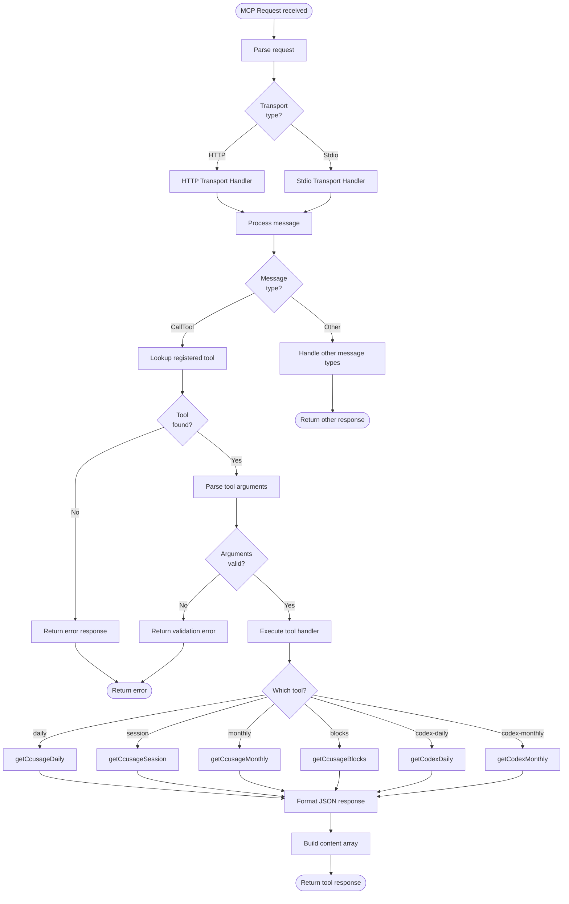

</details>

## Session Blocks Detection Activity

### 5-Hour Block Identification (Detailed)

The `identifySessionBlocks()` function in `_session-blocks.ts` implements Claude's billing block detection with gap handling.


<details>
<summary>View Mermaid Source</summary>

```mermaid
flowchart TD
    START([identifySessionBlocks<br/>entries, sessionDurationHours=5]) --> CHECK_EMPTY{entries.length<br/>== 0?}

    CHECK_EMPTY -->|Yes| RETURN_EMPTY([Return empty array])
    CHECK_EMPTY -->|No| CALC_DURATION[sessionDurationMs =<br/>5 × 60 × 60 × 1000]

    CALC_DURATION --> SORT[Sort entries by timestamp<br/>ascending]

    SORT --> INIT_VARS[currentBlockStart = null<br/>currentBlockEntries = []]

    INIT_VARS --> LOOP{For each entry<br/>in sortedEntries}

    LOOP -->|Done| CLOSE_LAST{currentBlockEntries<br/>.length > 0?}
    LOOP -->|Next| CHECK_FIRST{currentBlockStart<br/>== null?}

    CHECK_FIRST -->|Yes| START_FIRST[currentBlockStart =<br/>floorToHour(entry.timestamp)]
    CHECK_FIRST -->|No| CALC_TIME_DIFFS

    START_FIRST --> ADD_FIRST[currentBlockEntries = [entry]]
    ADD_FIRST --> LOOP

    CALC_TIME_DIFFS[timeSinceBlockStart =<br/>entry.time - blockStart.time<br/><br/>timeSinceLastEntry =<br/>entry.time - lastEntry.time]

    CALC_TIME_DIFFS --> CHECK_EXCEED{timeSinceBlockStart > 5hr<br/>OR<br/>timeSinceLastEntry > 5hr?}

    CHECK_EXCEED -->|No| ADD_TO_CURRENT[Add entry to currentBlockEntries]
    ADD_TO_CURRENT --> LOOP

    CHECK_EXCEED -->|Yes| CLOSE_BLOCK[createBlock<br/>currentBlockStart,<br/>currentBlockEntries]

    CLOSE_BLOCK --> PUSH_BLOCK[blocks.push(block)]

    PUSH_BLOCK --> CHECK_GAP{timeSinceLastEntry<br/>> 5 hours?}

    CHECK_GAP -->|Yes| CREATE_GAP[createGapBlock<br/>lastEntryTime, entryTime]
    CHECK_GAP -->|No| NEW_BLOCK

    CREATE_GAP --> PUSH_GAP[blocks.push(gapBlock)]
    PUSH_GAP --> NEW_BLOCK

    NEW_BLOCK[currentBlockStart =<br/>floorToHour(entry.timestamp)]
    NEW_BLOCK --> RESET_ENTRIES[currentBlockEntries = [entry]]
    RESET_ENTRIES --> LOOP

    CLOSE_LAST -->|Yes| CREATE_LAST[createBlock for last entries]
    CLOSE_LAST -->|No| RETURN_BLOCKS

    CREATE_LAST --> PUSH_LAST[blocks.push(lastBlock)]
    PUSH_LAST --> RETURN_BLOCKS([Return SessionBlock array])
```

</details>

### Block Creation Detail


<details>
<summary>View Mermaid Source</summary>

```mermaid
flowchart TD
    CREATE[createBlock<br/>startTime, entries, now, durationMs] --> CALC_END[endTime = startTime + 5 hours]

    CALC_END --> FIND_ACTUAL[actualEndTime = last entry timestamp]

    FIND_ACTUAL --> CHECK_ACTIVE{now < endTime<br/>AND<br/>now >= startTime?}

    CHECK_ACTIVE -->|Yes| SET_ACTIVE[isActive = true]
    CHECK_ACTIVE -->|No| SET_INACTIVE[isActive = false]

    SET_ACTIVE --> AGG_TOKENS
    SET_INACTIVE --> AGG_TOKENS

    AGG_TOKENS[Aggregate tokens:<br/>inputTokens<br/>outputTokens<br/>cacheCreationInputTokens<br/>cacheReadInputTokens]

    AGG_TOKENS --> SUM_COST[Sum costUSD from entries]

    SUM_COST --> COLLECT_MODELS[models = uniq(entry.model)]

    COLLECT_MODELS --> GET_RESET[usageLimitResetTime from<br/>first entry with value]

    GET_RESET --> BUILD_BLOCK[Build SessionBlock object]

    BUILD_BLOCK --> RETURN([Return SessionBlock])
```

</details>

### Gap Block Detection


<details>
<summary>View Mermaid Source</summary>

```mermaid
flowchart TD
    GAP_START([createGapBlock<br/>lastEntryTime, nextEntryTime]) --> CALC_GAP[gapDuration =<br/>nextEntryTime - lastEntryTime]

    CALC_GAP --> CHECK_SIG{gapDuration ><br/>sessionDurationMs?}

    CHECK_SIG -->|No| RETURN_NULL([Return null])
    CHECK_SIG -->|Yes| CREATE_GAP_BLOCK

    CREATE_GAP_BLOCK[Create gap block:<br/>startTime = lastEntryTime<br/>endTime = nextEntryTime<br/>isGap = true<br/>entries = []<br/>tokens = all zeros]

    CREATE_GAP_BLOCK --> RETURN_GAP([Return gap SessionBlock])
```

</details>

### Block Timing Diagram

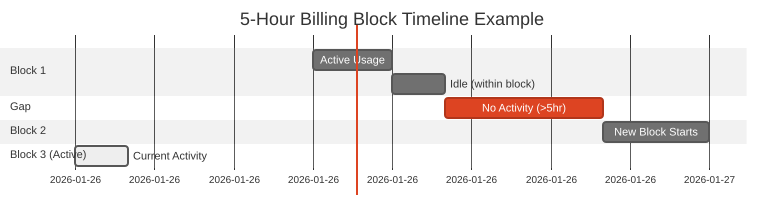

<details>
<summary>View Mermaid Source</summary>

```mermaid
gantt
    title 5-Hour Billing Block Timeline Example
    dateFormat HH:mm

    section Block 1
    Active Usage    :b1, 09:00, 3h
    Idle (within block) :idle1, 12:00, 2h

    section Gap
    No Activity (>5hr) :crit, gap1, 14:00, 6h

    section Block 2
    New Block Starts :b2, 20:00, 4h

    section Block 3 (Active)
    Current Activity :active, b3, 00:00, 2h
```

</details>

## Table Formatting Activity

### Usage Report Table Creation


<details>
<summary>View Mermaid Source</summary>

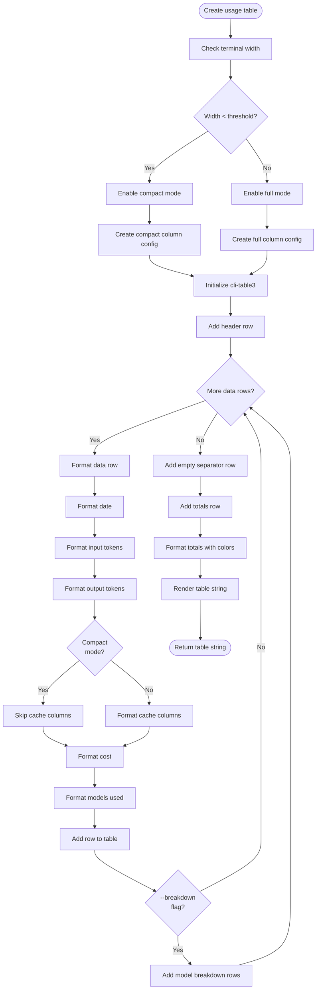

</details>

## Configuration Resolution Activity

### Config File Discovery and Merging


<details>
<summary>View Mermaid Source</summary>

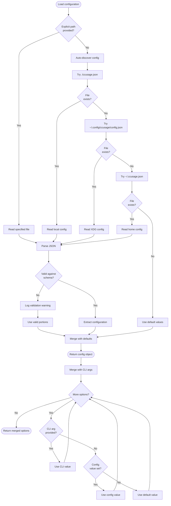

</details>
