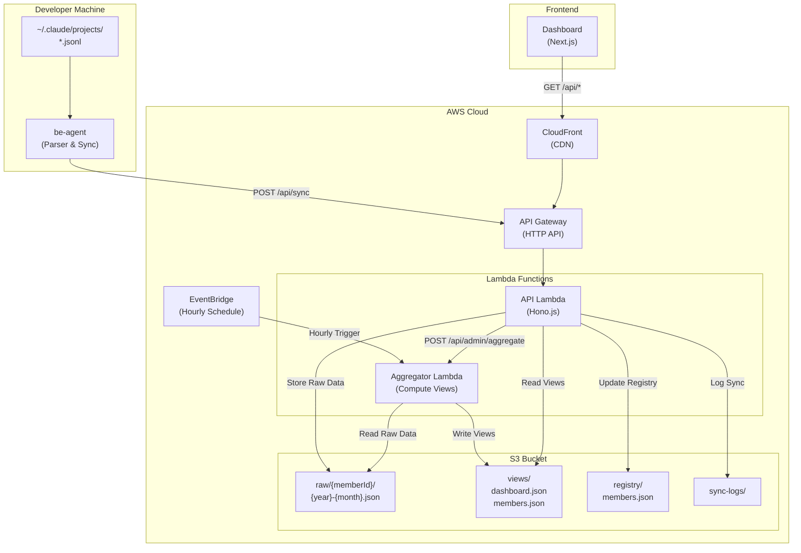
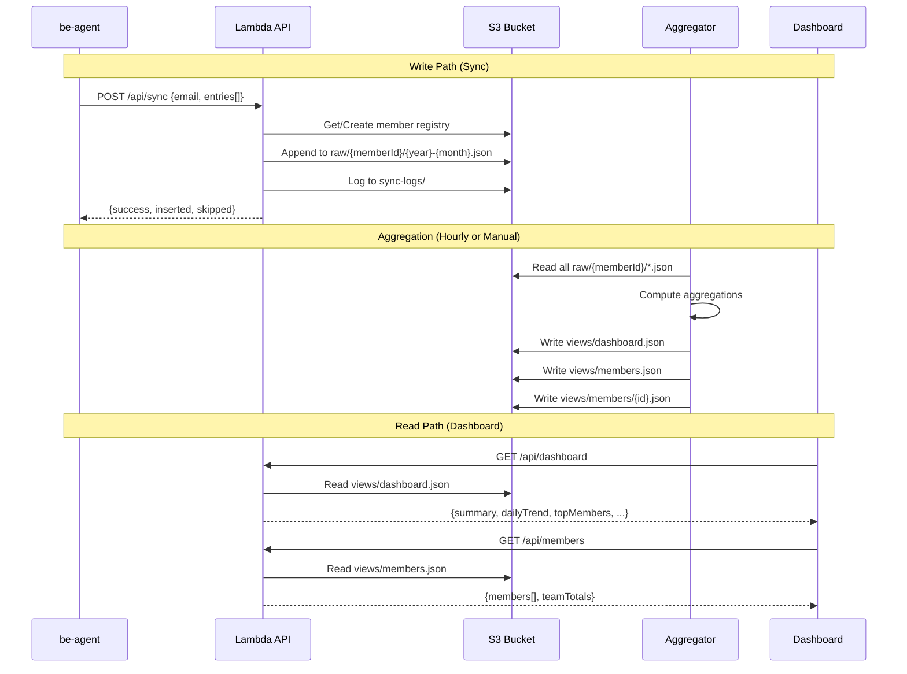
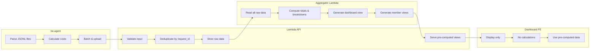
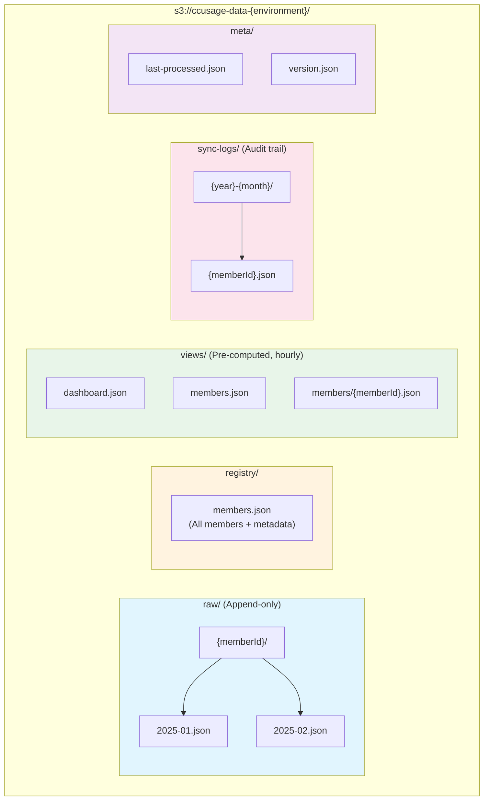
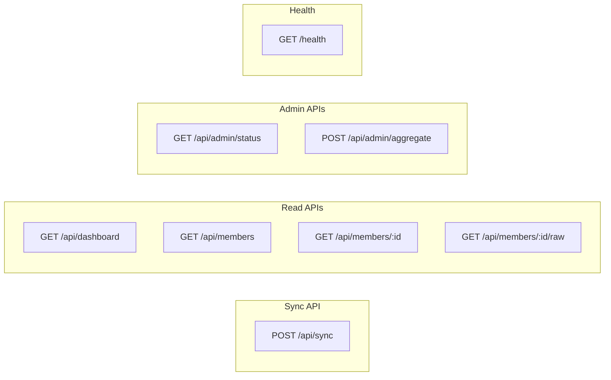

# CCUsage Monitor: S3 Serverless Architecture Specification

## Executive Summary

This document specifies a serverless architecture for CCUsage Monitor that replaces PostgreSQL with Amazon S3 for data storage, dramatically reducing monthly costs from $20-50 to $1-5 while maintaining or improving system functionality.

**Key Design Principles:**
- Pre-computed views pattern: compute once at write time, read many times
- Client becomes display-only: no calculations in the browser
- Eventual consistency: acceptable for monitoring use cases
- Cost optimization: leverage S3's cheap storage and CloudFront caching

---

## 1. System Architecture Overview

### 1.1 High-Level Architecture



### 1.2 Data Flow Diagram



### 1.3 Component Responsibilities



---

## 2. S3 Bucket Structure



### S3 Key Patterns

| Path | Purpose | Updated By |
|------|---------|------------|
| `raw/{memberId}/{year}-{month}.json` | Raw usage entries | API (on sync) |
| `registry/members.json` | Member registry | API (on sync) |
| `views/dashboard.json` | Team dashboard | Aggregator |
| `views/members.json` | Members list | Aggregator |
| `views/members/{id}.json` | Member detail | Aggregator |
| `sync-logs/{year}-{month}/{id}.json` | Sync audit | API (on sync) |

---

## 3. Data Models

### 3.1 Raw Data Schema

**File: `/raw/{memberId}/{year}-{month}.json`**

```typescript
interface RawMonthlyData {
  memberId: string;
  year: number;
  month: number;
  lastUpdated: string;                    // ISO timestamp

  // Daily records keyed by date
  records: {
    [date: string]: DailyRecord;         // "2025-01-15" -> DailyRecord
  };
}

interface DailyRecord {
  date: string;                           // "2025-01-15"
  updatedAt: string;                      // ISO timestamp

  // Aggregated totals for the day
  totals: {
    inputTokens: number;
    outputTokens: number;
    cacheCreationTokens: number;
    cacheReadTokens: number;
    costUsd: number;
    recordCount: number;
  };

  // Breakdown by model
  models: {
    [modelName: string]: ModelStats;
  };

  // Individual usage entries (for detailed drill-down)
  entries: UsageEntry[];
}

interface ModelStats {
  inputTokens: number;
  outputTokens: number;
  cacheCreationTokens: number;
  cacheReadTokens: number;
  costUsd: number;
  recordCount: number;
}

interface UsageEntry {
  requestId: string;                      // Unique identifier for deduplication
  timestamp: string;                      // ISO timestamp
  model: string;
  projectPath: string | null;
  sessionId: string | null;
  inputTokens: number;
  outputTokens: number;
  cacheCreationTokens: number;
  cacheReadTokens: number;
  costUsd: number;
  claudeVersion: string | null;
}
```

### 3.2 Member Registry Schema

**File: `/members/index.json`**

```typescript
interface MemberRegistry {
  version: number;                        // Schema version
  lastUpdated: string;                    // ISO timestamp

  members: {
    [memberId: string]: MemberInfo;
  };
}

interface MemberInfo {
  id: string;                             // UUID
  name: string;
  email: string;
  role: 'admin' | 'member';
  apiKeyHash: string;                     // SHA-256 hash of API key (not the key itself)
  isActive: boolean;
  createdAt: string;
  updatedAt: string;
  lastSyncAt: string | null;

  // Latest sync metadata
  lastSync?: {
    hostname: string | null;
    clientIp: string | null;
    userAgent: string | null;
    agentVersion: string | null;
  };
}
```

### 3.3 Pre-computed View: Dashboard

**File: `/views/dashboard.json`**

```typescript
interface DashboardView {
  generatedAt: string;                    // ISO timestamp
  version: number;                        // View schema version

  // Current period (current month by default)
  period: {
    from: string;                         // "2025-01-01"
    to: string;                           // "2025-01-31"
  };

  // Team summary
  summary: {
    totalCostUsd: number;
    totalInputTokens: number;
    totalOutputTokens: number;
    totalCacheCreationTokens: number;
    totalCacheReadTokens: number;
    totalRecords: number;

    // Comparisons with previous period
    costChangePercent: number;            // +15.5 means 15.5% increase
    tokensChangePercent: number;

    // Member stats
    totalMembers: number;
    activeMembers: number;                // Synced in last 24 hours
    avgCostPerMember: number;
  };

  // Daily trend for charts (last 30 days)
  dailyTrend: Array<{
    date: string;
    costUsd: number;
    inputTokens: number;
    outputTokens: number;
    activeMembers: number;
  }>;

  // Top users by cost (top 10)
  topMembers: Array<{
    memberId: string;
    name: string;
    costUsd: number;
    inputTokens: number;
    outputTokens: number;
    percentage: number;                   // Percentage of total team cost
  }>;

  // Model distribution
  modelDistribution: Array<{
    model: string;
    costUsd: number;
    inputTokens: number;
    outputTokens: number;
    percentage: number;
    recordCount: number;
  }>;

  // Recent sync activity (last 20)
  recentSyncs: Array<{
    memberId: string;
    memberName: string;
    syncedAt: string;
    recordsInserted: number;
    recordsSkipped: number;
    hostname: string | null;
  }>;
}
```

### 3.4 Pre-computed View: Members List

**File: `/views/members.json`**

```typescript
interface MembersListView {
  generatedAt: string;
  version: number;

  // Current month period
  period: {
    year: number;
    month: number;
  };

  members: Array<{
    id: string;
    name: string;
    email: string;
    role: 'admin' | 'member';
    isActive: boolean;
    createdAt: string;
    lastSyncAt: string | null;

    // Current month totals
    currentMonth: {
      costUsd: number;
      inputTokens: number;
      outputTokens: number;
      cacheCreationTokens: number;
      cacheReadTokens: number;
      recordCount: number;
    };

    // Previous month totals (for comparison)
    previousMonth: {
      costUsd: number;
      inputTokens: number;
      outputTokens: number;
    };

    // Cost change from previous month
    costChangePercent: number;

    // Latest sync info
    lastSync: {
      hostname: string | null;
      clientIp: string | null;
      agentVersion: string | null;
    } | null;
  }>;

  // Team totals for the period
  teamTotals: {
    costUsd: number;
    inputTokens: number;
    outputTokens: number;
  };
}
```

### 3.5 Pre-computed View: Member Detail

**File: `/views/members/{memberId}.json`**

```typescript
interface MemberDetailView {
  generatedAt: string;
  version: number;

  // Member info
  member: {
    id: string;
    name: string;
    email: string;
    role: 'admin' | 'member';
    isActive: boolean;
    createdAt: string;
    lastSyncAt: string | null;
  };

  // Current month data
  currentMonth: {
    year: number;
    month: number;

    // Totals
    totals: {
      costUsd: number;
      inputTokens: number;
      outputTokens: number;
      cacheCreationTokens: number;
      cacheReadTokens: number;
      recordCount: number;
    };

    // Daily breakdown for charts
    dailyUsage: Array<{
      date: string;
      costUsd: number;
      inputTokens: number;
      outputTokens: number;
      cacheCreationTokens: number;
      cacheReadTokens: number;
      recordCount: number;
    }>;

    // Model breakdown
    modelBreakdown: Array<{
      model: string;
      costUsd: number;
      inputTokens: number;
      outputTokens: number;
      percentage: number;
      recordCount: number;
    }>;

    // Project breakdown (top 10 by cost)
    projectBreakdown: Array<{
      projectPath: string;
      costUsd: number;
      inputTokens: number;
      outputTokens: number;
      recordCount: number;
    }>;
  };

  // Historical summary (last 6 months)
  historicalSummary: Array<{
    year: number;
    month: number;
    costUsd: number;
    inputTokens: number;
    outputTokens: number;
    recordCount: number;
  }>;

  // Recent sync history (last 20)
  recentSyncs: Array<{
    syncedAt: string;
    recordsInserted: number;
    recordsSkipped: number;
    hostname: string | null;
    agentVersion: string | null;
  }>;
}
```

### 3.6 Sync Log Schema

**File: `/sync-logs/{year}-{month}/{memberId}.json`**

```typescript
interface SyncLogFile {
  memberId: string;
  year: number;
  month: number;

  entries: Array<{
    syncId: string;
    syncedAt: string;
    recordsReceived: number;
    recordsInserted: number;
    recordsSkipped: number;
    clientIp: string | null;
    userAgent: string | null;
    agentVersion: string | null;
    hostname: string | null;
    processingTimeMs: number;
  }>;
}
```

### 3.7 Metadata Schema

**File: `/meta/last-processed.json`**

```typescript
interface ProcessingMetadata {
  lastProcessedAt: string;                // ISO timestamp
  lastProcessingDurationMs: number;
  processedMembers: number;
  processedRecords: number;
  viewsGenerated: string[];               // List of view files regenerated

  // Per-member tracking for incremental processing
  memberLastProcessed: {
    [memberId: string]: {
      lastRawFileProcessed: string;       // "2025-01.json"
      lastEntryTimestamp: string;         // ISO timestamp of last processed entry
    };
  };

  // Error tracking
  errors: Array<{
    timestamp: string;
    memberId: string | null;
    error: string;
    context: string;
  }>;
}
```

---

## 4. API Endpoints

### 4.1 POST /api/sync - Agent Data Upload

**Purpose:** Receive usage data from be-agent instances.

**Request:**
```typescript
interface SyncRequest {
  email: string;
  entries: Array<{
    request_id: string;
    timestamp: string;
    model: string;
    project_path?: string;
    session_id?: string;
    usage: {
      input_tokens: number;
      output_tokens: number;
      cache_creation_input_tokens?: number;
      cache_read_input_tokens?: number;
    };
    cost_usd?: number;
    version?: string;
  }>;
  agent_version?: string;
  hostname?: string;
}
```

**Response:**
```typescript
interface SyncResponse {
  success: boolean;
  data?: {
    synced: number;
    skipped: number;
    syncId: string;
  };
  error?: string;
}
```

**Lambda Handler Logic:**

```typescript
async function handleSync(event: APIGatewayProxyEvent): Promise<APIGatewayProxyResult> {
  const startTime = Date.now();
  const body = JSON.parse(event.body || '{}') as SyncRequest;

  // 1. Validate request
  const validation = validateSyncRequest(body);
  if (!validation.valid) {
    return errorResponse(400, validation.error);
  }

  // 2. Look up or create member
  const member = await findOrCreateMember(body.email);
  if (!member.isActive) {
    return errorResponse(403, 'Account is deactivated');
  }

  // 3. Group entries by month
  const entriesByMonth = groupEntriesByMonth(body.entries);

  // 4. Process each month
  let totalSynced = 0;
  let totalSkipped = 0;

  for (const [monthKey, entries] of Object.entries(entriesByMonth)) {
    const result = await processMonthEntries(member.id, monthKey, entries);
    totalSynced += result.synced;
    totalSkipped += result.skipped;
  }

  // 5. Update member last sync
  await updateMemberLastSync(member.id, {
    timestamp: new Date().toISOString(),
    hostname: body.hostname,
    clientIp: event.requestContext.identity.sourceIp,
    userAgent: event.headers['User-Agent'],
    agentVersion: body.agent_version,
  });

  // 6. Log sync
  await logSync(member.id, {
    recordsReceived: body.entries.length,
    recordsInserted: totalSynced,
    recordsSkipped: totalSkipped,
    processingTimeMs: Date.now() - startTime,
    ...extractClientInfo(event, body),
  });

  // 7. Trigger incremental view update (optional - for faster feedback)
  await triggerViewUpdate(member.id);

  return successResponse({
    synced: totalSynced,
    skipped: totalSkipped,
    syncId: `sync_${Date.now()}_${member.id.slice(0, 8)}`,
  });
}
```

**Concurrent Write Handling:**

```typescript
async function processMonthEntries(
  memberId: string,
  monthKey: string,  // "2025-01"
  entries: UsageEntry[]
): Promise<{ synced: number; skipped: number }> {
  const s3Key = `raw/${memberId}/${monthKey}.json`;

  // Optimistic locking with retries
  let attempts = 0;
  const maxAttempts = 3;

  while (attempts < maxAttempts) {
    attempts++;

    // 1. Read current data with ETag
    const { data, etag } = await readWithETag(s3Key);
    const monthData: RawMonthlyData = data || createEmptyMonthData(memberId, monthKey);

    // 2. Merge new entries
    const { synced, skipped } = mergeEntries(monthData, entries);
    monthData.lastUpdated = new Date().toISOString();

    // 3. Write with conditional put (ETag check)
    try {
      await writeWithETag(s3Key, monthData, etag);
      return { synced, skipped };
    } catch (err) {
      if (err.code === 'PreconditionFailed' && attempts < maxAttempts) {
        // Another write happened, retry
        await sleep(100 * attempts);  // Exponential backoff
        continue;
      }
      throw err;
    }
  }

  throw new Error('Failed to write after max retries');
}

function mergeEntries(
  monthData: RawMonthlyData,
  entries: UsageEntry[]
): { synced: number; skipped: number } {
  let synced = 0;
  let skipped = 0;

  for (const entry of entries) {
    const date = entry.timestamp.split('T')[0];

    // Initialize day if needed
    if (!monthData.records[date]) {
      monthData.records[date] = createEmptyDayRecord(date);
    }

    const dayRecord = monthData.records[date];

    // Check for duplicate (by requestId)
    const existingIndex = dayRecord.entries.findIndex(
      e => e.requestId === entry.request_id
    );

    if (existingIndex >= 0) {
      skipped++;
      continue;
    }

    // Add entry
    const usageEntry: UsageEntry = {
      requestId: entry.request_id,
      timestamp: entry.timestamp,
      model: entry.model,
      projectPath: entry.project_path || null,
      sessionId: entry.session_id || null,
      inputTokens: entry.usage.input_tokens,
      outputTokens: entry.usage.output_tokens,
      cacheCreationTokens: entry.usage.cache_creation_input_tokens || 0,
      cacheReadTokens: entry.usage.cache_read_input_tokens || 0,
      costUsd: entry.cost_usd || 0,
      claudeVersion: entry.version || null,
    };

    dayRecord.entries.push(usageEntry);

    // Update day totals
    dayRecord.totals.inputTokens += usageEntry.inputTokens;
    dayRecord.totals.outputTokens += usageEntry.outputTokens;
    dayRecord.totals.cacheCreationTokens += usageEntry.cacheCreationTokens;
    dayRecord.totals.cacheReadTokens += usageEntry.cacheReadTokens;
    dayRecord.totals.costUsd += usageEntry.costUsd;
    dayRecord.totals.recordCount++;

    // Update model breakdown
    if (!dayRecord.models[usageEntry.model]) {
      dayRecord.models[usageEntry.model] = {
        inputTokens: 0,
        outputTokens: 0,
        cacheCreationTokens: 0,
        cacheReadTokens: 0,
        costUsd: 0,
        recordCount: 0,
      };
    }
    const modelStats = dayRecord.models[usageEntry.model];
    modelStats.inputTokens += usageEntry.inputTokens;
    modelStats.outputTokens += usageEntry.outputTokens;
    modelStats.cacheCreationTokens += usageEntry.cacheCreationTokens;
    modelStats.cacheReadTokens += usageEntry.cacheReadTokens;
    modelStats.costUsd += usageEntry.costUsd;
    modelStats.recordCount++;

    dayRecord.updatedAt = new Date().toISOString();
    synced++;
  }

  return { synced, skipped };
}
```

### 4.2 GET /api/dashboard - Dashboard View

**Purpose:** Fetch pre-computed dashboard data.

**Query Parameters:**
- `from`: Start date (optional, defaults to current month start)
- `to`: End date (optional, defaults to current month end)

**Response:** Returns `DashboardView` directly from S3.

**Lambda Handler:**

```typescript
async function handleDashboard(event: APIGatewayProxyEvent): Promise<APIGatewayProxyResult> {
  // For current month, return the main dashboard view
  const query = parseQueryParams(event.queryStringParameters);

  const now = new Date();
  const currentMonthStart = `${now.getFullYear()}-${String(now.getMonth() + 1).padStart(2, '0')}-01`;

  // Check if requesting current month (use pre-computed view)
  if (!query.from || query.from === currentMonthStart) {
    const dashboard = await readS3Json<DashboardView>('views/dashboard.json');

    return {
      statusCode: 200,
      headers: {
        'Content-Type': 'application/json',
        'Cache-Control': 'public, max-age=300',  // 5 minute cache
      },
      body: JSON.stringify({ success: true, data: dashboard }),
    };
  }

  // For historical dates, compute on-the-fly or use historical snapshots
  const historicalKey = `views/dashboard-${query.from.slice(0, 7)}.json`;
  const historical = await readS3Json<DashboardView>(historicalKey);

  if (historical) {
    return successResponse(historical);
  }

  // Fallback: compute historical view (more expensive)
  const computed = await computeDashboardForPeriod(query.from, query.to);
  return successResponse(computed);
}
```

### 4.3 GET /api/members - Members List

**Purpose:** Fetch member list with current month stats.

**Query Parameters:**
- `search`: Search by name/email
- `active`: Filter by active status (boolean)
- `sort`: Sort field ('name', 'costUsd', 'lastSyncAt')
- `order`: Sort order ('asc', 'desc')

**Lambda Handler:**

```typescript
async function handleMembers(event: APIGatewayProxyEvent): Promise<APIGatewayProxyResult> {
  const query = parseQueryParams(event.queryStringParameters);

  // Read pre-computed view
  const membersView = await readS3Json<MembersListView>('views/members.json');

  if (!membersView) {
    return errorResponse(500, 'Members view not available');
  }

  let members = membersView.members;

  // Apply filters (client-side filtering on pre-computed data)
  if (query.search) {
    const search = query.search.toLowerCase();
    members = members.filter(m =>
      m.name.toLowerCase().includes(search) ||
      m.email.toLowerCase().includes(search)
    );
  }

  if (query.active !== undefined) {
    members = members.filter(m => m.isActive === query.active);
  }

  // Apply sorting
  const sortField = query.sort || 'name';
  const sortOrder = query.order || 'asc';

  members = [...members].sort((a, b) => {
    let aVal: any, bVal: any;

    switch (sortField) {
      case 'costUsd':
        aVal = a.currentMonth.costUsd;
        bVal = b.currentMonth.costUsd;
        break;
      case 'lastSyncAt':
        aVal = a.lastSyncAt || '';
        bVal = b.lastSyncAt || '';
        break;
      default:
        aVal = a.name.toLowerCase();
        bVal = b.name.toLowerCase();
    }

    const cmp = aVal < bVal ? -1 : aVal > bVal ? 1 : 0;
    return sortOrder === 'desc' ? -cmp : cmp;
  });

  return {
    statusCode: 200,
    headers: {
      'Content-Type': 'application/json',
      'Cache-Control': 'public, max-age=300',
    },
    body: JSON.stringify({
      success: true,
      data: members,
    }),
  };
}
```

### 4.4 GET /api/members/:id - Member Detail

**Purpose:** Fetch detailed member data.

**Query Parameters:**
- `year`: Year (optional, defaults to current)
- `month`: Month 1-12 (optional, defaults to current)

**Lambda Handler:**

```typescript
async function handleMemberDetail(event: APIGatewayProxyEvent): Promise<APIGatewayProxyResult> {
  const memberId = event.pathParameters?.id;
  const query = parseQueryParams(event.queryStringParameters);

  if (!memberId) {
    return errorResponse(400, 'Member ID required');
  }

  const now = new Date();
  const requestedYear = query.year || now.getFullYear();
  const requestedMonth = query.month || now.getMonth() + 1;
  const currentYear = now.getFullYear();
  const currentMonth = now.getMonth() + 1;

  // For current month, use pre-computed view
  if (requestedYear === currentYear && requestedMonth === currentMonth) {
    const memberView = await readS3Json<MemberDetailView>(`views/members/${memberId}.json`);

    if (!memberView) {
      return errorResponse(404, 'Member not found');
    }

    return {
      statusCode: 200,
      headers: {
        'Content-Type': 'application/json',
        'Cache-Control': 'public, max-age=300',
      },
      body: JSON.stringify({ success: true, data: memberView }),
    };
  }

  // For historical months, compute from raw data
  const monthKey = `${requestedYear}-${String(requestedMonth).padStart(2, '0')}`;
  const rawData = await readS3Json<RawMonthlyData>(`raw/${memberId}/${monthKey}.json`);

  if (!rawData) {
    return errorResponse(404, 'No data for requested period');
  }

  // Compute view from raw data
  const computed = computeMemberViewFromRaw(memberId, rawData);
  return successResponse(computed);
}
```

### 4.5 POST /api/members - Create Member (Admin)

**Lambda Handler:**

```typescript
async function handleCreateMember(event: APIGatewayProxyEvent): Promise<APIGatewayProxyResult> {
  // Verify admin authentication
  const authResult = await verifyAdminAuth(event);
  if (!authResult.authorized) {
    return errorResponse(401, 'Unauthorized');
  }

  const body = JSON.parse(event.body || '{}');

  // Validate input
  const validation = validateCreateMember(body);
  if (!validation.valid) {
    return errorResponse(400, validation.error);
  }

  // Read member registry
  const registry = await readS3Json<MemberRegistry>('members/index.json') || {
    version: 1,
    lastUpdated: new Date().toISOString(),
    members: {},
  };

  // Check if email exists
  const existingMember = Object.values(registry.members).find(
    m => m.email.toLowerCase() === body.email.toLowerCase()
  );

  if (existingMember) {
    return errorResponse(409, 'Email already exists');
  }

  // Generate ID and API key
  const memberId = crypto.randomUUID();
  const apiKey = generateApiKey();
  const apiKeyHash = hashApiKey(apiKey);

  // Add to registry
  registry.members[memberId] = {
    id: memberId,
    name: body.name,
    email: body.email.toLowerCase(),
    role: body.role || 'member',
    apiKeyHash,
    isActive: true,
    createdAt: new Date().toISOString(),
    updatedAt: new Date().toISOString(),
    lastSyncAt: null,
  };

  registry.lastUpdated = new Date().toISOString();

  // Save registry
  await writeS3Json('members/index.json', registry);

  return {
    statusCode: 201,
    body: JSON.stringify({
      success: true,
      data: {
        id: memberId,
        name: body.name,
        email: body.email,
        role: body.role || 'member',
        apiKey,  // Return plain API key only on creation
        createdAt: registry.members[memberId].createdAt,
      },
    }),
  };
}
```

### 4.6 POST /api/process - Manual View Regeneration (Admin)

**Purpose:** Manually trigger view regeneration (for debugging/recovery).

**Lambda Handler:**

```typescript
async function handleProcess(event: APIGatewayProxyEvent): Promise<APIGatewayProxyResult> {
  // Verify admin authentication
  const authResult = await verifyAdminAuth(event);
  if (!authResult.authorized) {
    return errorResponse(401, 'Unauthorized');
  }

  const body = JSON.parse(event.body || '{}');

  // Optionally specify which views to regenerate
  const views = body.views || ['dashboard', 'members', 'member-details'];

  // Trigger the aggregator Lambda
  const result = await triggerAggregator({
    force: true,
    views,
    memberId: body.memberId,  // Optional: regenerate specific member only
  });

  return successResponse({
    message: 'View regeneration triggered',
    requestId: result.requestId,
  });
}
```

---

## 5. Lambda Aggregator (Cron Job)

### 5.1 Overview

The aggregator Lambda runs on a schedule (default: hourly) to:
1. Read all raw data files
2. Compute aggregated views
3. Write pre-computed views to S3

### 5.2 Trigger Configuration

```yaml
# EventBridge Rule (Serverless Framework)
AggregatorSchedule:
  Type: AWS::Events::Rule
  Properties:
    Name: ccusage-aggregator-schedule
    Description: "Trigger view aggregation hourly"
    ScheduleExpression: "rate(1 hour)"
    State: ENABLED
    Targets:
      - Id: AggregatorLambda
        Arn: !GetAtt AggregatorFunction.Arn
```

### 5.3 Aggregator Logic

```typescript
interface AggregatorEvent {
  force?: boolean;                        // Force full recomputation
  views?: string[];                       // Specific views to regenerate
  memberId?: string;                      // Specific member to process
}

async function handler(event: AggregatorEvent): Promise<void> {
  const startTime = Date.now();
  console.log('Starting view aggregation', event);

  try {
    // 1. Read processing metadata
    const meta = await readS3Json<ProcessingMetadata>('meta/last-processed.json') || {
      lastProcessedAt: null,
      memberLastProcessed: {},
      errors: [],
    };

    // 2. Read member registry
    const registry = await readS3Json<MemberRegistry>('members/index.json');
    if (!registry) {
      throw new Error('Member registry not found');
    }

    // 3. Collect all raw data
    const memberDataMap = new Map<string, MemberAggregatedData>();
    const activeMembers = Object.values(registry.members).filter(m => m.isActive);

    for (const member of activeMembers) {
      // Skip if specific member requested and this isn't it
      if (event.memberId && event.memberId !== member.id) {
        continue;
      }

      const memberData = await collectMemberData(member.id, meta, event.force);
      memberDataMap.set(member.id, memberData);
    }

    // 4. Generate views
    const viewsToGenerate = event.views || ['dashboard', 'members', 'member-details'];
    const generatedViews: string[] = [];

    if (viewsToGenerate.includes('dashboard')) {
      await generateDashboardView(memberDataMap, registry);
      generatedViews.push('views/dashboard.json');
    }

    if (viewsToGenerate.includes('members')) {
      await generateMembersListView(memberDataMap, registry);
      generatedViews.push('views/members.json');
    }

    if (viewsToGenerate.includes('member-details')) {
      for (const [memberId, data] of memberDataMap) {
        await generateMemberDetailView(memberId, data, registry);
        generatedViews.push(`views/members/${memberId}.json`);
      }
    }

    // 5. Update metadata
    meta.lastProcessedAt = new Date().toISOString();
    meta.lastProcessingDurationMs = Date.now() - startTime;
    meta.processedMembers = memberDataMap.size;
    meta.viewsGenerated = generatedViews;

    await writeS3Json('meta/last-processed.json', meta);

    console.log('Aggregation completed', {
      durationMs: Date.now() - startTime,
      membersProcessed: memberDataMap.size,
      viewsGenerated: generatedViews.length,
    });

  } catch (error) {
    console.error('Aggregation failed', error);

    // Update metadata with error
    const meta = await readS3Json<ProcessingMetadata>('meta/last-processed.json') || {
      lastProcessedAt: null,
      memberLastProcessed: {},
      errors: [],
    };

    meta.errors.push({
      timestamp: new Date().toISOString(),
      memberId: event.memberId || null,
      error: (error as Error).message,
      context: 'aggregator',
    });

    // Keep only last 100 errors
    meta.errors = meta.errors.slice(-100);

    await writeS3Json('meta/last-processed.json', meta);

    throw error;
  }
}

interface MemberAggregatedData {
  memberId: string;
  currentMonth: MonthAggregation;
  previousMonth: MonthAggregation;
  last6Months: MonthAggregation[];
  recentSyncs: SyncLogEntry[];
}

interface MonthAggregation {
  year: number;
  month: number;
  totals: {
    costUsd: number;
    inputTokens: number;
    outputTokens: number;
    cacheCreationTokens: number;
    cacheReadTokens: number;
    recordCount: number;
  };
  dailyBreakdown: DailyTotals[];
  modelBreakdown: Map<string, ModelStats>;
  projectBreakdown: Map<string, ProjectStats>;
}

async function collectMemberData(
  memberId: string,
  meta: ProcessingMetadata,
  force: boolean
): Promise<MemberAggregatedData> {
  const now = new Date();
  const currentYear = now.getFullYear();
  const currentMonth = now.getMonth() + 1;

  // Calculate months to process (current + previous + 4 more for history)
  const monthsToProcess: string[] = [];
  for (let i = 0; i < 6; i++) {
    const date = new Date(currentYear, currentMonth - 1 - i, 1);
    const monthKey = `${date.getFullYear()}-${String(date.getMonth() + 1).padStart(2, '0')}`;
    monthsToProcess.push(monthKey);
  }

  const monthAggregations: MonthAggregation[] = [];

  for (const monthKey of monthsToProcess) {
    const rawData = await readS3Json<RawMonthlyData>(`raw/${memberId}/${monthKey}.json`);

    if (rawData) {
      monthAggregations.push(aggregateMonth(rawData));
    } else {
      monthAggregations.push(createEmptyMonthAggregation(monthKey));
    }
  }

  // Get recent sync logs
  const syncLogs = await readS3Json<SyncLogFile>(
    `sync-logs/${monthsToProcess[0].slice(0, 7)}/${memberId}.json`
  );

  return {
    memberId,
    currentMonth: monthAggregations[0],
    previousMonth: monthAggregations[1],
    last6Months: monthAggregations,
    recentSyncs: syncLogs?.entries.slice(-20) || [],
  };
}

function aggregateMonth(rawData: RawMonthlyData): MonthAggregation {
  const [year, month] = rawData.year
    ? [rawData.year, rawData.month]
    : parseMonthKey(Object.keys(rawData.records)[0]?.slice(0, 7) || '2025-01');

  const totals = {
    costUsd: 0,
    inputTokens: 0,
    outputTokens: 0,
    cacheCreationTokens: 0,
    cacheReadTokens: 0,
    recordCount: 0,
  };

  const dailyBreakdown: DailyTotals[] = [];
  const modelBreakdown = new Map<string, ModelStats>();
  const projectBreakdown = new Map<string, ProjectStats>();

  for (const [date, dayRecord] of Object.entries(rawData.records)) {
    // Accumulate totals
    totals.costUsd += dayRecord.totals.costUsd;
    totals.inputTokens += dayRecord.totals.inputTokens;
    totals.outputTokens += dayRecord.totals.outputTokens;
    totals.cacheCreationTokens += dayRecord.totals.cacheCreationTokens;
    totals.cacheReadTokens += dayRecord.totals.cacheReadTokens;
    totals.recordCount += dayRecord.totals.recordCount;

    // Daily breakdown
    dailyBreakdown.push({
      date,
      ...dayRecord.totals,
    });

    // Model breakdown
    for (const [model, stats] of Object.entries(dayRecord.models)) {
      const existing = modelBreakdown.get(model) || createEmptyModelStats();
      existing.inputTokens += stats.inputTokens;
      existing.outputTokens += stats.outputTokens;
      existing.cacheCreationTokens += stats.cacheCreationTokens;
      existing.cacheReadTokens += stats.cacheReadTokens;
      existing.costUsd += stats.costUsd;
      existing.recordCount += stats.recordCount;
      modelBreakdown.set(model, existing);
    }

    // Project breakdown (from entries)
    for (const entry of dayRecord.entries) {
      const project = entry.projectPath || 'unknown';
      const existing = projectBreakdown.get(project) || createEmptyProjectStats();
      existing.inputTokens += entry.inputTokens;
      existing.outputTokens += entry.outputTokens;
      existing.costUsd += entry.costUsd;
      existing.recordCount++;
      projectBreakdown.set(project, existing);
    }
  }

  // Sort daily breakdown by date
  dailyBreakdown.sort((a, b) => a.date.localeCompare(b.date));

  return {
    year,
    month,
    totals,
    dailyBreakdown,
    modelBreakdown,
    projectBreakdown,
  };
}
```

### 5.4 View Generation Functions

```typescript
async function generateDashboardView(
  memberDataMap: Map<string, MemberAggregatedData>,
  registry: MemberRegistry
): Promise<void> {
  const now = new Date();

  // Calculate team totals
  let totalCost = 0;
  let totalInput = 0;
  let totalOutput = 0;
  let totalCacheCreation = 0;
  let totalCacheRead = 0;
  let totalRecords = 0;
  let prevTotalCost = 0;

  const modelTotals = new Map<string, ModelStats>();
  const dailyTotals = new Map<string, { costUsd: number; inputTokens: number; outputTokens: number; activeMembers: Set<string> }>();
  const memberCosts: Array<{ memberId: string; name: string; costUsd: number; inputTokens: number; outputTokens: number }> = [];

  for (const [memberId, data] of memberDataMap) {
    const member = registry.members[memberId];
    if (!member) continue;

    const currentMonth = data.currentMonth;
    const prevMonth = data.previousMonth;

    // Team totals
    totalCost += currentMonth.totals.costUsd;
    totalInput += currentMonth.totals.inputTokens;
    totalOutput += currentMonth.totals.outputTokens;
    totalCacheCreation += currentMonth.totals.cacheCreationTokens;
    totalCacheRead += currentMonth.totals.cacheReadTokens;
    totalRecords += currentMonth.totals.recordCount;
    prevTotalCost += prevMonth.totals.costUsd;

    // Member costs
    memberCosts.push({
      memberId,
      name: member.name,
      costUsd: currentMonth.totals.costUsd,
      inputTokens: currentMonth.totals.inputTokens,
      outputTokens: currentMonth.totals.outputTokens,
    });

    // Model totals
    for (const [model, stats] of currentMonth.modelBreakdown) {
      const existing = modelTotals.get(model) || createEmptyModelStats();
      existing.costUsd += stats.costUsd;
      existing.inputTokens += stats.inputTokens;
      existing.outputTokens += stats.outputTokens;
      existing.recordCount += stats.recordCount;
      modelTotals.set(model, existing);
    }

    // Daily totals
    for (const daily of currentMonth.dailyBreakdown) {
      const existing = dailyTotals.get(daily.date) || {
        costUsd: 0,
        inputTokens: 0,
        outputTokens: 0,
        activeMembers: new Set()
      };
      existing.costUsd += daily.costUsd;
      existing.inputTokens += daily.inputTokens;
      existing.outputTokens += daily.outputTokens;
      existing.activeMembers.add(memberId);
      dailyTotals.set(daily.date, existing);
    }
  }

  // Calculate active members (synced in last 24 hours)
  const oneDayAgo = new Date(now.getTime() - 24 * 60 * 60 * 1000).toISOString();
  const activeMembers = Object.values(registry.members).filter(
    m => m.isActive && m.lastSyncAt && m.lastSyncAt > oneDayAgo
  ).length;

  // Sort and limit
  memberCosts.sort((a, b) => b.costUsd - a.costUsd);
  const topMembers = memberCosts.slice(0, 10).map(m => ({
    ...m,
    percentage: totalCost > 0 ? Math.round((m.costUsd / totalCost) * 1000) / 10 : 0,
  }));

  // Model distribution
  const modelDistribution = Array.from(modelTotals.entries())
    .map(([model, stats]) => ({
      model,
      costUsd: Math.round(stats.costUsd * 100) / 100,
      inputTokens: stats.inputTokens,
      outputTokens: stats.outputTokens,
      percentage: totalCost > 0 ? Math.round((stats.costUsd / totalCost) * 1000) / 10 : 0,
      recordCount: stats.recordCount,
    }))
    .sort((a, b) => b.costUsd - a.costUsd);

  // Daily trend (last 30 days)
  const thirtyDaysAgo = new Date(now.getTime() - 30 * 24 * 60 * 60 * 1000);
  const dailyTrend = Array.from(dailyTotals.entries())
    .filter(([date]) => new Date(date) >= thirtyDaysAgo)
    .sort(([a], [b]) => a.localeCompare(b))
    .map(([date, data]) => ({
      date,
      costUsd: Math.round(data.costUsd * 100) / 100,
      inputTokens: data.inputTokens,
      outputTokens: data.outputTokens,
      activeMembers: data.activeMembers.size,
    }));

  // Collect recent syncs
  const recentSyncs: DashboardView['recentSyncs'] = [];
  for (const [memberId, data] of memberDataMap) {
    const member = registry.members[memberId];
    if (!member) continue;

    for (const sync of data.recentSyncs.slice(-5)) {
      recentSyncs.push({
        memberId,
        memberName: member.name,
        syncedAt: sync.syncedAt,
        recordsInserted: sync.recordsInserted,
        recordsSkipped: sync.recordsSkipped,
        hostname: sync.hostname,
      });
    }
  }
  recentSyncs.sort((a, b) => b.syncedAt.localeCompare(a.syncedAt));

  const dashboard: DashboardView = {
    generatedAt: now.toISOString(),
    version: 1,
    period: {
      from: `${now.getFullYear()}-${String(now.getMonth() + 1).padStart(2, '0')}-01`,
      to: new Date(now.getFullYear(), now.getMonth() + 1, 0).toISOString().split('T')[0],
    },
    summary: {
      totalCostUsd: Math.round(totalCost * 100) / 100,
      totalInputTokens: totalInput,
      totalOutputTokens: totalOutput,
      totalCacheCreationTokens: totalCacheCreation,
      totalCacheReadTokens: totalCacheRead,
      totalRecords,
      costChangePercent: prevTotalCost > 0
        ? Math.round(((totalCost - prevTotalCost) / prevTotalCost) * 1000) / 10
        : 0,
      tokensChangePercent: 0,  // TODO: calculate
      totalMembers: Object.values(registry.members).filter(m => m.isActive).length,
      activeMembers,
      avgCostPerMember: memberDataMap.size > 0
        ? Math.round((totalCost / memberDataMap.size) * 100) / 100
        : 0,
    },
    dailyTrend,
    topMembers,
    modelDistribution,
    recentSyncs: recentSyncs.slice(0, 20),
  };

  await writeS3Json('views/dashboard.json', dashboard);
}

async function generateMembersListView(
  memberDataMap: Map<string, MemberAggregatedData>,
  registry: MemberRegistry
): Promise<void> {
  const now = new Date();

  let teamTotalCost = 0;
  let teamTotalInput = 0;
  let teamTotalOutput = 0;

  const members: MembersListView['members'] = [];

  for (const memberInfo of Object.values(registry.members)) {
    const data = memberDataMap.get(memberInfo.id);

    const currentMonth = data?.currentMonth.totals || {
      costUsd: 0,
      inputTokens: 0,
      outputTokens: 0,
      cacheCreationTokens: 0,
      cacheReadTokens: 0,
      recordCount: 0,
    };

    const previousMonth = data?.previousMonth.totals || {
      costUsd: 0,
      inputTokens: 0,
      outputTokens: 0,
    };

    teamTotalCost += currentMonth.costUsd;
    teamTotalInput += currentMonth.inputTokens;
    teamTotalOutput += currentMonth.outputTokens;

    members.push({
      id: memberInfo.id,
      name: memberInfo.name,
      email: memberInfo.email,
      role: memberInfo.role,
      isActive: memberInfo.isActive,
      createdAt: memberInfo.createdAt,
      lastSyncAt: memberInfo.lastSyncAt,
      currentMonth,
      previousMonth: {
        costUsd: previousMonth.costUsd,
        inputTokens: previousMonth.inputTokens,
        outputTokens: previousMonth.outputTokens,
      },
      costChangePercent: previousMonth.costUsd > 0
        ? Math.round(((currentMonth.costUsd - previousMonth.costUsd) / previousMonth.costUsd) * 1000) / 10
        : 0,
      lastSync: memberInfo.lastSync || null,
    });
  }

  // Sort by cost (descending) by default
  members.sort((a, b) => b.currentMonth.costUsd - a.currentMonth.costUsd);

  const view: MembersListView = {
    generatedAt: now.toISOString(),
    version: 1,
    period: {
      year: now.getFullYear(),
      month: now.getMonth() + 1,
    },
    members,
    teamTotals: {
      costUsd: Math.round(teamTotalCost * 100) / 100,
      inputTokens: teamTotalInput,
      outputTokens: teamTotalOutput,
    },
  };

  await writeS3Json('views/members.json', view);
}

async function generateMemberDetailView(
  memberId: string,
  data: MemberAggregatedData,
  registry: MemberRegistry
): Promise<void> {
  const member = registry.members[memberId];
  if (!member) return;

  const now = new Date();
  const currentMonth = data.currentMonth;

  // Convert model breakdown to array
  const modelBreakdown = Array.from(currentMonth.modelBreakdown.entries())
    .map(([model, stats]) => ({
      model,
      costUsd: Math.round(stats.costUsd * 100) / 100,
      inputTokens: stats.inputTokens,
      outputTokens: stats.outputTokens,
      percentage: currentMonth.totals.costUsd > 0
        ? Math.round((stats.costUsd / currentMonth.totals.costUsd) * 1000) / 10
        : 0,
      recordCount: stats.recordCount,
    }))
    .sort((a, b) => b.costUsd - a.costUsd);

  // Convert project breakdown to array (top 10)
  const projectBreakdown = Array.from(currentMonth.projectBreakdown.entries())
    .map(([projectPath, stats]) => ({
      projectPath,
      costUsd: Math.round(stats.costUsd * 100) / 100,
      inputTokens: stats.inputTokens,
      outputTokens: stats.outputTokens,
      recordCount: stats.recordCount,
    }))
    .sort((a, b) => b.costUsd - a.costUsd)
    .slice(0, 10);

  // Historical summary
  const historicalSummary = data.last6Months.map(m => ({
    year: m.year,
    month: m.month,
    costUsd: Math.round(m.totals.costUsd * 100) / 100,
    inputTokens: m.totals.inputTokens,
    outputTokens: m.totals.outputTokens,
    recordCount: m.totals.recordCount,
  }));

  const view: MemberDetailView = {
    generatedAt: now.toISOString(),
    version: 1,
    member: {
      id: member.id,
      name: member.name,
      email: member.email,
      role: member.role,
      isActive: member.isActive,
      createdAt: member.createdAt,
      lastSyncAt: member.lastSyncAt,
    },
    currentMonth: {
      year: currentMonth.year,
      month: currentMonth.month,
      totals: {
        costUsd: Math.round(currentMonth.totals.costUsd * 100) / 100,
        inputTokens: currentMonth.totals.inputTokens,
        outputTokens: currentMonth.totals.outputTokens,
        cacheCreationTokens: currentMonth.totals.cacheCreationTokens,
        cacheReadTokens: currentMonth.totals.cacheReadTokens,
        recordCount: currentMonth.totals.recordCount,
      },
      dailyUsage: currentMonth.dailyBreakdown.map(d => ({
        date: d.date,
        costUsd: Math.round(d.costUsd * 100) / 100,
        inputTokens: d.inputTokens,
        outputTokens: d.outputTokens,
        cacheCreationTokens: d.cacheCreationTokens,
        cacheReadTokens: d.cacheReadTokens,
        recordCount: d.recordCount,
      })),
      modelBreakdown,
      projectBreakdown,
    },
    historicalSummary,
    recentSyncs: data.recentSyncs.slice(-20).map(s => ({
      syncedAt: s.syncedAt,
      recordsInserted: s.recordsInserted,
      recordsSkipped: s.recordsSkipped,
      hostname: s.hostname,
      agentVersion: s.agentVersion,
    })),
  };

  await writeS3Json(`views/members/${memberId}.json`, view);
}
```

---

## 6. Security Architecture

### 6.1 Agent Authentication

**Strategy:** API Key-based authentication for agents.

```typescript
// Agent sends API key in header
const headers = {
  'Authorization': `Bearer ${apiKey}`,
  'Content-Type': 'application/json',
};

// Lambda validates
async function validateAgentAuth(event: APIGatewayProxyEvent): Promise<{
  valid: boolean;
  memberId?: string;
  error?: string;
}> {
  const authHeader = event.headers['Authorization'] || event.headers['authorization'];

  if (!authHeader?.startsWith('Bearer ')) {
    return { valid: false, error: 'Missing or invalid Authorization header' };
  }

  const apiKey = authHeader.slice(7);
  const apiKeyHash = hashApiKey(apiKey);

  // Look up member by API key hash
  const registry = await readS3Json<MemberRegistry>('members/index.json');

  const member = Object.values(registry?.members || {}).find(
    m => m.apiKeyHash === apiKeyHash && m.isActive
  );

  if (!member) {
    return { valid: false, error: 'Invalid API key or inactive account' };
  }

  return { valid: true, memberId: member.id };
}

// For backward compatibility, also support email-based lookup (auto-create)
async function findOrCreateMember(email: string): Promise<MemberInfo> {
  const registry = await readS3Json<MemberRegistry>('members/index.json') || {
    version: 1,
    lastUpdated: new Date().toISOString(),
    members: {},
  };

  const existingMember = Object.values(registry.members).find(
    m => m.email.toLowerCase() === email.toLowerCase()
  );

  if (existingMember) {
    return existingMember;
  }

  // Auto-create member
  const memberId = crypto.randomUUID();
  const apiKey = generateApiKey();

  registry.members[memberId] = {
    id: memberId,
    name: email.split('@')[0],
    email: email.toLowerCase(),
    role: 'member',
    apiKeyHash: hashApiKey(apiKey),
    isActive: true,
    createdAt: new Date().toISOString(),
    updatedAt: new Date().toISOString(),
    lastSyncAt: null,
  };

  registry.lastUpdated = new Date().toISOString();
  await writeS3Json('members/index.json', registry);

  console.log(`Auto-created member: ${email}`);

  return registry.members[memberId];
}
```

### 6.2 Dashboard Authentication

**Strategy:** JWT tokens with short expiry, stored in httpOnly cookies.

```typescript
// Login endpoint
async function handleLogin(event: APIGatewayProxyEvent): Promise<APIGatewayProxyResult> {
  const body = JSON.parse(event.body || '{}');
  const { email, password } = body;

  const registry = await readS3Json<MemberRegistry>('members/index.json');
  const member = Object.values(registry?.members || {}).find(
    m => m.email.toLowerCase() === email.toLowerCase() && m.isActive
  );

  if (!member) {
    return errorResponse(401, 'Invalid credentials');
  }

  // Verify password (stored separately for security)
  const isValid = await verifyPassword(member.id, password);
  if (!isValid) {
    return errorResponse(401, 'Invalid credentials');
  }

  // Generate JWT
  const token = jwt.sign(
    {
      sub: member.id,
      email: member.email,
      role: member.role,
    },
    process.env.JWT_SECRET!,
    { expiresIn: '24h' }
  );

  return {
    statusCode: 200,
    headers: {
      'Set-Cookie': `token=${token}; HttpOnly; Secure; SameSite=Strict; Max-Age=86400; Path=/`,
    },
    body: JSON.stringify({
      success: true,
      data: {
        id: member.id,
        name: member.name,
        email: member.email,
        role: member.role,
      },
    }),
  };
}
```

### 6.3 S3 Bucket Policy

```json
{
  "Version": "2012-10-17",
  "Statement": [
    {
      "Sid": "DenyPublicAccess",
      "Effect": "Deny",
      "Principal": "*",
      "Action": "s3:*",
      "Resource": [
        "arn:aws:s3:::ccusage-data-prod",
        "arn:aws:s3:::ccusage-data-prod/*"
      ],
      "Condition": {
        "Bool": {
          "aws:SecureTransport": "false"
        }
      }
    },
    {
      "Sid": "AllowLambdaAccess",
      "Effect": "Allow",
      "Principal": {
        "AWS": [
          "arn:aws:iam::ACCOUNT_ID:role/ccusage-api-lambda-role",
          "arn:aws:iam::ACCOUNT_ID:role/ccusage-aggregator-lambda-role"
        ]
      },
      "Action": [
        "s3:GetObject",
        "s3:PutObject",
        "s3:ListBucket"
      ],
      "Resource": [
        "arn:aws:s3:::ccusage-data-prod",
        "arn:aws:s3:::ccusage-data-prod/*"
      ]
    },
    {
      "Sid": "AllowCloudFrontReadViews",
      "Effect": "Allow",
      "Principal": {
        "Service": "cloudfront.amazonaws.com"
      },
      "Action": "s3:GetObject",
      "Resource": "arn:aws:s3:::ccusage-data-prod/views/*",
      "Condition": {
        "StringEquals": {
          "AWS:SourceArn": "arn:aws:cloudfront::ACCOUNT_ID:distribution/DISTRIBUTION_ID"
        }
      }
    }
  ]
}
```

### 6.4 IAM Roles

**API Lambda Role:**

```json
{
  "Version": "2012-10-17",
  "Statement": [
    {
      "Effect": "Allow",
      "Action": [
        "s3:GetObject",
        "s3:PutObject"
      ],
      "Resource": [
        "arn:aws:s3:::ccusage-data-prod/raw/*",
        "arn:aws:s3:::ccusage-data-prod/members/*",
        "arn:aws:s3:::ccusage-data-prod/sync-logs/*",
        "arn:aws:s3:::ccusage-data-prod/views/*"
      ]
    },
    {
      "Effect": "Allow",
      "Action": "s3:ListBucket",
      "Resource": "arn:aws:s3:::ccusage-data-prod"
    },
    {
      "Effect": "Allow",
      "Action": [
        "logs:CreateLogGroup",
        "logs:CreateLogStream",
        "logs:PutLogEvents"
      ],
      "Resource": "arn:aws:logs:*:*:*"
    },
    {
      "Effect": "Allow",
      "Action": "lambda:InvokeFunction",
      "Resource": "arn:aws:lambda:*:*:function:ccusage-aggregator"
    }
  ]
}
```

**Aggregator Lambda Role:**

```json
{
  "Version": "2012-10-17",
  "Statement": [
    {
      "Effect": "Allow",
      "Action": [
        "s3:GetObject",
        "s3:PutObject",
        "s3:ListBucket"
      ],
      "Resource": [
        "arn:aws:s3:::ccusage-data-prod",
        "arn:aws:s3:::ccusage-data-prod/*"
      ]
    },
    {
      "Effect": "Allow",
      "Action": [
        "logs:CreateLogGroup",
        "logs:CreateLogStream",
        "logs:PutLogEvents"
      ],
      "Resource": "arn:aws:logs:*:*:*"
    }
  ]
}
```

---

## 7. CloudFront Configuration (Optional)

### 7.1 Distribution Setup

```yaml
# Serverless Framework (resources section)
CloudFrontDistribution:
  Type: AWS::CloudFront::Distribution
  Properties:
    DistributionConfig:
      Enabled: true
      DefaultRootObject: index.html
      PriceClass: PriceClass_100  # US, Canada, Europe only

      Origins:
        # S3 origin for pre-computed views
        - Id: S3ViewsOrigin
          DomainName: !GetAtt DataBucket.RegionalDomainName
          OriginPath: /views
          S3OriginConfig:
            OriginAccessIdentity: ''
          OriginAccessControlId: !Ref CloudFrontOAC

        # API Gateway origin for dynamic endpoints
        - Id: APIOrigin
          DomainName: !Sub "${ApiGateway}.execute-api.${AWS::Region}.amazonaws.com"
          OriginPath: /prod
          CustomOriginConfig:
            HTTPSPort: 443
            OriginProtocolPolicy: https-only

      CacheBehaviors:
        # Cache pre-computed views (5 minutes)
        - PathPattern: /views/*
          TargetOriginId: S3ViewsOrigin
          ViewerProtocolPolicy: redirect-to-https
          CachePolicyId: !Ref ViewsCachePolicy
          AllowedMethods: [GET, HEAD, OPTIONS]
          CachedMethods: [GET, HEAD]

        # No cache for API mutations
        - PathPattern: /api/sync
          TargetOriginId: APIOrigin
          ViewerProtocolPolicy: redirect-to-https
          CachePolicyId: !Ref NoCachePolicy
          AllowedMethods: [GET, HEAD, OPTIONS, PUT, POST, PATCH, DELETE]

      DefaultCacheBehavior:
        TargetOriginId: APIOrigin
        ViewerProtocolPolicy: redirect-to-https
        CachePolicyId: !Ref DefaultCachePolicy
        AllowedMethods: [GET, HEAD, OPTIONS, PUT, POST, PATCH, DELETE]

ViewsCachePolicy:
  Type: AWS::CloudFront::CachePolicy
  Properties:
    CachePolicyConfig:
      Name: ccusage-views-cache
      DefaultTTL: 300      # 5 minutes
      MaxTTL: 600          # 10 minutes
      MinTTL: 60           # 1 minute
      ParametersInCacheKeyAndForwardedToOrigin:
        EnableAcceptEncodingGzip: true
        EnableAcceptEncodingBrotli: true
        HeadersConfig:
          HeaderBehavior: none
        CookiesConfig:
          CookieBehavior: none
        QueryStringsConfig:
          QueryStringBehavior: none
```

### 7.2 Cache Invalidation

When views are regenerated, invalidate CloudFront cache:

```typescript
async function invalidateCloudFrontCache(paths: string[]): Promise<void> {
  const cloudfront = new CloudFrontClient({});

  await cloudfront.send(new CreateInvalidationCommand({
    DistributionId: process.env.CLOUDFRONT_DISTRIBUTION_ID,
    InvalidationBatch: {
      CallerReference: `ccusage-${Date.now()}`,
      Paths: {
        Quantity: paths.length,
        Items: paths.map(p => `/${p}`),
      },
    },
  }));
}

// In aggregator, after writing views:
await invalidateCloudFrontCache([
  'views/dashboard.json',
  'views/members.json',
  'views/members/*',
]);
```

---

## 8. Error Handling & Recovery

### 8.1 Concurrent Write Handling

**Problem:** Multiple agents syncing simultaneously may cause write conflicts.

**Solution:** Optimistic locking with ETag-based conditional writes.

```typescript
async function readWithETag(key: string): Promise<{ data: any; etag: string | null }> {
  try {
    const response = await s3.send(new GetObjectCommand({
      Bucket: BUCKET_NAME,
      Key: key,
    }));

    const body = await streamToString(response.Body);
    return {
      data: JSON.parse(body),
      etag: response.ETag || null,
    };
  } catch (err) {
    if ((err as any).name === 'NoSuchKey') {
      return { data: null, etag: null };
    }
    throw err;
  }
}

async function writeWithETag(key: string, data: any, expectedETag: string | null): Promise<void> {
  const command = new PutObjectCommand({
    Bucket: BUCKET_NAME,
    Key: key,
    Body: JSON.stringify(data, null, 2),
    ContentType: 'application/json',
  });

  // Add condition if we have an expected ETag
  if (expectedETag) {
    command.input.IfMatch = expectedETag;
  } else {
    // Only write if file doesn't exist
    command.input.IfNoneMatch = '*';
  }

  try {
    await s3.send(command);
  } catch (err) {
    if ((err as any).name === 'PreconditionFailed') {
      const error = new Error('Concurrent modification detected');
      (error as any).code = 'PreconditionFailed';
      throw error;
    }
    throw err;
  }
}
```

### 8.2 Cron Job Failure Recovery

**Problem:** Aggregator Lambda may fail mid-processing.

**Solution:** Idempotent processing with checkpoint tracking.

```typescript
async function handler(event: AggregatorEvent): Promise<void> {
  const meta = await readS3Json<ProcessingMetadata>('meta/last-processed.json');

  try {
    // Process incrementally
    for (const member of members) {
      await processMember(member, meta);

      // Update checkpoint after each member
      meta.memberLastProcessed[member.id] = {
        lastProcessedAt: new Date().toISOString(),
        status: 'completed',
      };
      await writeS3Json('meta/last-processed.json', meta);
    }

    // Generate views
    await generateViews();

    meta.lastProcessedAt = new Date().toISOString();
    meta.status = 'completed';
    await writeS3Json('meta/last-processed.json', meta);

  } catch (error) {
    // Log error but allow retry on next run
    meta.errors.push({
      timestamp: new Date().toISOString(),
      error: (error as Error).message,
    });
    await writeS3Json('meta/last-processed.json', meta);
    throw error;
  }
}
```

### 8.3 Data Consistency

**Strategy:** Eventual consistency with version tracking.

```typescript
interface ViewMetadata {
  version: number;
  generatedAt: string;
  sourceDataTimestamp: string;  // Latest raw data timestamp included
}

// Dashboard clients can check freshness
function isDataFresh(view: DashboardView): boolean {
  const generatedAt = new Date(view.generatedAt);
  const now = new Date();
  const ageMinutes = (now.getTime() - generatedAt.getTime()) / 60000;

  // Consider stale if older than 2 hours
  return ageMinutes < 120;
}
```

### 8.4 Missing Data Recovery

```typescript
// Manual recovery endpoint
async function handleRecovery(event: APIGatewayProxyEvent): Promise<APIGatewayProxyResult> {
  const body = JSON.parse(event.body || '{}');

  // Re-process specific member's raw data
  if (body.memberId) {
    await reprocessMemberData(body.memberId);
  }

  // Regenerate all views from raw data
  if (body.regenerateViews) {
    await triggerAggregator({ force: true });
  }

  return successResponse({ message: 'Recovery initiated' });
}
```

---

## 9. Cost Estimation

### 9.1 Assumptions

- **Team size:** 20 members
- **Syncs per member:** 50/day (hourly during work hours)
- **Usage records per sync:** 50 average
- **Data retention:** 12 months

### 9.2 S3 Costs

**Storage:**
- Raw data: ~5 KB per member per month = 5 KB x 20 x 12 = 1.2 MB
- Views: ~50 KB total = 50 KB
- Sync logs: ~10 KB per member per month = 2.4 MB
- **Total storage:** ~5 MB = **$0.001/month**

**Requests:**
- PUT requests (syncs): 20 x 50 x 30 = 30,000/month = **$0.15/month**
- GET requests (views): 20 x 100 x 30 = 60,000/month = **$0.024/month**
- LIST requests (aggregator): 100/month = **$0.0005/month**

**S3 Total:** ~**$0.20/month**

### 9.3 Lambda Costs

**API Lambda (sync + read):**
- Invocations: 50,000/month
- Duration: 500ms average @ 256MB
- Compute: 50,000 x 0.5s x 256MB = 6,400 GB-seconds
- Cost: 6,400 x $0.0000166667 = **$0.11/month**

**Aggregator Lambda:**
- Invocations: 720/month (hourly)
- Duration: 10s average @ 512MB
- Compute: 720 x 10s x 512MB = 3,686 GB-seconds
- Cost: 3,686 x $0.0000166667 = **$0.06/month**

**Lambda Total:** ~**$0.20/month**

### 9.4 CloudFront Costs (Optional)

**Requests:**
- 100,000 requests/month = **$0.085/month**

**Data Transfer:**
- 1 GB/month = **$0.085/month**

**CloudFront Total:** ~**$0.20/month**

### 9.5 Total Monthly Cost

| Component | Cost |
|-----------|------|
| S3 Storage | $0.001 |
| S3 Requests | $0.18 |
| Lambda Compute | $0.20 |
| CloudFront (optional) | $0.20 |
| **Total** | **$0.58/month** |

**Compared to PostgreSQL:**
- RDS db.t3.micro: $12.41/month
- Storage (20GB): $2.30/month
- **PostgreSQL Total:** ~$15-50/month

**Cost Reduction:** 95%+ savings

---

## 10. Migration Strategy

### 10.1 Phase 1: Parallel Running (Week 1-2)

1. **Deploy new infrastructure:**
   - Create S3 bucket
   - Deploy Lambda functions
   - Set up CloudFront (optional)

2. **Dual-write from agents:**
   - Update be-agent to write to both PostgreSQL and S3
   - Verify data parity

```typescript
// In be-agent pusher.ts
async function pushToServers(entries: UsageEntry[], config: AgentConfig) {
  // Push to existing PostgreSQL server
  const pgResult = await pushToPostgres(entries, config);

  // Push to new S3-based API (if configured)
  if (config.s3_api_url) {
    try {
      await pushToS3Api(entries, config);
    } catch (err) {
      console.warn('S3 API push failed (non-fatal):', err);
    }
  }

  return pgResult;
}
```

### 10.2 Phase 2: Data Migration (Week 2-3)

1. **Export PostgreSQL data:**

```typescript
// Migration script
async function migrateToS3() {
  // 1. Export members
  const members = await db.select().from(membersTable);
  const registry: MemberRegistry = {
    version: 1,
    lastUpdated: new Date().toISOString(),
    members: {},
  };

  for (const member of members) {
    registry.members[member.id] = {
      id: member.id,
      name: member.name,
      email: member.email,
      role: member.role,
      apiKeyHash: hashApiKey(member.apiKey),
      isActive: member.isActive,
      createdAt: member.createdAt.toISOString(),
      updatedAt: member.updatedAt.toISOString(),
      lastSyncAt: member.lastSyncAt?.toISOString() || null,
    };
  }

  await writeS3Json('members/index.json', registry);

  // 2. Export usage records grouped by member and month
  for (const member of members) {
    const records = await db.select()
      .from(usageRecordsTable)
      .where(eq(usageRecordsTable.memberId, member.id))
      .orderBy(usageRecordsTable.usageDate);

    // Group by month
    const byMonth = new Map<string, UsageEntry[]>();
    for (const record of records) {
      const monthKey = record.usageDate.slice(0, 7);
      if (!byMonth.has(monthKey)) {
        byMonth.set(monthKey, []);
      }
      byMonth.get(monthKey)!.push(convertToUsageEntry(record));
    }

    // Write each month
    for (const [monthKey, entries] of byMonth) {
      const rawData = createRawMonthlyData(member.id, monthKey, entries);
      await writeS3Json(`raw/${member.id}/${monthKey}.json`, rawData);
    }
  }

  // 3. Trigger initial view generation
  await triggerAggregator({ force: true });
}
```

### 10.3 Phase 3: Switchover (Week 3-4)

1. **Update dashboard:**
   - Point `API_SERVER_URL` to new Lambda/CloudFront endpoint
   - Update any client-side calculations to use pre-computed views

2. **Update be-agent:**
   - Remove PostgreSQL push
   - Point to S3 API only

3. **Verification:**
   - Compare data between old and new systems
   - Monitor for errors
   - Test all dashboard features

### 10.4 Phase 4: Decommission (Week 4+)

1. **Disable PostgreSQL server**
2. **Keep RDS snapshot for 30 days**
3. **Delete RDS instance after verification period**

---

## 11. Infrastructure as Code

### 11.1 Serverless Framework Configuration

```yaml
# serverless.yml
service: ccusage-monitor

provider:
  name: aws
  runtime: nodejs20.x
  region: ${opt:region, 'ap-southeast-1'}
  stage: ${opt:stage, 'dev'}

  # Lambda configuration
  memorySize: 512
  timeout: 29
  architecture: x86_64

  # Environment variables
  environment:
    NODE_ENV: production
    BUCKET_NAME: ${self:custom.bucketName}
    JWT_SECRET: ${env:JWT_SECRET, ''}

  # IAM permissions for S3
  iam:
    role:
      statements:
        - Effect: Allow
          Action:
            - s3:GetObject
            - s3:PutObject
            - s3:ListBucket
          Resource:
            - arn:aws:s3:::${self:custom.bucketName}
            - arn:aws:s3:::${self:custom.bucketName}/*
        - Effect: Allow
          Action:
            - lambda:InvokeFunction
          Resource:
            - arn:aws:lambda:${self:provider.region}:*:function:${self:service}-${self:provider.stage}-aggregator

# Built-in esbuild configuration (Serverless v4)
build:
  esbuild:
    bundle: true
    minify: false
    sourcemap: false
    target: node20
    platform: node
    format: esm

# Lambda functions
functions:
  api:
    handler: src/lambda.handler
    description: CCUsage API - Sync and read endpoints
    events:
      - httpApi:
          path: /api/{proxy+}
          method: ANY
      - httpApi:
          path: /health
          method: GET

  aggregator:
    handler: src/aggregator.handler
    description: CCUsage Aggregator - Compute pre-calculated views
    memorySize: 1024
    timeout: 300
    events:
      - schedule:
          rate: rate(1 hour)
          enabled: true

# S3 Bucket and other resources
resources:
  Resources:
    DataBucket:
      Type: AWS::S3::Bucket
      Properties:
        BucketName: ${self:custom.bucketName}
        BucketEncryption:
          ServerSideEncryptionConfiguration:
            - ServerSideEncryptionByDefault:
                SSEAlgorithm: AES256
        PublicAccessBlockConfiguration:
          BlockPublicAcls: true
          BlockPublicPolicy: true
          IgnorePublicAcls: true
          RestrictPublicBuckets: true
        VersioningConfiguration:
          Status: Enabled
        LifecycleConfiguration:
          Rules:
            - Id: DeleteOldSyncLogs
              Prefix: sync-logs/
              Status: Enabled
              ExpirationInDays: 90

  Outputs:
    ApiEndpoint:
      Description: API Gateway endpoint URL
      Value: !Sub "https://${HttpApi}.execute-api.${AWS::Region}.amazonaws.com"
    BucketName:
      Description: S3 bucket name
      Value: !Ref DataBucket

# Plugins
plugins:
  - serverless-offline

# Custom configuration
custom:
  bucketName: ccusage-data-${self:provider.stage}
  serverless-offline:
    httpPort: 3001
    lambdaPort: 3002
    noPrependStageInUrl: true
```

---

## 12. Monitoring & Observability

### 12.1 CloudWatch Metrics

```typescript
// Custom metrics in Lambda
import { CloudWatch } from '@aws-sdk/client-cloudwatch';

const cloudwatch = new CloudWatch({});

async function publishMetrics(metrics: {
  syncRecords?: number;
  syncDurationMs?: number;
  aggregationDurationMs?: number;
  viewsGenerated?: number;
  errors?: number;
}): Promise<void> {
  const namespace = 'CCUsage';
  const dimensions = [{ Name: 'Environment', Value: process.env.ENVIRONMENT || 'dev' }];

  const metricData = [];

  if (metrics.syncRecords !== undefined) {
    metricData.push({
      MetricName: 'SyncRecords',
      Value: metrics.syncRecords,
      Unit: 'Count',
      Dimensions: dimensions,
    });
  }

  if (metrics.syncDurationMs !== undefined) {
    metricData.push({
      MetricName: 'SyncDuration',
      Value: metrics.syncDurationMs,
      Unit: 'Milliseconds',
      Dimensions: dimensions,
    });
  }

  // ... other metrics

  if (metricData.length > 0) {
    await cloudwatch.putMetricData({
      Namespace: namespace,
      MetricData: metricData,
    });
  }
}
```

### 12.2 CloudWatch Alarms

```yaml
# High error rate alarm
HighErrorRateAlarm:
  Type: AWS::CloudWatch::Alarm
  Properties:
    AlarmName: !Sub ccusage-high-errors-${Environment}
    MetricName: Errors
    Namespace: AWS/Lambda
    Statistic: Sum
    Period: 300
    EvaluationPeriods: 2
    Threshold: 10
    ComparisonOperator: GreaterThanThreshold
    Dimensions:
      - Name: FunctionName
        Value: !Ref ApiFunction
    AlarmActions:
      - !Ref AlertTopic

# Aggregator failure alarm
AggregatorFailureAlarm:
  Type: AWS::CloudWatch::Alarm
  Properties:
    AlarmName: !Sub ccusage-aggregator-failure-${Environment}
    MetricName: Errors
    Namespace: AWS/Lambda
    Statistic: Sum
    Period: 3600
    EvaluationPeriods: 1
    Threshold: 1
    ComparisonOperator: GreaterThanThreshold
    Dimensions:
      - Name: FunctionName
        Value: !Ref AggregatorFunction
    AlarmActions:
      - !Ref AlertTopic
```

### 12.3 Dashboard Metrics Widget

```typescript
// Add to dashboard view for monitoring
interface DashboardView {
  // ... existing fields

  systemHealth: {
    lastAggregationAt: string;
    aggregationDurationMs: number;
    lastSyncAt: string;
    syncErrorsLast24h: number;
    viewsStale: boolean;
  };
}
```

---

## 13. Future Enhancements

### 13.1 Real-time Updates (WebSocket)

For teams requiring near-real-time dashboard updates:

```typescript
// API Gateway WebSocket API
// On sync completion, broadcast to connected clients
async function notifyDashboardClients(memberId: string): Promise<void> {
  const connections = await getActiveConnections();

  for (const connectionId of connections) {
    await apiGateway.postToConnection({
      ConnectionId: connectionId,
      Data: JSON.stringify({
        type: 'SYNC_COMPLETE',
        memberId,
        timestamp: new Date().toISOString(),
      }),
    });
  }
}
```

### 13.2 Cost Alerts

```typescript
// Daily cost check Lambda
async function checkCostAlerts(): Promise<void> {
  const dashboard = await readS3Json<DashboardView>('views/dashboard.json');

  // Check if daily cost exceeds threshold
  const yesterday = dashboard.dailyTrend[dashboard.dailyTrend.length - 1];
  if (yesterday.costUsd > DAILY_COST_THRESHOLD) {
    await sendAlert({
      type: 'COST_ALERT',
      message: `Daily cost ($${yesterday.costUsd}) exceeded threshold ($${DAILY_COST_THRESHOLD})`,
      date: yesterday.date,
    });
  }

  // Check for unusual cost spikes
  const avgCost = dashboard.dailyTrend.reduce((sum, d) => sum + d.costUsd, 0) / dashboard.dailyTrend.length;
  if (yesterday.costUsd > avgCost * 2) {
    await sendAlert({
      type: 'COST_SPIKE',
      message: `Unusual cost spike detected: $${yesterday.costUsd} (avg: $${avgCost.toFixed(2)})`,
      date: yesterday.date,
    });
  }
}
```

### 13.3 Data Export API

```typescript
// GET /api/export?format=csv&from=2025-01-01&to=2025-01-31
async function handleExport(event: APIGatewayProxyEvent): Promise<APIGatewayProxyResult> {
  const query = parseQueryParams(event.queryStringParameters);

  // Read raw data for date range
  const data = await collectExportData(query.from, query.to, query.memberId);

  if (query.format === 'csv') {
    const csv = convertToCSV(data);
    return {
      statusCode: 200,
      headers: {
        'Content-Type': 'text/csv',
        'Content-Disposition': `attachment; filename="ccusage-export-${query.from}-${query.to}.csv"`,
      },
      body: csv,
    };
  }

  return successResponse(data);
}
```

---

## Appendix A: API Reference Summary

### Implemented Endpoints (Current)



| Endpoint | Method | Auth | Description | Status |
|----------|--------|------|-------------|--------|
| `/health` | GET | None | Health check | Implemented |
| `/api/sync` | POST | Email-based | Agent data upload | Implemented |
| `/api/dashboard` | GET | None | Dashboard view (pre-computed) | Implemented |
| `/api/members` | GET | None | Member list with stats | Implemented |
| `/api/members/:id` | GET | None | Member detail view | Implemented |
| `/api/members/:id/raw` | GET | None | Raw monthly data | Implemented |
| `/api/admin/status` | GET | None | System status | Implemented |
| `/api/admin/aggregate` | POST | None | Trigger aggregator | Implemented |

### Planned Endpoints (Future)

| Endpoint | Method | Auth | Description |
|----------|--------|------|-------------|
| `/api/auth/login` | POST | - | Login |
| `/api/auth/logout` | POST | JWT | Logout |
| `/api/members` | POST | JWT (Admin) | Create member |
| `/api/members/:id` | PATCH | JWT (Admin) | Update member |

---

## Appendix B: Environment Variables

### Currently Used

| Variable | Description | Example |
|----------|-------------|---------|
| `BUCKET_NAME` | S3 bucket name | `ccusage-data-dev` |
| `NODE_ENV` | Environment mode | `production` |
| `ALLOWED_ORIGINS` | CORS allowed origins (comma-separated) | `http://localhost:3000,https://example.com` |
| `AGGREGATOR_FUNCTION_NAME` | Aggregator Lambda ARN | `ccusage-monitor-dev-aggregator` |
| `AWS_REGION` | AWS region | `ap-southeast-1` |

### Future (Planned)

| Variable | Description | Example |
|----------|-------------|---------|
| `JWT_SECRET` | Secret for JWT signing | `<random-string>` |
| `CLOUDFRONT_DISTRIBUTION_ID` | CloudFront distribution | `E1234567890` |

---

## Appendix C: Data Size Estimates

| Data Type | Size per Member | 20 Members | 12 Months |
|-----------|-----------------|------------|-----------|
| Raw monthly data | 5 KB | 100 KB | 1.2 MB |
| Member views | 3 KB | 60 KB | 60 KB |
| Dashboard view | - | 10 KB | 10 KB |
| Members list view | - | 5 KB | 5 KB |
| Sync logs | 10 KB | 200 KB | 2.4 MB |
| **Total** | - | - | **~4 MB** |

---

*Document Version: 2.0*
*Last Updated: 2026-01-27*
*Author: Architecture Team*

---

## Appendix D: Deployment Information

### Current Deployment

| Resource | Value |
|----------|-------|
| API Gateway | `https://5kvqadz4mc.execute-api.ap-southeast-1.amazonaws.com` |
| S3 Bucket | `ccusage-data-dev` |
| Dashboard | `https://d1ohuii7czj4jp.cloudfront.net` |
| Region | `ap-southeast-1` |
| Stage | `dev` |

### Quick Commands

```bash
# Deploy Lambda
cd lambda-server && pnpm run deploy

# Trigger aggregator via API
curl -X POST https://5kvqadz4mc.execute-api.ap-southeast-1.amazonaws.com/api/admin/aggregate

# Check system status
curl https://5kvqadz4mc.execute-api.ap-southeast-1.amazonaws.com/api/admin/status

# Deploy dashboard to S3
./scripts/deploy-dashboard-s3.sh https://5kvqadz4mc.execute-api.ap-southeast-1.amazonaws.com
```
