# CCUsage Monitor -- Architecture Documentation

Team monitoring system for Claude Code usage tracking. Serverless architecture on AWS (Lambda + S3) with three core components: a local agent, a Lambda-based API server, and a static dashboard.

---

## Table of Contents

1. [System Architecture Overview](#1-system-architecture-overview)
2. [Component Architecture](#2-component-architecture)
3. [Data Architecture](#3-data-architecture)
4. [Communication Patterns](#4-communication-patterns)
5. [Authentication & Security](#5-authentication--security)
6. [Infrastructure Architecture](#6-infrastructure-architecture)
7. [Design Patterns](#7-design-patterns)
8. [Deployment Architecture](#8-deployment-architecture)
9. [Scalability & Reliability](#9-scalability--reliability)

---

## 1. System Architecture Overview

CCUsage Monitor consists of three independently deployable components connected through a single API Gateway and S3 bucket.

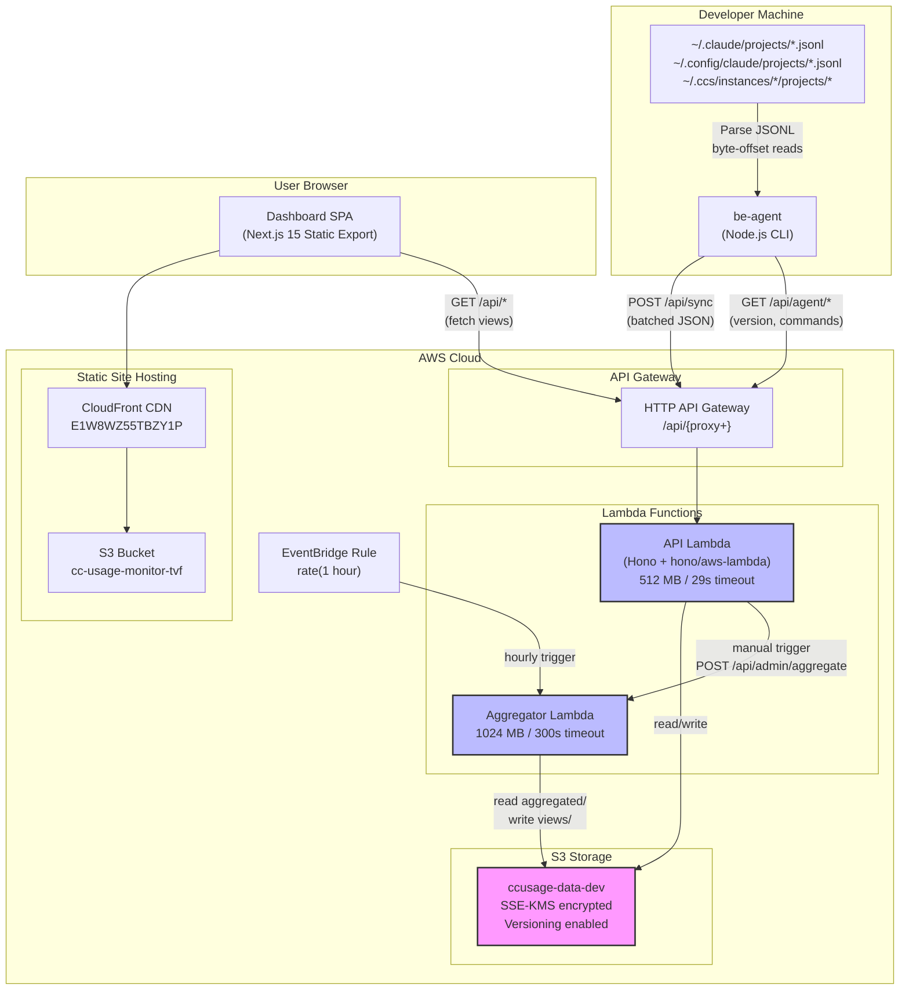

### Component Summary

| Component | Technology | Role |
|-----------|-----------|------|
| **be-agent** | Node.js CLI (Commander.js) | Parse local JSONL logs, push to server, auto-update, execute admin commands |
| **lambda-server** | Hono on AWS Lambda (Node.js 20) | Store raw data in S3, serve pre-computed views, manage members, admin operations |
| **dashboard** | Next.js 15 (static export) | Fetch pre-computed views via API, render charts with Recharts, hosted on CloudFront |

### Request Flow Summary

1. **Agent to Server**: The agent parses JSONL files on the developer's machine and pushes structured usage records, project metadata, and prompt text via `POST /api/sync`.
2. **Server to S3**: The sync endpoint stores raw data in `raw/`, computes pre-aggregated summaries in `aggregated/`, and writes sync logs, project data, and prompts.
3. **Aggregator to Views**: An EventBridge rule triggers the Aggregator Lambda hourly. It reads from `aggregated/` and generates dashboard-ready JSON files in `views/`.
4. **Dashboard to Server**: The static SPA fetches pre-computed `views/*.json` through the API Lambda and renders charts and tables.

---

## 2. Component Architecture

### 2.1 be-agent (Local CLI)

The agent runs on each developer's machine, either manually or as a background daemon (launchd on macOS, systemd on Linux). It discovers Claude Code JSONL files, parses them, and pushes structured data to the server.

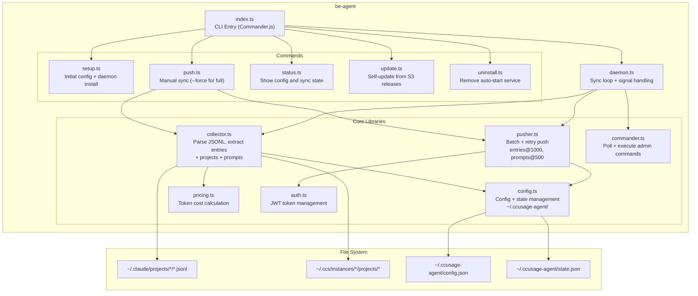

**Key modules:**

- **collector.ts** -- Scans all Claude Code directories (auto-discovered at runtime via `discoverClaudePaths()`), reads JSONL files using per-file byte offsets (append-only optimization), extracts usage entries with token counts, discovers projects from `cwd` fields, and collects user prompts for ISMS audit.

- **pusher.ts** -- Sends collected data to `POST /api/sync` in batches (1000 entries per batch, 500 prompts per batch). Implements exponential backoff retry for 5xx errors and network failures. Includes hostname, local IP, and public IP metadata with each request.

- **config.ts** -- Manages persistent configuration (`~/.ccusage-agent/config.json`) and state (`~/.ccusage-agent/state.json`). State uses version 2 format with per-file byte offsets, replacing the earlier seen-request-IDs approach. Includes v1-to-v2 migration logic.

- **daemon.ts** -- Runs the sync loop on a configurable interval (default: 5 minutes). Entries sync every cycle; prompts sync less frequently (default: every 24 hours). Each cycle: collect, push, save updated file offsets, then poll for admin commands.

- **commander.ts** -- Polls `GET /api/agent/commands` for pending admin commands (revoke-token, force-sync, update-config) and executes them locally, then ACKs back to the server.

#### JSONL Collection with Byte-Offset Tracking

The collector uses per-file byte offsets to achieve efficient incremental reads. JSONL files are append-only, so only bytes after the last-known offset need to be read.

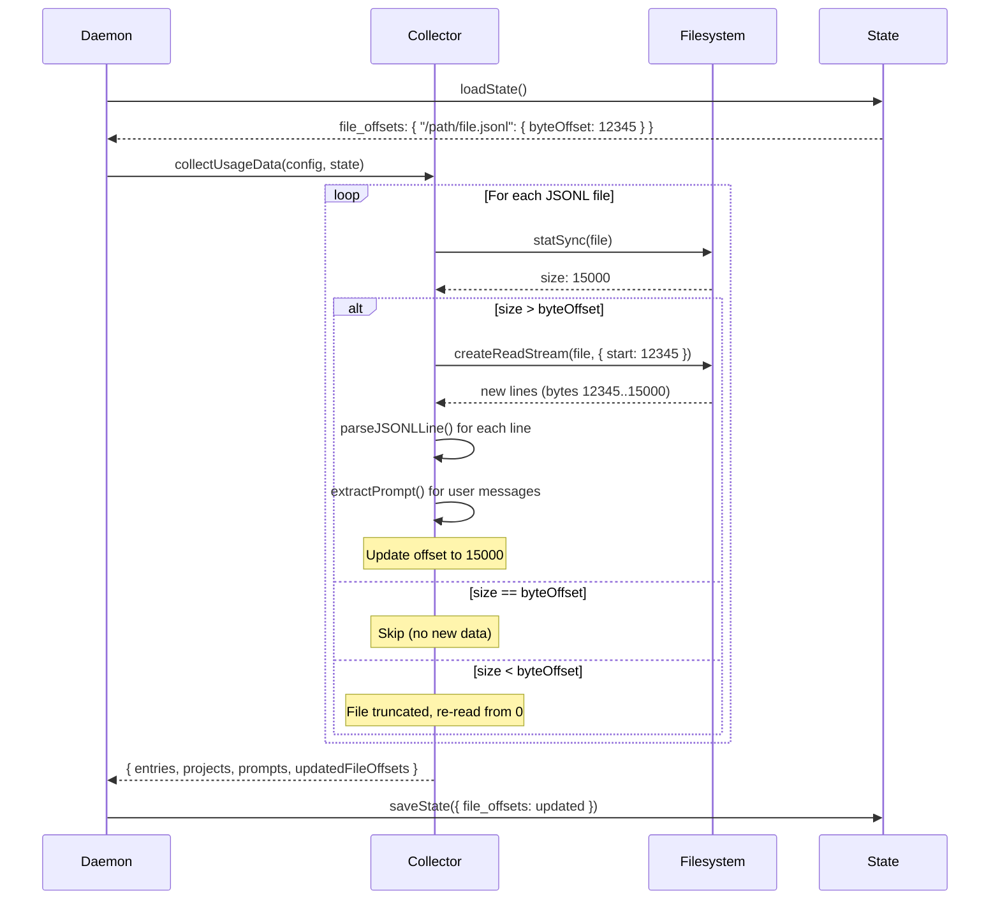

#### Data Path Discovery

The agent automatically discovers JSONL files from multiple locations:

| Path | Source |
|------|--------|
| `~/.claude/projects/*` | Native Claude Code |
| `~/.config/claude/projects/*` | Alternative Claude location |
| `~/.ccs/instances/*/projects/*` | CCS (Claude Code Spaces) multi-instance |
| Custom paths in `extra_claude_paths` | User-configured |

#### Auto-Start Service

After setup, the agent registers as a system service:

| Platform | Mechanism | Config Path |
|----------|-----------|-------------|
| macOS | launchd | `~/Library/LaunchAgents/com.ccusage.agent.plist` |
| Linux | systemd (user) | `~/.config/systemd/user/ccusage-agent.service` |

The daemon runs the sync cycle at a configurable interval (default: 60 minutes) and also polls for admin commands after each sync.

#### Self-Update Mechanism

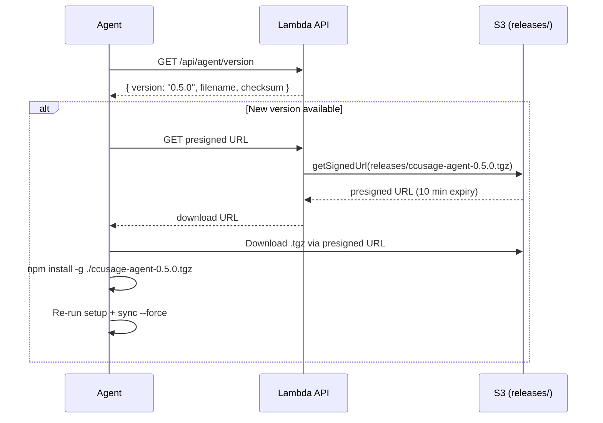

### 2.2 lambda-server (Serverless Backend)

The Lambda server is a Hono application deployed to AWS Lambda via API Gateway. It uses lazy route loading to minimize cold start time.

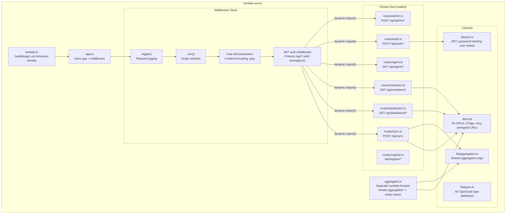

**Lazy route loading pattern** -- Instead of importing all route modules at startup (which increases cold start time), `app.ts` uses dynamic `import()` within the catch-all `/api/*` handler. Only the route module matching the incoming request path is loaded:

```typescript
app.all('/api/*', async (c, next) => {
  const path = c.req.path;
  if (path === '/api/sync' && c.req.method === 'POST') {
    const { default: syncRoute } = await import('./routes/sync.js');
    // Only sync.ts module is loaded for sync requests
  }
  // Other routes similarly lazy-loaded
});
```

**Aggregator Lambda** -- A separate Lambda function (1024 MB, 300s timeout) that:
1. Reads all `aggregated/{memberId}/{year}-{month}.json` files
2. Generates three types of dashboard-ready views: `views/dashboard.json`, `views/members.json`, `views/members/{memberId}/{year}.json`
3. Triggered hourly by EventBridge or manually via `POST /api/admin/aggregate`
4. Supports a `force` flag to recompute from raw data instead of using cached aggregated data
5. Implements change detection by comparing `lastUpdated` timestamps against `meta/last-processed.json`

#### Sync Endpoint Data Flow

The sync endpoint (`POST /api/sync`) is the primary ingestion point:

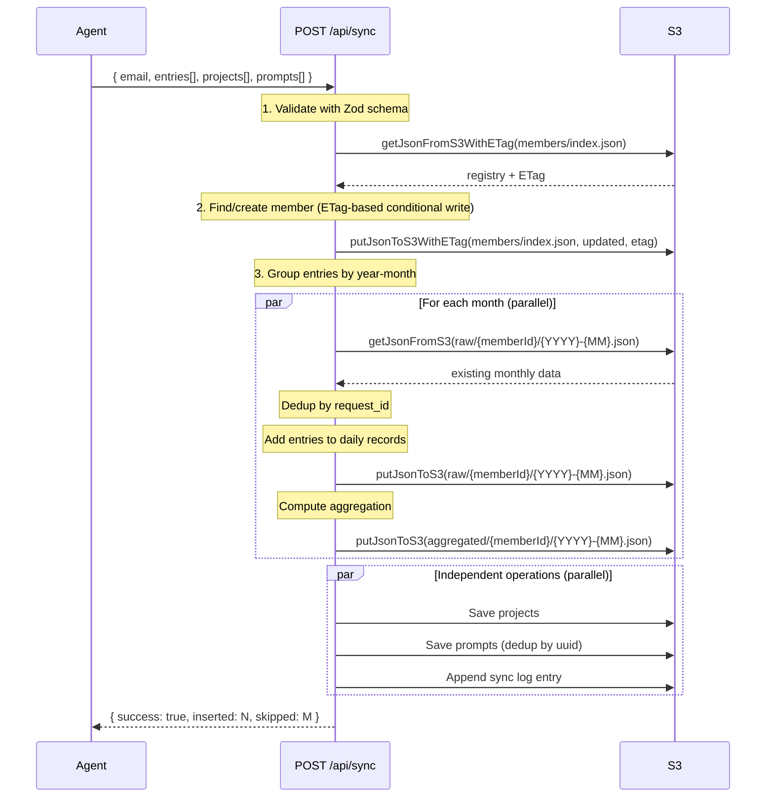

#### Aggregator Data Flow

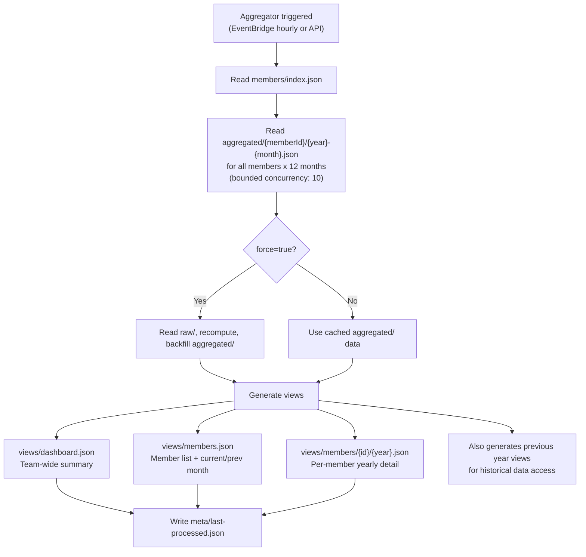

### 2.3 dashboard (Frontend SPA)

The dashboard is a Next.js 15 application exported as a static site and hosted on S3 + CloudFront.

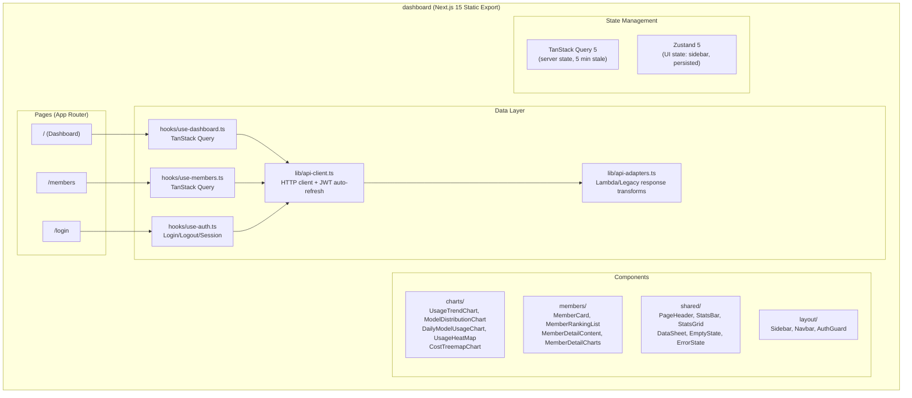

**Key architectural decisions:**

- **Modal-based detail views** -- Member details open in a slide-over sheet (`DataSheet`) rather than navigating to a separate route, avoiding the need for CloudFront URL rewrite rules for dynamic segments.
- **Flat route structure** -- Only `/`, `/members`, `/login` to work cleanly with S3 static hosting.
- **Dual API support** -- Adapters handle both Lambda API format (current, detected by `generatedAt` field) and legacy PostgreSQL format transparently.
- **Token auto-refresh** -- The API client intercepts 401 responses, attempts a single token refresh, and retries the original request. Concurrent refresh attempts are deduplicated.

#### Component Hierarchy

```
app/(dashboard)/layout.tsx
  |-- AuthGuard (redirects to /login if no tokens)
  |-- Sidebar (collapsible, Zustand persisted)
  |-- Navbar (user info, theme toggle)
  +-- Page Content
       |-- PageHeader
       |-- StatsBar / StatsGrid
       |-- ControlsBar (ViewToggle + Sort)
       +-- Charts / DataSheet modals
```

---

## 3. Data Architecture

### 3.1 Three-Layer S3 Architecture

The data storage follows a three-layer architecture where each layer can be rebuilt from the one above it:

```
raw/           = "What happened"    (source of truth, individual entries)
aggregated/    = "What it means"    (pre-computed per-month summaries)
views/         = "What to show"     (dashboard-ready JSON)
```

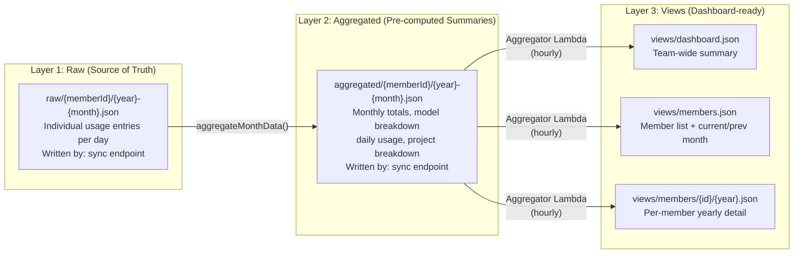

**Rebuild guarantees:**
- `aggregated/` can always be regenerated from `raw/` using `aggregateMonthData()`
- `views/` can always be regenerated from `aggregated/` using the aggregator Lambda with `?force=true`
- Full rebuild: `POST /api/admin/aggregate?force=true`

### 3.2 Complete S3 Bucket Layout

```
ccusage-data-{stage}/
|
|-- INPUT LAYER (written by sync endpoint)
|   |-- raw/{memberId}/{year}-{month}.json            All usage entries (source of truth)
|   |-- aggregated/{memberId}/{year}-{month}.json      Pre-computed monthly summaries
|   |-- members/index.json                             Member registry (email->id mapping)
|   |-- sync-logs/{year}-{month}/{memberId}.json       Sync audit trail
|   |-- projects/{memberId}.json                       Project list with git remotes
|   |-- prompts/{memberId}/{year}-{month}.json         Prompt text archive (ISMS audit)
|   +-- commands/{memberId}/queue.json                 Admin command queue for agents
|
|-- OUTPUT LAYER (written by aggregator Lambda)
|   +-- views/
|       |-- dashboard.json                             Team-wide summary stats
|       |-- members.json                               Member list with current/prev month
|       +-- members/{memberId}/{year}.json             Per-member yearly detail
|
|-- METADATA
|   +-- meta/last-processed.json                       Aggregation timestamp + duration
|
+-- RELEASES
    +-- releases/
        |-- version.json                               Latest agent version manifest
        +-- ccusage-agent-*.tgz                        Agent binaries for auto-update
```

### 3.3 Core Data Types

**RawMonthlyData** (`raw/{memberId}/{year}-{month}.json`):

```typescript
interface RawMonthlyData {
  memberId: string;
  year: number;
  month: number;
  lastUpdated: string;                     // ISO timestamp
  records: Record<string, DailyRecord>;    // keyed by date "2026-01-27"
}

interface DailyRecord {
  date: string;
  updatedAt: string;
  totals: {
    inputTokens: number;
    outputTokens: number;
    cacheCreationTokens: number;
    cacheReadTokens: number;
    costUsd: number;
    recordCount: number;
  };
  models: Record<string, ModelStats>;   // per-model breakdown
  entries: UsageEntry[];                // individual API call records
}

interface UsageEntry {
  requestId: string;        // Unique ID for deduplication
  timestamp: string;        // ISO timestamp
  model: string;            // e.g., "claude-sonnet-4-20250514"
  projectPath: string | null;
  sessionId: string | null;
  inputTokens: number;
  outputTokens: number;
  cacheCreationTokens: number;
  cacheReadTokens: number;
  costUsd: number;          // 6 decimal places
  claudeVersion: string | null;
}
```

**MonthAggregation** (`aggregated/{memberId}/{year}-{month}.json`):

```typescript
interface MonthAggregation {
  year: number;
  month: number;
  lastUpdated?: string;
  totals: {
    inputTokens: number;
    outputTokens: number;
    cacheCreationTokens: number;
    cacheReadTokens: number;
    costUsd: number;
    recordCount: number;
  };
  dailyUsage: DayAggregation[];                      // daily totals sorted by date
  dailyModelUsage: DailyModelUsage[];                 // per-day per-model breakdown
  modelBreakdown: Record<string, ModelBreakdown>;     // monthly per-model totals
  projectBreakdown: Record<string, number>;           // project -> costUsd
}
```

**MemberRegistry** (`members/index.json`):

```typescript
interface MemberRegistry {
  version: number;
  lastUpdated: string;
  members: Record<string, MemberInfo>;   // keyed by memberId (UUID)
}

interface MemberInfo {
  id: string;
  name: string;
  email: string;
  role: 'admin' | 'member';
  isActive: boolean;
  createdAt: string;
  updatedAt: string;
  lastSyncAt: string | null;
  lastSync?: {
    hostname: string | null;
    localIp: string | null;
    publicIp: string | null;
    userAgent: string | null;
    agentVersion: string | null;
  };
}
```

**View Types** (`views/`):

```typescript
// views/dashboard.json
interface DashboardView {
  generatedAt: string;
  summary: {
    totalCost: number;
    totalInputTokens: number;
    totalOutputTokens: number;
    totalMembers: number;
    activeMembers: number;
    avgCostPerMember: number;
  };
  costChangePercent: number;
  dailyTrend: Array<{ date: string; costUsd: number; inputTokens: number; outputTokens: number }>;
  topMembers: Array<{ memberId: string; name: string; costUsd: number; percentage: number }>;
  modelDistribution: Array<{ model: string; costUsd: number; percentage: number }>;
  recentSyncs: Array<{ memberId: string; memberName: string; syncedAt: string; recordsInserted: number }>;
}

// views/members/{memberId}/{year}.json
interface MemberYearlyView {
  generatedAt: string;
  member: { id: string; name: string; email: string; role: string; isActive: boolean };
  year: number;
  months: Record<string, MonthlyData>;   // "1".."12"
  recentSyncs: SyncLogEntry[];
  projects: ProjectData[];
  promptStats: Record<string, { count: number }>;
}
```

### 3.4 End-to-End Data Flow

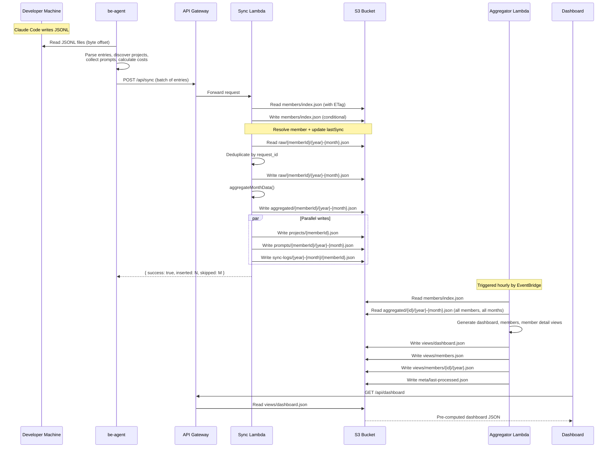

---

## 4. Communication Patterns

### 4.1 Agent-to-Server Sync Protocol

The sync protocol uses `POST /api/sync` with a JSON body containing entries, projects, and prompts.

**Request structure:**

```typescript
interface SyncRequest {
  email: string;                    // Member identifier
  name?: string;                    // Display name (for auto-registration)
  entries: SyncRequestEntry[];      // Usage records (up to 1000 per batch)
  projects?: SyncRequestProject[];  // Discovered projects (first batch only)
  prompts?: SyncRequestPrompt[];    // User prompts (up to 500 per batch)
  hostname?: string;                // Machine hostname
  agent_version?: string;           // Agent version for tracking
  local_ip?: string | null;         // LAN IP
  public_ip?: string | null;        // Public IP (via checkip.amazonaws.com)
}
```

**Batching strategy:**

| Data Type | Batch Size | Notes |
|-----------|-----------|-------|
| Entries | 1000 per request | Token usage records (~200 bytes each) |
| Prompts | 500 per request | Full prompt text (larger payload) |
| Projects | First batch only | Small metadata, sent once |

Total batches = max(ceil(entries/1000), ceil(prompts/500))

**Retry logic:**
- 4xx errors: fail immediately (client-side validation error)
- 5xx errors: exponential backoff (2^attempt seconds), up to 3 retries
- Network errors: same backoff strategy as 5xx

**Daemon sync cycle:**

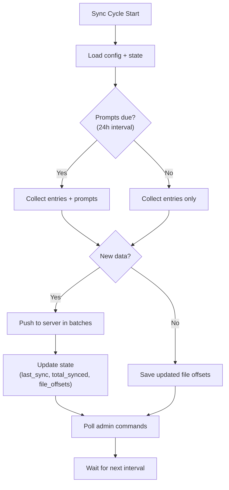

### 4.2 Dashboard-to-Server API

The dashboard reads pre-computed views. All dashboard endpoints are simple S3 reads -- no computation happens at request time.

| Endpoint | Source S3 Key | Purpose |
|----------|--------------|---------|
| `GET /api/dashboard` | `views/dashboard.json` | Team-wide summary (costs, trends, top members, model distribution) |
| `GET /api/dashboard/model-distribution` | `views/dashboard.json` (subset) | Model cost breakdown for pie chart |
| `GET /api/dashboard/meta` | `meta/last-processed.json` | Aggregator last run timestamp + duration |
| `GET /api/members` | `views/members.json` | Member list with current/previous month stats |
| `GET /api/members/:id?year=2026` | `views/members/{id}/{year}.json` | Full yearly detail for a member |
| `GET /api/members/:id/raw?year=&month=` | `raw/{id}/{year}-{month}.json` | Raw usage records for inspection |

### 4.3 Agent Command Protocol

Admins can issue commands to agents via the server. The agent polls for pending commands each sync cycle.

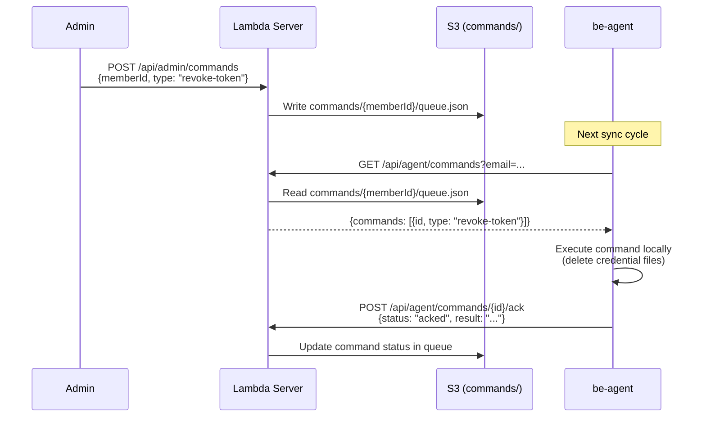

**Supported commands:**

| Command | Action |
|---------|--------|
| `revoke-token` | Deletes Claude Code credential files from standard and CCS paths |
| `force-sync` | Acknowledged; will run full sync on next cycle |
| `update-config` | Overwrites agent config.json fields from admin-provided payload |

### 4.4 API Reference

#### Sync (Agent to Server)

| Method | Path | Auth | Purpose |
|--------|------|------|---------|
| `POST` | `/api/sync` | Public | Receive entries, projects, prompts from agent |

#### Dashboard (Dashboard to Server)

| Method | Path | Auth | Purpose |
|--------|------|------|---------|
| `GET` | `/api/dashboard` | Bearer | Team-wide summary |
| `GET` | `/api/dashboard/model-distribution` | Bearer | Model usage breakdown |
| `GET` | `/api/dashboard/meta` | Bearer | Aggregator metadata |
| `GET` | `/api/members` | Bearer | Member list |
| `GET` | `/api/members/:id?year=YYYY` | Bearer | Member yearly detail |
| `GET` | `/api/members/:id/raw?year=&month=` | Bearer | Raw usage records |

#### Agent (Agent to Server)

| Method | Path | Auth | Purpose |
|--------|------|------|---------|
| `GET` | `/api/agent/version` | Public | Latest version + presigned download URL |
| `GET` | `/api/agent/commands?email=...` | Public | Poll pending admin commands |
| `POST` | `/api/agent/commands/:id/ack` | Public | Acknowledge command execution |

#### Auth

| Method | Path | Auth | Purpose |
|--------|------|------|---------|
| `POST` | `/api/auth/login` | Public | Login (email + password), returns JWT tokens |
| `POST` | `/api/auth/refresh` | Public | Exchange refresh token for new token pair |
| `GET` | `/api/auth/me` | Bearer | Get current user session |
| `POST` | `/api/auth/logout` | Bearer | Logout (client clears tokens) |

#### Admin

| Method | Path | Auth | Purpose |
|--------|------|------|---------|
| `POST` | `/api/admin/aggregate` | Public | Trigger aggregator (`?force=true` for full rebuild) |
| `POST` | `/api/admin/commands` | Public | Create command for agent |
| `GET` | `/api/admin/commands/:memberId` | Public | View command history |
| `GET` | `/api/admin/status` | Public | System status |

---

## 5. Authentication & Security

### 5.1 JWT-Based Authentication

The system uses JWT tokens (HS256) with two token types:

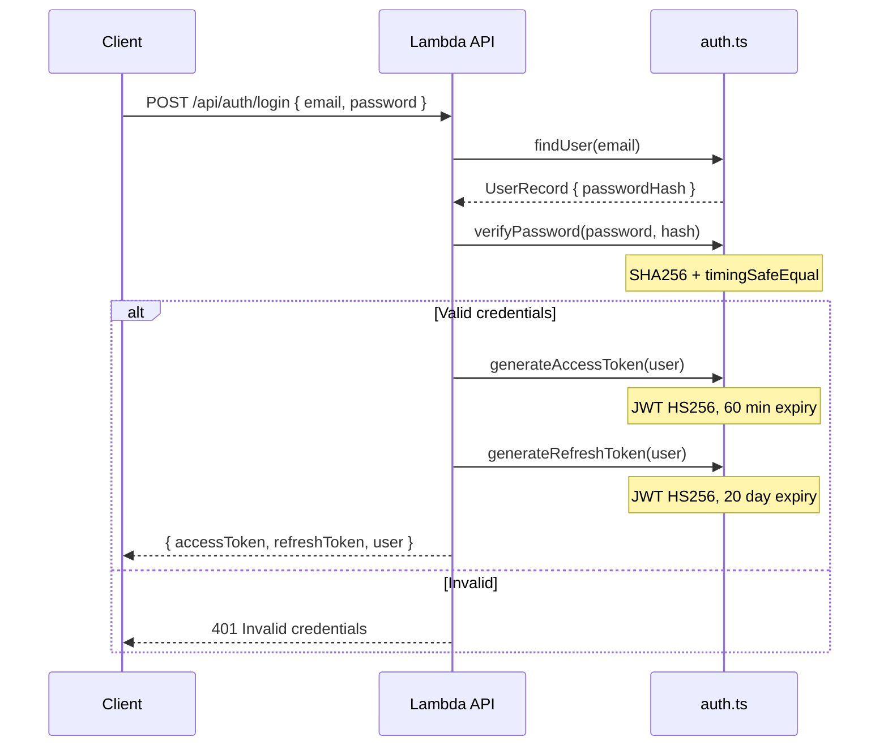

**Token configuration:**

| Property | Access Token | Refresh Token |
|----------|-------------|---------------|
| Expiry | 60 minutes | 20 days |
| Algorithm | HS256 | HS256 |
| Payload | email, name, role, type | email, name, role, type |
| Secret | `JWT_SECRET` env var | `JWT_SECRET` env var |

### 5.2 User Management

Users are stored in a static JSON file (`src/data/users.json`) bundled at build time:

```typescript
interface UserRecord {
  email: string;
  passwordHash: string;   // SHA256 hex digest
  name: string;
  role: 'admin' | 'agent' | 'member';
}
```

Password verification uses timing-safe comparison (`crypto.timingSafeEqual`) to prevent timing attacks.

### 5.3 Endpoint Protection

| Category | Endpoints | Auth Required |
|----------|-----------|---------------|
| Public | `/api/sync`, `/api/agent/*`, `/api/admin/*`, `/api/auth/login`, `/api/auth/refresh`, `/api/register/*` | No |
| Protected | `/api/dashboard/*`, `/api/members/*`, `/api/auth/me`, `/api/auth/logout` | Bearer token |

### 5.4 Dashboard Token Handling

The dashboard stores tokens in `localStorage` and implements automatic token refresh:

1. Every API request attaches `Authorization: Bearer {accessToken}` header
2. On 401 response, the client attempts a token refresh using the stored refresh token
3. Concurrent refresh attempts are deduplicated (single in-flight refresh promise)
4. If refresh fails, tokens are cleared and the user is redirected to `/login`

### 5.5 CORS Configuration

Origins are configured per deployment stage:

| Stage | Allowed Origins |
|-------|----------------|
| dev | `http://localhost:3000`, `http://127.0.0.1:3000`, `https://d1ohuii7czj4jp.cloudfront.net` |
| prod | `https://d1ohuii7czj4jp.cloudfront.net` |

In non-production mode, any `http://localhost:*` origin is also allowed. Requests with no origin (curl, server-to-server) are allowed with `*`.

### 5.6 S3 Security

| Control | Configuration |
|---------|--------------|
| Encryption | SSE-KMS with bucket key enabled (cost-optimized) |
| Public Access | All public access blocked (BlockPublicAcls, BlockPublicPolicy, IgnorePublicAcls, RestrictPublicBuckets) |
| Versioning | Enabled for data protection and recovery |
| Lifecycle | Sync logs auto-expire after 90 days |

---

## 6. Infrastructure Architecture

### 6.1 AWS Resources Overview

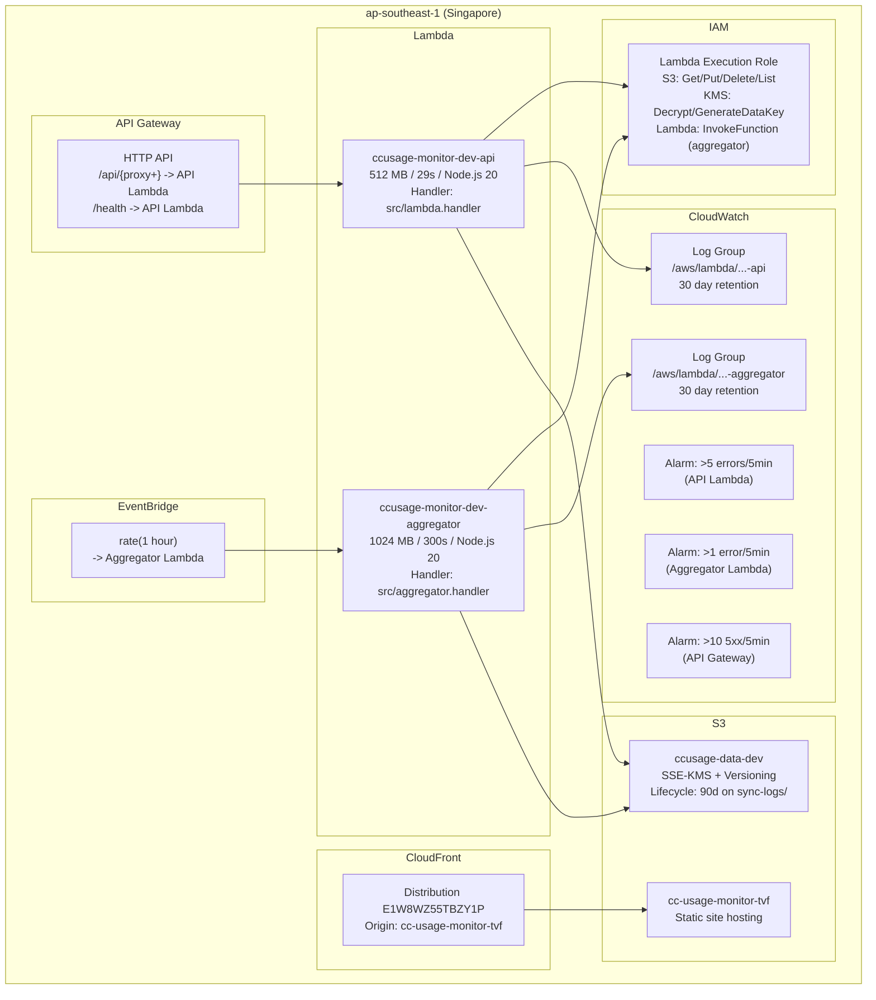

### 6.2 Lambda Configuration

| Property | API Lambda | Aggregator Lambda |
|----------|-----------|-------------------|
| Runtime | Node.js 20.x | Node.js 20.x |
| Architecture | x86_64 | x86_64 |
| Memory | 512 MB | 1024 MB |
| Timeout | 29 seconds | 300 seconds (5 min) |
| Trigger | API Gateway HTTP API | EventBridge (hourly) + manual |
| Bundle | esbuild (ESM format) | esbuild (ESM format) |

### 6.3 CloudWatch Alarms

| Alarm | Metric | Threshold | Period |
|-------|--------|-----------|--------|
| API Lambda Errors | Lambda Errors (Sum) | > 5 | 5 minutes |
| Aggregator Errors | Lambda Errors (Sum) | > 1 | 5 minutes |
| API Gateway 5xx | 5xx errors (Sum) | > 10 | 5 minutes |

### 6.4 IAM Permissions

The Lambda execution role has:
- **S3**: `GetObject`, `PutObject`, `DeleteObject`, `ListBucket` on the data bucket and all keys within it
- **KMS**: `Decrypt`, `GenerateDataKey` for SSE-KMS encrypted objects
- **Lambda**: `InvokeFunction` on the aggregator function (for manual trigger from API)

### 6.5 Environment Variables

| Variable | Purpose |
|----------|---------|
| `NODE_ENV` | `production` in deployed Lambda |
| `BUCKET_NAME` | S3 data bucket name (`ccusage-data-{stage}`) |
| `ALLOWED_ORIGINS` | Comma-separated CORS origins |
| `AGGREGATOR_FUNCTION_NAME` | Aggregator Lambda function name (for manual trigger) |
| `JWT_SECRET` | HS256 secret key for JWT signing (required in production) |
| `AWS_REGION` | AWS region (default: `ap-southeast-1`) |

---

## 7. Design Patterns

### 7.1 Idempotent Sync

Every usage record has a unique `requestId` (generated from Claude Code's JSONL data or constructed as `{sessionId}_{timestamp}`). Deduplication happens at two levels:

1. **Agent side**: Per-file byte offsets ensure only new data is read. If a file shrinks (truncated/rewritten), the agent re-reads from the beginning.
2. **Server side**: The sync endpoint collects all existing `requestId` values for the target month and skips duplicates. This makes sync safe to re-run at any time.

### 7.2 ETag-Based Optimistic Locking

The member registry (`members/index.json`) uses S3 conditional writes via ETags to handle concurrent modifications from multiple agents syncing simultaneously:

```typescript
// Read with ETag
const { data: registry, etag } = await getJsonFromS3WithETag<MemberRegistry>(key);

// Modify registry...
registry.members[memberId].lastSyncAt = now;

// Write with conditional check
await putJsonToS3WithETag(key, registry, etag);
// Uses IfMatch: etag (update existing) or IfNoneMatch: * (create new)
// Throws ConditionalCheckFailed on concurrent modification
```

If a concurrent modification is detected, the entire read-modify-write cycle is retried with exponential backoff (up to 3 retries, 100ms base delay with jitter).

### 7.3 Write-Time Aggregation

When the sync endpoint writes raw data, it also immediately computes and writes the aggregated summary for the same month. This means `aggregated/` is always up-to-date after a sync, and the hourly aggregator only needs to read `aggregated/` files (not raw data) for view generation:

```typescript
// In processMonthEntries():
const aggregation = aggregateMonthData(monthData, year, month);
await Promise.all([
  putJsonToS3(rawKey, monthData),       // Write raw
  putJsonToS3(aggKey, aggregation),     // Write aggregated (derived from raw)
]);
```

Benefits:
- Aggregated data is always up to date immediately after a sync
- The hourly aggregator only combines already-computed summaries into views
- Dashboard reads are always fast (no computation needed)

### 7.4 Lazy Route Loading

The API Lambda uses dynamic `import()` to load route modules on demand, reducing cold start time:

```
Request -> Middleware chain -> Path matching -> dynamic import() -> Sub-app.fetch()
```

A `/api/dashboard` request never loads `sync.ts`, `admin.ts`, or other unrelated route modules.

### 7.5 Presigned URLs for Agent Updates

Agent binary downloads use S3 presigned URLs to avoid passing credentials through the API:

```typescript
const url = await getPresignedDownloadUrl(`releases/${filename}`, 600);
// 10-minute expiry, agent downloads directly from S3
```

### 7.6 Bounded Concurrency

S3 operations in the aggregator are processed through a worker pool pattern (`mapWithConcurrency`) with a default concurrency limit of 10 to prevent memory exhaustion when processing many members in parallel.

### 7.7 Decimal Precision for Costs

All cost arithmetic uses fixed-point math with 6 decimal places (microdollars) to avoid floating-point precision errors:

```typescript
function addCost(a: number, b: number): number {
  const PRECISION = 1000000;
  return Math.round((a * PRECISION + b * PRECISION)) / PRECISION;
}
```

### 7.8 Exponential Backoff with Jitter

Retry logic uses exponential backoff with random jitter to avoid thundering herd effects:

```
Delay = baseDelay * 2^attempt * random(1.0, 1.5)
Default: 100ms, 200ms, 400ms (with 0-50% jitter)
```

Transient S3 errors (ThrottlingException, ServiceUnavailable, SlowDown, socket hang up, ECONNRESET) and ETag conflicts are retried. Validation and permission errors fail immediately.

### 7.9 Change Detection in Aggregator

The aggregator tracks which months have changed since its last run by comparing `lastUpdated` timestamps on aggregated data against `meta/last-processed.json`:

| Condition | Behavior |
|-----------|----------|
| First run (no meta) | Process all months with data |
| `lastUpdated > lastProcessedAt` | Process (month has new data) |
| `lastUpdated <= lastProcessedAt` | Skip (no changes) |
| `force=true` | Process all months regardless |

---

## 8. Deployment Architecture

### 8.1 Lambda Server Deployment

The Lambda server is deployed using the Serverless Framework v4 with esbuild bundling:

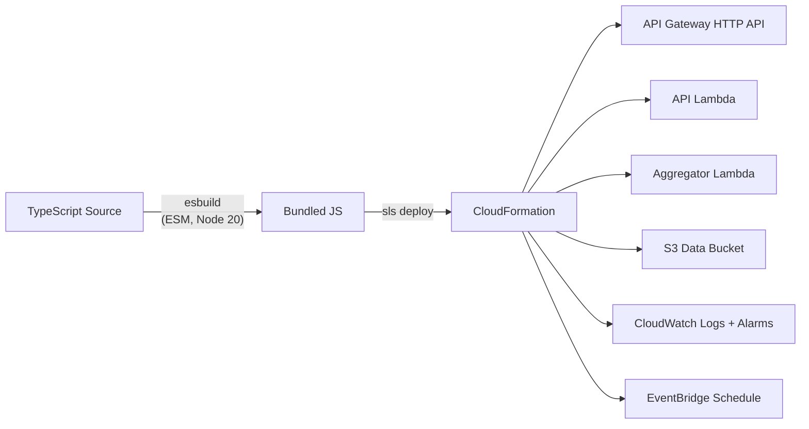

**Deployment commands:**

```bash
cd lambda-server
pnpm build
serverless deploy --stage dev --region ap-southeast-1
```

### 8.2 Dashboard Deployment

The dashboard is built as a static export and deployed to S3 with CloudFront invalidation:

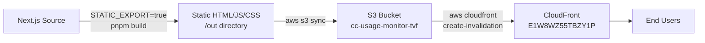

**Deployment command:**

```bash
./scripts/deploy-dashboard-s3.sh [API_URL]
# Default API: https://5kvqadz4mc.execute-api.ap-southeast-1.amazonaws.com
```

### 8.3 Agent Release Process

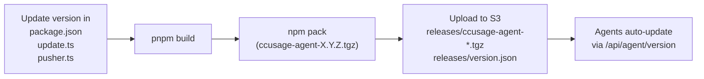

**Release command:**

```bash
# 1. Update version in be-agent/package.json, src/commands/update.ts, src/lib/pusher.ts
# 2. Build, pack, and upload:
./scripts/publish-agent.sh
# Uploads to S3 releases/ and updates version.json
```

### 8.4 Post-Deploy Operations

```bash
# Trigger full aggregation to rebuild all views
curl -X POST "https://<api-endpoint>/api/admin/aggregate?force=true"
```

### 8.5 Local Development

```bash
# Lambda server (local via serverless-offline)
cd lambda-server && pnpm dev     # Runs on :3001

# Dashboard (local with API proxy)
cd dashboard && pnpm dev         # Runs on :3000
# Configure API_SERVER_URL=http://localhost:3001 in dashboard/.env.local

# Agent (local build + test)
cd be-agent && pnpm build
pnpm start sync --dry-run        # Preview what would be synced
```

---

## 9. Scalability & Reliability

### 9.1 Concurrent Agent Handling

Multiple agents (from the same or different team members) can sync simultaneously:

| Concern | Solution |
|---------|----------|
| Member registry writes | ETag-based conditional writes with retry (up to 3 attempts) |
| Same-member concurrent sync | Raw data deduplication by `requestId` |
| Multi-device for same email | Data merged under same member (lookup by email) |
| S3 throttling | Transient error detection + exponential backoff with jitter |
| API Gateway concurrency | Lambda auto-scaling (no explicit limit configured) |

### 9.2 Data Growth Management

| Data Type | Growth Pattern | Management |
|-----------|---------------|------------|
| Raw entries | Grows linearly with team size and usage | Partitioned by member + month |
| Aggregated summaries | One file per member per month | Overwritten on each sync (small files) |
| Views | Fixed set of files | Regenerated hourly |
| Sync logs | Grows with sync frequency | Auto-expired after 90 days (S3 lifecycle) |
| Prompts | Grows with user activity | Partitioned by member + month |

### 9.3 Cold Start Optimization

Lambda cold starts are minimized through:

1. **Lazy route loading** -- Only the requested route module is dynamically imported
2. **Minimal middleware** -- Logger, CORS, gzip decompression, and JWT are lightweight
3. **S3 client reuse** -- The S3Client is created at module level and reused across warm invocations
4. **ESM bundle format** -- Tree-shakeable bundles via esbuild reduce deployment package size
5. **No ORM or database driver** -- Pure S3 operations, no connection pool management

### 9.4 Aggregator Efficiency

The aggregator uses several strategies to minimize processing time:

1. **Change detection** -- Compares `lastUpdated` timestamp on aggregated data against `lastProcessedAt` from the previous run; only processes months with new data
2. **Force rebuild** -- The `?force=true` flag bypasses change detection and recomputes everything from raw data
3. **Bounded concurrency** -- Processes up to 10 S3 operations in parallel (`mapWithConcurrency`)
4. **Aggregated-first reads** -- In normal mode, reads from `aggregated/` (fast); only falls back to `raw/` (slow) when aggregated data is missing
5. **Previous year support** -- Generates views for the previous year when data exists, ensuring December data remains accessible in January

### 9.5 Fault Tolerance

| Failure Scenario | Behavior |
|-----------------|----------|
| Agent network error during sync | Retry with exponential backoff (up to 3 attempts) |
| S3 transient error (throttling, timeout) | Retry with jitter (ThrottlingException, SlowDown, ServiceUnavailable) |
| ETag conflict (concurrent write) | Retry read-modify-write cycle (up to 3 attempts) |
| Aggregator failure | Views remain stale until next hourly run; manual trigger available |
| Lambda timeout (29s for API) | Client receives 5xx; retry on next sync cycle |
| Agent crash/restart | Daemon restarts via launchd/systemd; file offsets preserve progress |
| Dashboard API unreachable | TanStack Query shows cached data; retry on user interaction |
| Malformed JSONL line | Skipped silently; does not block processing of remaining lines |
| Failed project write | Logged as warning; sync still succeeds for entries |
| Failed prompt write | Logged as warning; sync still succeeds for entries |

### 9.6 Data Integrity

- **S3 Versioning** -- Enabled on the data bucket; accidental overwrites can be recovered from previous versions
- **Idempotent sync** -- Re-syncing the same data produces identical results (dedup by `requestId`)
- **Rebuild capability** -- Each layer (`raw` -> `aggregated` -> `views`) can be regenerated from the layer above
- **Audit trail** -- Sync logs record every sync operation with hostname, IP, agent version, and record counts
- **Prompt archive** -- User prompts stored with UUID deduplication for ISMS compliance audit
- **Request validation** -- All sync requests validated via Zod schemas before any S3 writes

### 9.7 Multi-Device Support

When the same email runs agents on multiple devices:

1. **Member Resolution**: The sync endpoint looks up the member by email in the registry. Multiple devices with the same email are treated as the same member.
2. **Deduplication**: The `requestId` on each usage entry prevents duplicate records even if the same JSONL file is processed by agents on different machines.
3. **Audit Trail**: Sync logs record hostname, local IP, public IP, and user agent per sync, allowing visibility into which devices are syncing.
4. **Last Sync Tracking**: The member registry stores the most recent sync metadata (hostname, IP, agent version) for admin visibility.

---

## Appendix: File Reference

### be-agent

| File | Purpose |
|------|---------|
| `src/index.ts` | CLI entry point (Commander.js) |
| `src/daemon.ts` | Daemon loop with interval-based sync |
| `src/commands/setup.ts` | First-time setup (config + launchd/systemd) |
| `src/commands/push.ts` | Manual sync trigger |
| `src/commands/status.ts` | Display config and sync state |
| `src/commands/update.ts` | Self-update from S3 releases |
| `src/commands/uninstall.ts` | Remove auto-start service |
| `src/lib/config.ts` | Config + state persistence (`~/.ccusage-agent/`) |
| `src/lib/collector.ts` | JSONL parser with byte-offset tracking |
| `src/lib/pusher.ts` | Batched HTTP push with retry |
| `src/lib/commander.ts` | Admin command polling and execution |
| `src/lib/auth.ts` | JWT token management |
| `src/lib/pricing.ts` | LiteLLM pricing fetcher + cost calculator |

### lambda-server

| File | Purpose |
|------|---------|
| `src/app.ts` | Hono app with middleware + lazy route loader |
| `src/lambda.ts` | Lambda handler entry point (`hono/aws-lambda`) |
| `src/aggregator.ts` | Aggregator Lambda handler |
| `src/routes/sync.ts` | `POST /api/sync` -- data ingestion |
| `src/routes/dashboard.ts` | Dashboard view endpoints |
| `src/routes/members.ts` | Member list + detail endpoints |
| `src/routes/agent.ts` | Agent-facing endpoints (version, commands) |
| `src/routes/admin.ts` | Admin endpoints (aggregate trigger, commands) |
| `src/routes/auth.ts` | Login, refresh, logout, session |
| `src/routes/register.ts` | Registration endpoints |
| `src/lib/s3.ts` | S3 CRUD, path helpers, retry, ETag, presigned URLs |
| `src/lib/types.ts` | All TypeScript type definitions |
| `src/lib/aggregation.ts` | Shared month aggregation logic |
| `src/lib/auth.ts` | JWT signing/verification, password hashing |
| `serverless.yml` | Serverless Framework v4 configuration |

### dashboard

| File | Purpose |
|------|---------|
| `src/app/(dashboard)/layout.tsx` | Dashboard layout (AuthGuard + Sidebar + Navbar) |
| `src/app/(dashboard)/page.tsx` | Dashboard home page |
| `src/app/(dashboard)/members/page.tsx` | Members list page |
| `src/app/(auth)/login/page.tsx` | Login page |
| `src/hooks/use-dashboard.ts` | Dashboard data fetching (TanStack Query) |
| `src/hooks/use-members.ts` | Members list + detail fetching |
| `src/hooks/use-auth.ts` | Login, logout, session hooks |
| `src/lib/api-client.ts` | HTTP client with auth, retry, token refresh |
| `src/lib/api-adapters.ts` | Lambda/legacy API response adapters |
| `src/stores/ui-store.ts` | Sidebar state (Zustand, persisted) |
| `src/components/charts/` | Recharts visualizations |
| `src/components/members/` | Member cards, ranking, detail views |
| `src/components/shared/` | Reusable: PageHeader, StatsBar, DataSheet, etc. |
