# Architecture Documentation

## System Architecture Overview



<details>
<summary>View Mermaid Source</summary>

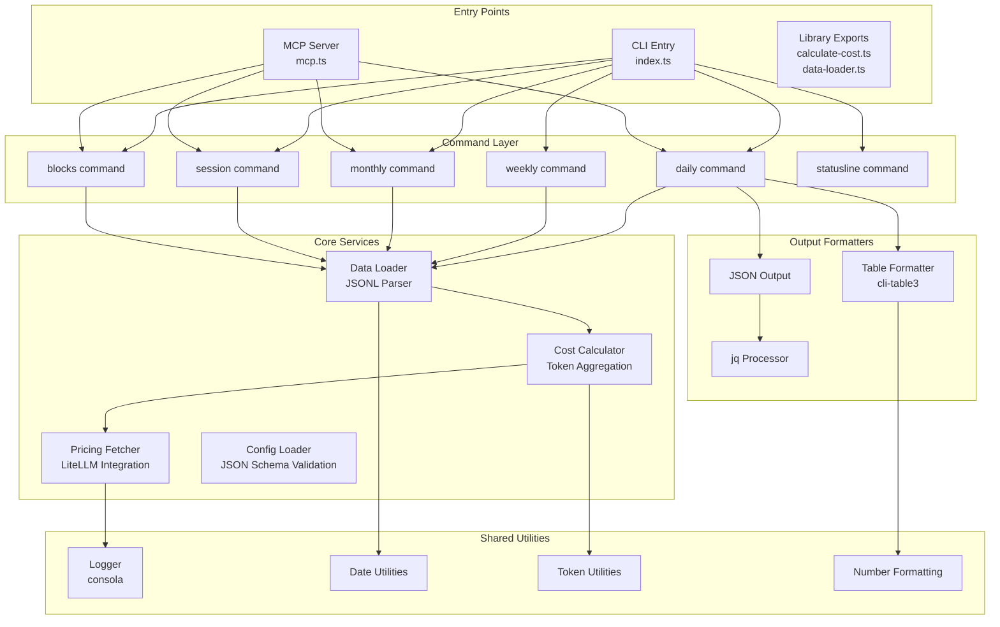
```mermaid
graph TB
    subgraph "Entry Points"
        CLI_ENTRY["CLI Entry<br/>index.ts"]
        MCP_ENTRY["MCP Server<br/>mcp.ts"]
        LIB_ENTRY["Library Exports<br/>calculate-cost.ts<br/>data-loader.ts"]
    end

    subgraph "Command Layer"
        DAILY["daily command"]
        WEEKLY["weekly command"]
        MONTHLY["monthly command"]
        SESSION["session command"]
        BLOCKS["blocks command"]
        STATUSLINE["statusline command"]
    end

    subgraph "Core Services"
        DATA_LOADER["Data Loader<br/>JSONL Parser"]
        COST_CALC["Cost Calculator<br/>Token Aggregation"]
        PRICING["Pricing Fetcher<br/>LiteLLM Integration"]
        CONFIG["Config Loader<br/>JSON Schema Validation"]
    end

    subgraph "Output Formatters"
        TABLE["Table Formatter<br/>cli-table3"]
        JSON_OUT["JSON Output"]
        JQ["jq Processor"]
    end

    subgraph "Shared Utilities"
        LOGGER["Logger<br/>consola"]
        DATE_UTILS["Date Utilities"]
        TOKEN_UTILS["Token Utilities"]
        FORMAT["Number Formatting"]
    end

    CLI_ENTRY --> DAILY
    CLI_ENTRY --> WEEKLY
    CLI_ENTRY --> MONTHLY
    CLI_ENTRY --> SESSION
    CLI_ENTRY --> BLOCKS
    CLI_ENTRY --> STATUSLINE

    MCP_ENTRY --> DAILY
    MCP_ENTRY --> MONTHLY
    MCP_ENTRY --> SESSION
    MCP_ENTRY --> BLOCKS

    DAILY --> DATA_LOADER
    WEEKLY --> DATA_LOADER
    MONTHLY --> DATA_LOADER
    SESSION --> DATA_LOADER
    BLOCKS --> DATA_LOADER

    DATA_LOADER --> COST_CALC
    COST_CALC --> PRICING

    DAILY --> TABLE
    DAILY --> JSON_OUT
    JSON_OUT --> JQ

    DATA_LOADER --> DATE_UTILS
    COST_CALC --> TOKEN_UTILS
    PRICING --> LOGGER
    TABLE --> FORMAT
```

</details>

## Component Architecture

### Application Layer



<details>
<summary>View Mermaid Source</summary>

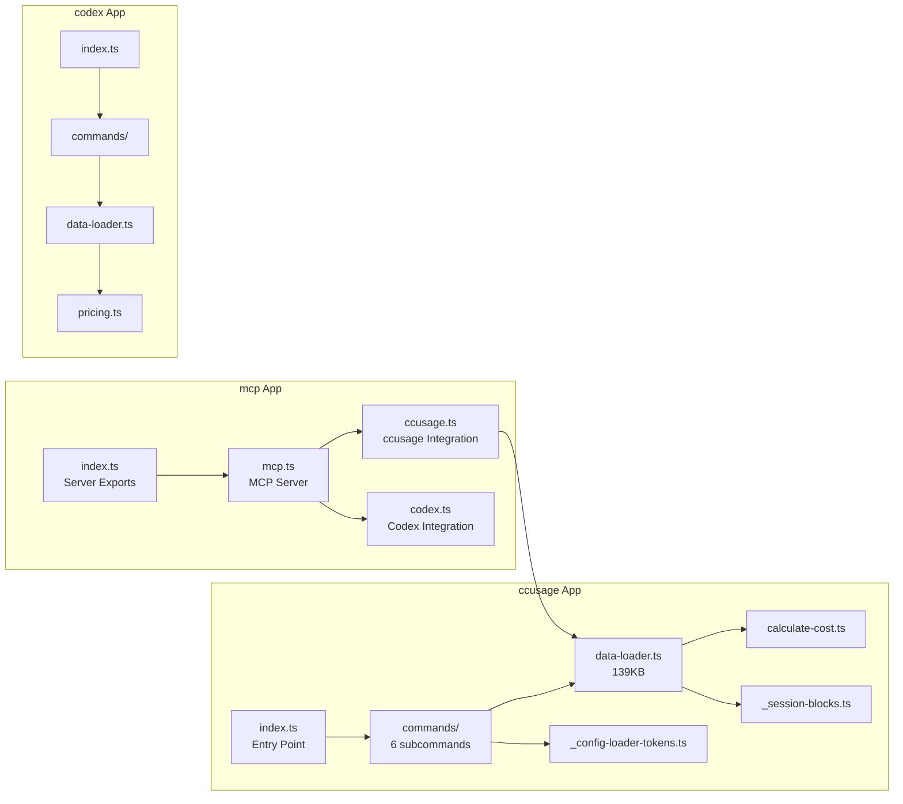
```mermaid
graph LR
    subgraph "ccusage App"
        CC_INDEX["index.ts<br/>Entry Point"]
        CC_COMMANDS["commands/<br/>6 subcommands"]
        CC_LOADER["data-loader.ts<br/>139KB"]
        CC_CALC["calculate-cost.ts"]
        CC_CONFIG["_config-loader-tokens.ts"]
        CC_BLOCKS["_session-blocks.ts"]
    end

    subgraph "mcp App"
        MCP_INDEX["index.ts<br/>Server Exports"]
        MCP_MAIN["mcp.ts<br/>MCP Server"]
        MCP_CC["ccusage.ts<br/>ccusage Integration"]
        MCP_CODEX["codex.ts<br/>Codex Integration"]
    end

    subgraph "codex App"
        CDX_INDEX["index.ts"]
        CDX_LOADER["data-loader.ts"]
        CDX_PRICING["pricing.ts"]
        CDX_COMMANDS["commands/"]
    end

    CC_INDEX --> CC_COMMANDS
    CC_COMMANDS --> CC_LOADER
    CC_LOADER --> CC_CALC
    CC_COMMANDS --> CC_CONFIG
    CC_LOADER --> CC_BLOCKS

    MCP_INDEX --> MCP_MAIN
    MCP_MAIN --> MCP_CC
    MCP_MAIN --> MCP_CODEX
    MCP_CC --> CC_LOADER

    CDX_INDEX --> CDX_COMMANDS
    CDX_COMMANDS --> CDX_LOADER
    CDX_LOADER --> CDX_PRICING
```

</details>

### Shared Package Architecture



<details>
<summary>View Mermaid Source</summary>

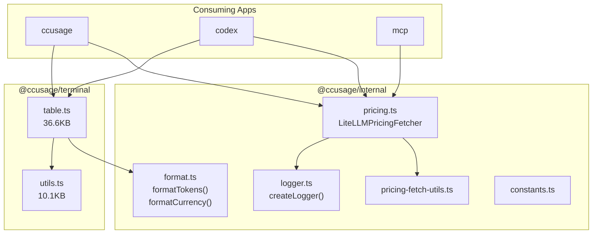
```mermaid
graph TB
    subgraph "@ccusage/internal"
        PRICING_MOD["pricing.ts<br/>LiteLLMPricingFetcher"]
        PRICING_UTILS["pricing-fetch-utils.ts"]
        LOGGER_MOD["logger.ts<br/>createLogger()"]
        FORMAT_MOD["format.ts<br/>formatTokens()<br/>formatCurrency()"]
        CONSTANTS["constants.ts"]
    end

    subgraph "@ccusage/terminal"
        TABLE_MOD["table.ts<br/>36.6KB"]
        TERM_UTILS["utils.ts<br/>10.1KB"]
    end

    subgraph "Consuming Apps"
        APP_CC["ccusage"]
        APP_CDX["codex"]
        APP_MCP["mcp"]
    end

    APP_CC --> PRICING_MOD
    APP_CC --> TABLE_MOD
    APP_CDX --> PRICING_MOD
    APP_CDX --> TABLE_MOD
    APP_MCP --> PRICING_MOD

    PRICING_MOD --> PRICING_UTILS
    PRICING_MOD --> LOGGER_MOD
    TABLE_MOD --> FORMAT_MOD
    TABLE_MOD --> TERM_UTILS
```

</details>

## Data Architecture

### Data Flow Overview



<details>
<summary>View Mermaid Source</summary>

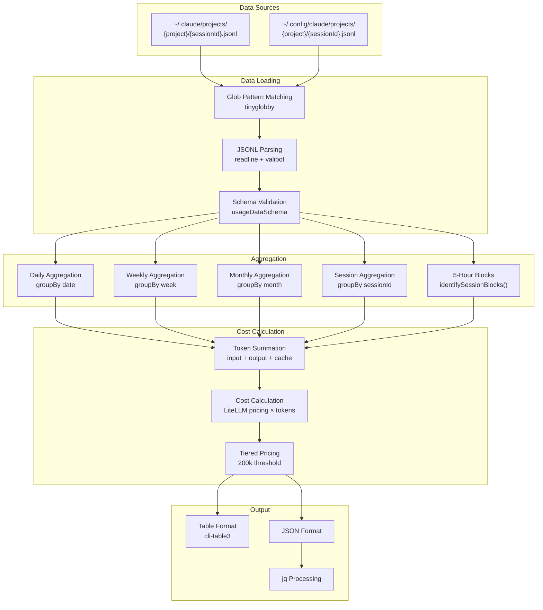
```mermaid
flowchart TD
    subgraph "Data Sources"
        FS1["~/.claude/projects/<br/>{project}/{sessionId}.jsonl"]
        FS2["~/.config/claude/projects/<br/>{project}/{sessionId}.jsonl"]
    end

    subgraph "Data Loading"
        GLOB["Glob Pattern Matching<br/>tinyglobby"]
        PARSE["JSONL Parsing<br/>readline + valibot"]
        VALIDATE["Schema Validation<br/>usageDataSchema"]
    end

    subgraph "Aggregation"
        AGG_DAILY["Daily Aggregation<br/>groupBy date"]
        AGG_WEEKLY["Weekly Aggregation<br/>groupBy week"]
        AGG_MONTHLY["Monthly Aggregation<br/>groupBy month"]
        AGG_SESSION["Session Aggregation<br/>groupBy sessionId"]
        AGG_BLOCKS["5-Hour Blocks<br/>identifySessionBlocks()"]
    end

    subgraph "Cost Calculation"
        TOKEN_SUM["Token Summation<br/>input + output + cache"]
        COST_CALC["Cost Calculation<br/>LiteLLM pricing × tokens"]
        TIERED["Tiered Pricing<br/>200k threshold"]
    end

    subgraph "Output"
        OUT_TABLE["Table Format<br/>cli-table3"]
        OUT_JSON["JSON Format"]
        OUT_JQ["jq Processing"]
    end

    FS1 --> GLOB
    FS2 --> GLOB
    GLOB --> PARSE
    PARSE --> VALIDATE

    VALIDATE --> AGG_DAILY
    VALIDATE --> AGG_WEEKLY
    VALIDATE --> AGG_MONTHLY
    VALIDATE --> AGG_SESSION
    VALIDATE --> AGG_BLOCKS

    AGG_DAILY --> TOKEN_SUM
    AGG_WEEKLY --> TOKEN_SUM
    AGG_MONTHLY --> TOKEN_SUM
    AGG_SESSION --> TOKEN_SUM
    AGG_BLOCKS --> TOKEN_SUM

    TOKEN_SUM --> COST_CALC
    COST_CALC --> TIERED

    TIERED --> OUT_TABLE
    TIERED --> OUT_JSON
    OUT_JSON --> OUT_JQ
```

</details>

## CLI Command Architecture



<details>
<summary>View Mermaid Source</summary>

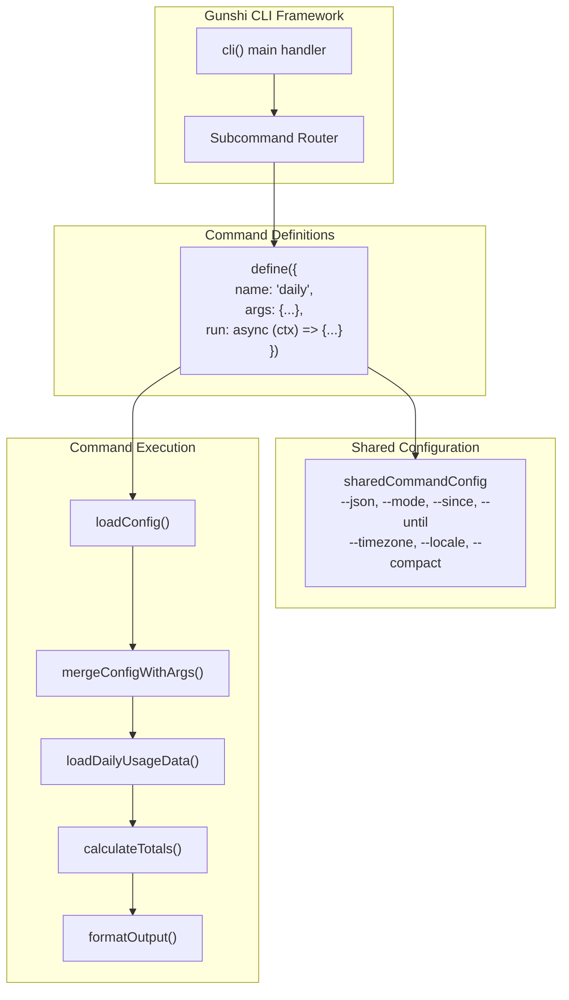
```mermaid
graph TB
    subgraph "Gunshi CLI Framework"
        CLI_MAIN["cli() main handler"]
        ROUTER["Subcommand Router"]
    end

    subgraph "Command Definitions"
        CMD_DEF["define({<br/>  name: 'daily',<br/>  args: {...},<br/>  run: async (ctx) => {...}<br/>})"]
    end

    subgraph "Shared Configuration"
        SHARED_ARGS["sharedCommandConfig<br/>--json, --mode, --since, --until<br/>--timezone, --locale, --compact"]
    end

    subgraph "Command Execution"
        LOAD_CONFIG["loadConfig()"]
        MERGE_ARGS["mergeConfigWithArgs()"]
        LOAD_DATA["loadDailyUsageData()"]
        CALC_TOTALS["calculateTotals()"]
        FORMAT_OUT["formatOutput()"]
    end

    CLI_MAIN --> ROUTER
    ROUTER --> CMD_DEF
    CMD_DEF --> SHARED_ARGS

    CMD_DEF --> LOAD_CONFIG
    LOAD_CONFIG --> MERGE_ARGS
    MERGE_ARGS --> LOAD_DATA
    LOAD_DATA --> CALC_TOTALS
    CALC_TOTALS --> FORMAT_OUT
```

</details>

## MCP Server Architecture



<details>
<summary>View Mermaid Source</summary>

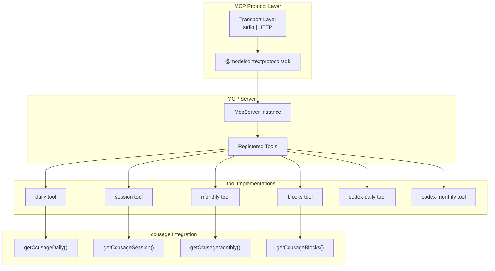
```mermaid
graph TB
    subgraph "MCP Protocol Layer"
        TRANSPORT["Transport Layer<br/>stdio | HTTP"]
        SDK["@modelcontextprotocol/sdk"]
    end

    subgraph "MCP Server"
        SERVER["McpServer Instance"]
        TOOLS["Registered Tools"]
    end

    subgraph "Tool Implementations"
        TOOL_DAILY["daily tool"]
        TOOL_SESSION["session tool"]
        TOOL_MONTHLY["monthly tool"]
        TOOL_BLOCKS["blocks tool"]
        TOOL_CDX_DAILY["codex-daily tool"]
        TOOL_CDX_MONTHLY["codex-monthly tool"]
    end

    subgraph "ccusage Integration"
        CC_DAILY["getCcusageDaily()"]
        CC_SESSION["getCcusageSession()"]
        CC_MONTHLY["getCcusageMonthly()"]
        CC_BLOCKS["getCcusageBlocks()"]
    end

    TRANSPORT --> SDK
    SDK --> SERVER
    SERVER --> TOOLS

    TOOLS --> TOOL_DAILY
    TOOLS --> TOOL_SESSION
    TOOLS --> TOOL_MONTHLY
    TOOLS --> TOOL_BLOCKS
    TOOLS --> TOOL_CDX_DAILY
    TOOLS --> TOOL_CDX_MONTHLY

    TOOL_DAILY --> CC_DAILY
    TOOL_SESSION --> CC_SESSION
    TOOL_MONTHLY --> CC_MONTHLY
    TOOL_BLOCKS --> CC_BLOCKS
```

</details>

## Error Handling Architecture



<details>
<summary>View Mermaid Source</summary>

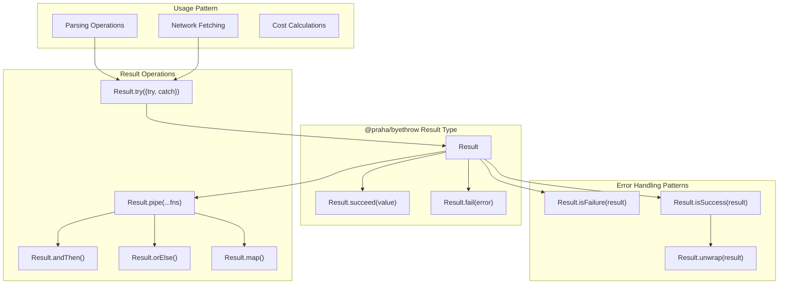
```mermaid
graph TB
    subgraph "@praha/byethrow Result Type"
        RESULT["Result<T, E>"]
        SUCCESS["Result.succeed(value)"]
        FAILURE["Result.fail(error)"]
    end

    subgraph "Result Operations"
        TRY["Result.try({try, catch})"]
        PIPE["Result.pipe(...fns)"]
        AND_THEN["Result.andThen()"]
        OR_ELSE["Result.orElse()"]
        MAP["Result.map()"]
    end

    subgraph "Error Handling Patterns"
        CHECK_FAIL["Result.isFailure(result)"]
        CHECK_SUCCESS["Result.isSuccess(result)"]
        UNWRAP["Result.unwrap(result)"]
    end

    subgraph "Usage Pattern"
        PARSE["Parsing Operations"]
        FETCH["Network Fetching"]
        CALC["Cost Calculations"]
    end

    RESULT --> SUCCESS
    RESULT --> FAILURE

    TRY --> RESULT
    PARSE --> TRY
    FETCH --> TRY

    RESULT --> PIPE
    PIPE --> AND_THEN
    PIPE --> OR_ELSE
    PIPE --> MAP

    RESULT --> CHECK_FAIL
    RESULT --> CHECK_SUCCESS
    CHECK_SUCCESS --> UNWRAP
```

</details>

## Pricing System Architecture



<details>
<summary>View Mermaid Source</summary>

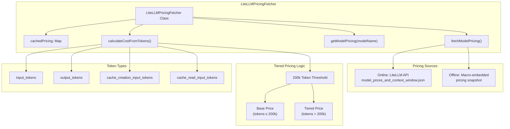
```mermaid
graph TB
    subgraph "LiteLLMPricingFetcher"
        FETCHER["LiteLLMPricingFetcher Class"]
        CACHE["cachedPricing: Map"]
        FETCH_API["fetchModelPricing()"]
        GET_PRICING["getModelPricing(modelName)"]
        CALC_COST["calculateCostFromTokens()"]
    end

    subgraph "Pricing Sources"
        ONLINE["Online: LiteLLM API<br/>model_prices_and_context_window.json"]
        OFFLINE["Offline: Macro-embedded<br/>pricing snapshot"]
    end

    subgraph "Tiered Pricing Logic"
        THRESHOLD["200k Token Threshold"]
        BASE_PRICE["Base Price<br/>(tokens ≤ 200k)"]
        TIERED_PRICE["Tiered Price<br/>(tokens > 200k)"]
    end

    subgraph "Token Types"
        INPUT["input_tokens"]
        OUTPUT["output_tokens"]
        CACHE_CREATE["cache_creation_input_tokens"]
        CACHE_READ["cache_read_input_tokens"]
    end

    FETCHER --> CACHE
    FETCHER --> FETCH_API
    FETCHER --> GET_PRICING
    FETCHER --> CALC_COST

    FETCH_API --> ONLINE
    FETCH_API --> OFFLINE

    CALC_COST --> THRESHOLD
    THRESHOLD --> BASE_PRICE
    THRESHOLD --> TIERED_PRICE

    CALC_COST --> INPUT
    CALC_COST --> OUTPUT
    CALC_COST --> CACHE_CREATE
    CALC_COST --> CACHE_READ
```

</details>

## Caching Strategy

### LiteLLM Pricing Cache



<details>
<summary>View Mermaid Source</summary>

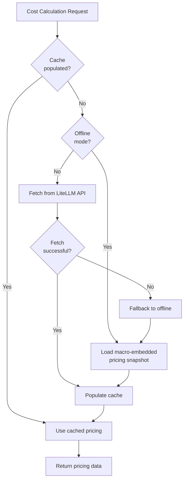
```mermaid
flowchart TD
    REQUEST[Cost Calculation Request] --> CHECK_CACHE{Cache<br/>populated?}

    CHECK_CACHE -->|Yes| USE_CACHE[Use cached pricing]
    CHECK_CACHE -->|No| CHECK_MODE{Offline<br/>mode?}

    CHECK_MODE -->|Yes| LOAD_OFFLINE[Load macro-embedded<br/>pricing snapshot]
    CHECK_MODE -->|No| FETCH_API[Fetch from LiteLLM API]

    FETCH_API --> CHECK_SUCCESS{Fetch<br/>successful?}

    CHECK_SUCCESS -->|Yes| POPULATE_CACHE[Populate cache]
    CHECK_SUCCESS -->|No| FALLBACK[Fallback to offline]

    FALLBACK --> LOAD_OFFLINE
    LOAD_OFFLINE --> POPULATE_CACHE

    POPULATE_CACHE --> USE_CACHE
    USE_CACHE --> RETURN[Return pricing data]
```

</details>

### Cache Behavior

| Aspect | Behavior |
|--------|----------|
| **Lifetime** | Per-process (in-memory Map) |
| **Invalidation** | Manual via `clearCache()` or process restart |
| **Fallback** | Offline macro-embedded snapshot |
| **Size** | ~500+ model entries |

### Cache Implementation

```typescript
class LiteLLMPricingFetcher implements Disposable {
  private cachedPricing: Map<string, LiteLLMModelPricing> | null = null;

  // Clear cache manually
  clearCache(): void {
    this.cachedPricing = null;
  }

  // Auto-cleanup with Disposable pattern
  [Symbol.dispose](): void {
    this.clearCache();
  }
}
```

---

## Resilience Patterns

### Pricing Fetch Resilience

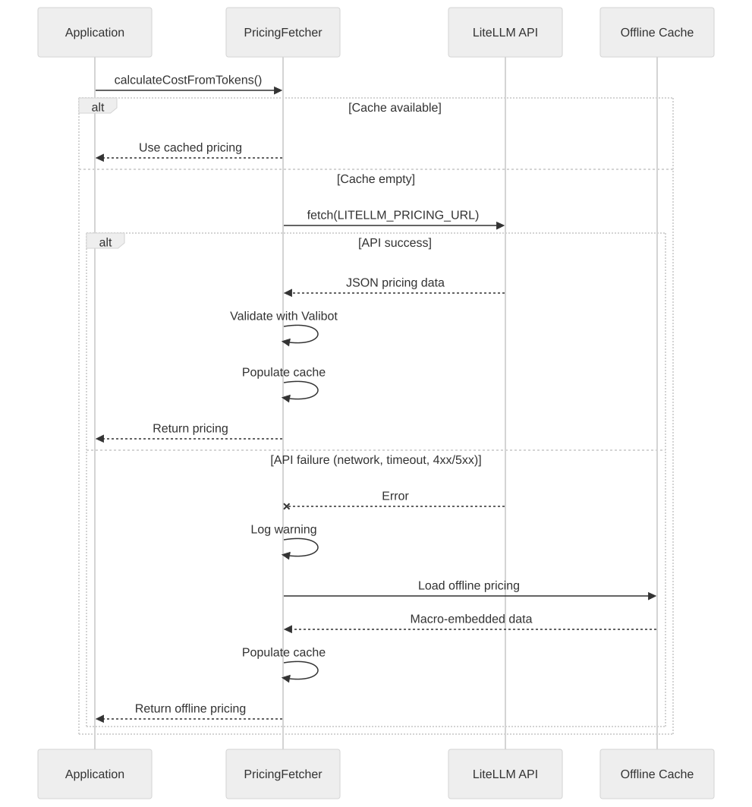

<details>
<summary>View Mermaid Source</summary>

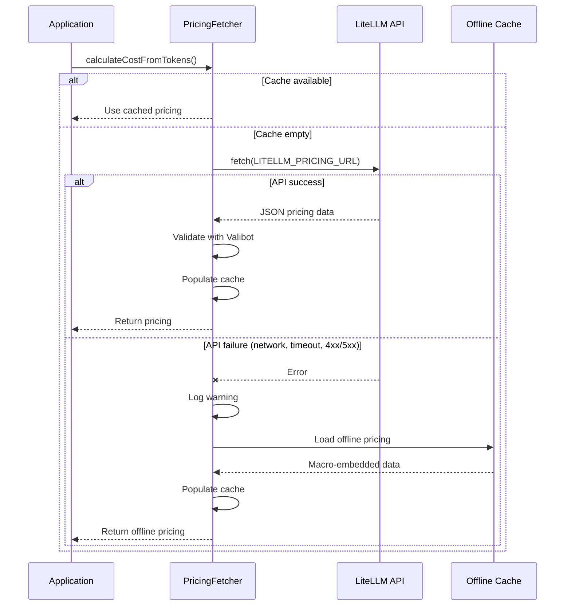
```mermaid
sequenceDiagram
    participant App as Application
    participant Fetcher as PricingFetcher
    participant API as LiteLLM API
    participant Offline as Offline Cache

    App->>Fetcher: calculateCostFromTokens()

    alt Cache available
        Fetcher-->>App: Use cached pricing
    else Cache empty
        Fetcher->>API: fetch(LITELLM_PRICING_URL)

        alt API success
            API-->>Fetcher: JSON pricing data
            Fetcher->>Fetcher: Validate with Valibot
            Fetcher->>Fetcher: Populate cache
            Fetcher-->>App: Return pricing
        else API failure (network, timeout, 4xx/5xx)
            API--xFetcher: Error
            Fetcher->>Fetcher: Log warning
            Fetcher->>Offline: Load offline pricing
            Offline-->>Fetcher: Macro-embedded data
            Fetcher->>Fetcher: Populate cache
            Fetcher-->>App: Return offline pricing
        end
    end
```

</details>

### Error Recovery Strategy

| Failure Type | Recovery Action |
|--------------|-----------------|
| Network timeout | Fallback to offline cache |
| API 4xx/5xx | Fallback to offline cache |
| Invalid JSON | Skip invalid entries, use valid ones |
| Model not found | Return null, caller handles gracefully |
| Parse error | Log warning, continue with defaults |

### Graceful Degradation

```typescript
// JSONL parsing - skip malformed lines silently
for await (const line of reader) {
  const parseResult = Result.try(() => JSON.parse(line));
  if (Result.isFailure(parseResult)) {
    continue; // Skip silently, don't fail entire load
  }
  // Process valid entry...
}
```

---

## Key Design Patterns

### 1. Monorepo with Bundled Apps
All apps ship as bundled CLIs - runtime dependencies are in `devDependencies` so bundler captures them.

### 2. Functional Error Handling
Uses `@praha/byethrow` Result type instead of try-catch for composable error handling.

### 3. In-Source Testing
Tests live alongside implementation using `if (import.meta.vitest != null)` blocks.

### 4. Schema Validation
Valibot schemas with branded types for type-safe parsing and validation.

### 5. Command Pattern
Gunshi CLI framework with `define()` for declarative command configuration.

### 6. Disposable Pattern
`LiteLLMPricingFetcher` implements `Disposable` for automatic resource cleanup with `using` keyword.
