# System Architecture Overview

CCUsage Monitor is a team monitoring system for tracking Claude Code usage across an organization. It follows a serverless architecture on AWS with three main components.

## High-Level Architecture

## Components

### be-agent (Local CLI)

A Node.js CLI tool installed globally on each developer's machine. It runs as a background service (launchd on macOS, systemd on Linux) and performs incremental syncing of Claude Code usage data to the central server.

**Key responsibilities:**
- Discovers Claude Code data directories automatically (native installations at `~/.claude/projects`, alternative at `~/.config/claude/projects`, and CCS multi-instance setups at `~/.ccs/instances/*/projects`)
- Parses JSONL log files using byte-offset tracking with SHA-256 fingerprint verification for change detection
- Extracts three data types: usage entries (model, tokens, cost), user prompts (ISMS audit), and project info (git remotes)
- Batches and pushes data to the Lambda server (entries at 1000/batch, prompts at 500/batch)
- Polls for and executes admin commands (revoke-token, force-sync, update-config)
- Self-updates from S3 releases via presigned download URLs
- Calculates token costs using LiteLLM pricing data (cached 24 hours)

### lambda-server (Serverless Backend)

A Hono web framework running on AWS Lambda, handling all API traffic through API Gateway. Uses a three-layer S3 storage architecture for data processing.

**Key responsibilities:**
- Receives sync data from agents, deduplicates by request_id, stores in S3
- Manages member registry with ETag-based optimistic concurrency control
- Computes pre-aggregated monthly summaries at sync time (write-time aggregation)
- Runs an hourly aggregator Lambda that generates dashboard-ready view files
- Serves pre-computed views to the dashboard for fast reads
- Manages agent releases (version checks, presigned download URLs)
- Handles admin command queues for remote agent management

### dashboard (Frontend SPA)

A Next.js 15 static-export single-page application hosted on S3 + CloudFront. Provides team-wide visibility into Claude Code usage.

**Key responsibilities:**
- Displays team summary with cost trends, model distribution, and member rankings
- Provides per-member detail views with monthly breakdowns, daily usage, and model analysis
- Supports three view modes for members: ranking list, card grid, and treemap chart
- Handles JWT authentication with auto-refresh and session management
- Uses TanStack Query for server state (5-minute stale time) and Zustand for UI state
- Adapts between Lambda API format and legacy PostgreSQL format transparently

## Data Flow Summary

1. Developers use Claude Code, which writes JSONL log files to `~/.claude/projects/`
2. The be-agent daemon reads new data incrementally (byte offsets + fingerprints) every N minutes
3. Agent pushes structured JSON to POST /api/sync on the Lambda server
4. Lambda stores raw entries in S3, computes monthly aggregations, logs the sync
5. Hourly aggregator reads all aggregated data and generates dashboard view files
6. Dashboard fetches pre-computed views and renders interactive charts

## Design Principles

- **Idempotent sync**: Deduplication by request_id on both agent and server side. Safe to re-sync any time.
- **Incremental reads**: Byte-offset tracking with SHA-256 fingerprint verification. Only new data is read and sent.
- **Three-layer storage**: raw/ (source of truth) feeds aggregated/ (sync-time summaries) feeds views/ (dashboard-ready JSON). Each layer can be rebuilt from the one above.
- **ETag concurrency**: Member registry uses conditional writes to handle concurrent agent syncs safely.
- **Lazy route loading**: Lambda handler lazy-loads route modules to minimize cold start time.
- **Presigned URLs**: Agent downloads bypass authentication using time-limited S3 presigned URLs (10-minute expiry).
- **Batched uploads**: Large payloads are split to stay under API Gateway's 10MB limit.
- **Decimal-safe arithmetic**: Cost calculations use 6-decimal precision to avoid floating-point drift.
