# AWS Infrastructure

CCUsage Monitor runs on a fully serverless AWS stack in the ap-southeast-1 (Singapore) region. The system supports multiple deployment stages (dev, jit) with isolated resources per stage.

## Infrastructure Diagram

## Compute

### API Lambda Function
- **Runtime**: Node.js 20 (x86_64)
- **Memory**: 512 MB
- **Timeout**: 29 seconds (just under API Gateway's 30-second limit)
- **Handler**: Hono web framework with lazy-loaded routes
- **Trigger**: API Gateway HTTP API catching `ANY /api/{proxy+}` and `GET /health`
- **Environment**: NODE_ENV=production, BUCKET_NAME, ALLOWED_ORIGINS, AGGREGATOR_FUNCTION_NAME, JWT_SECRET

### Aggregator Lambda Function
- **Runtime**: Node.js 20 (x86_64)
- **Memory**: 1024 MB (larger allocation for processing all members)
- **Timeout**: 300 seconds (5 minutes)
- **Handler**: Reads all member data from S3, generates dashboard view files
- **Trigger**: EventBridge schedule at `rate(1 hour)` plus on-demand via POST /api/admin/aggregate
- **Concurrency**: Bounded at 10 parallel S3 operations per member

## Storage

### S3 Data Bucket (`ccusage-data-${stage}`)
- **Encryption**: SSE-KMS with bucket key enabled (cost optimization)
- **Public Access**: Fully blocked
- **Versioning**: Enabled (data protection and accidental overwrite recovery)
- **Lifecycle Rules**: sync-logs/ prefix expires after 90 days
- **Key Patterns**: See S3 Data Model document for full layout

### S3 Dashboard Bucket (`cc-usage-monitor-tvf` for dev, `cc-usage-monitor-jit` for jit)
- **Hosting**: Static website hosting enabled (index.html, error: index.html for SPA routing)
- **Content**: Next.js static export (HTML, JS, CSS, images)
- **Deployment**: Uploaded via `scripts/deploy-dashboard.sh --stage <stage>`

## Networking

### API Gateway
- **Type**: HTTP API (v2) - lower latency and cost than REST API
- **Routes**: Catch-all proxy to Lambda
- **CORS**: Configured per stage with allowed origins including localhost for development

### CloudFront
- **Purpose**: CDN for dashboard SPA with HTTPS
- **Origin**: S3 dashboard bucket (static website endpoint)
- **Error Pages**: 404 → index.html (SPA client-side routing)
- **Distribution IDs**: Stage-specific (E1W8WZ55TBZY1P for dev)

## Security

### IAM Permissions (Least Privilege)
- S3: GetObject, PutObject, DeleteObject, ListBucket on data bucket only
- KMS: Decrypt, GenerateDataKey for SSE-KMS encrypted objects
- Lambda: InvokeFunction for aggregator trigger only

### JWT Authentication
- Algorithm: HS256
- Secret: JWT_SECRET environment variable (required in production)
- Access token: 60-minute expiry
- Refresh token: 20-day expiry
- Password validation: SHA-256 with timingSafeEqual (timing attack resistant)

## Monitoring

### CloudWatch Alarms
| Alarm | Metric | Threshold | Severity |
|-------|--------|-----------|----------|
| API Lambda Errors | Errors | > 5 in 5 minutes | Warning |
| Aggregator Lambda Errors | Errors | > 1 | Critical |
| API Gateway 5xx | 5xx count | > 10 in 5 minutes | Warning |

## Multi-Stage Resources

| Resource | dev | jit |
|----------|-----|-----|
| API Gateway URL | `https://5kvqadz4mc.execute-api.ap-southeast-1.amazonaws.com` | `https://eu9i1zr4x6.execute-api.ap-southeast-1.amazonaws.com` |
| Data Bucket | `ccusage-data-dev` | `ccusage-data-jit` |
| Dashboard Bucket | `cc-usage-monitor-tvf` | `cc-usage-monitor-jit` |
| CloudFront | `E1W8WZ55TBZY1P` | TBD |
| AWS Profile | `2026-pik` | `2026-pik` |
| Region | `ap-southeast-1` | `ap-southeast-1` |

## Build Configuration

### Lambda Build (esbuild via Serverless Framework)
- Bundle: true (single file output)
- Minify: false (readable stack traces)
- Source maps: disabled
- Target: node20
- Platform: node
- Format: ESM (ES modules)
