# S3 Data Model

All application data is stored in a single S3 bucket per stage (`ccusage-data-${stage}`). The storage follows a three-layer architecture where each layer can be rebuilt from the layer above it.

## Data Model Diagram

## Three-Layer Architecture

| Layer | Written By | Purpose | Rebuild Strategy |
|-------|-----------|---------|-----------------|
| **raw/** | Sync endpoint | Source of truth - individual usage entries | Cannot rebuild (original data) |
| **aggregated/** | Sync endpoint | Pre-computed monthly summaries | Rebuild from raw/ via force aggregate |
| **views/** | Aggregator Lambda | Dashboard-ready JSON | Rebuild from aggregated/ via hourly job |

## Input Layer (Written by Sync Endpoint)

### MemberRegistry (`members/index.json`)
Central member directory mapping emails to UUIDs. Uses ETag-based optimistic concurrency for safe concurrent writes from multiple agents.

| Field | Type | Description |
|-------|------|-------------|
| version | number | Schema version for migration |
| lastUpdated | ISO timestamp | Last modification time |
| members | Record&lt;memberId, MemberInfo&gt; | UUID-keyed member map |

**MemberInfo fields**: id, name, email, role (admin/member), isActive, createdAt, updatedAt, lastSyncAt, lastSync (hostname, localIp, publicIp, userAgent, agentVersion)

### RawMonthlyData (`raw/{memberId}/{year}-{month}.json`)
Source of truth for all usage entries, organized by day within each monthly file.

| Field | Type | Description |
|-------|------|-------------|
| memberId | string | UUID of the member |
| year | number | Year (e.g., 2026) |
| month | number | Month (1-12) |
| lastUpdated | ISO timestamp | Last sync that modified this file |
| records | Record&lt;date, DailyRecord&gt; | Day-keyed usage records |

**DailyRecord** contains: date, updatedAt, totals (ModelStats), models (Record&lt;modelName, ModelStats&gt;), entries (UsageEntry[])

**UsageEntry** fields: requestId, timestamp, model, projectPath, sessionId, inputTokens, outputTokens, cacheCreationTokens, cacheReadTokens, costUsd, claudeVersion

### MonthAggregation (`aggregated/{memberId}/{year}-{month}.json`)
Pre-computed monthly summaries written at sync time. Avoids expensive re-aggregation during reads.

| Field | Type | Description |
|-------|------|-------------|
| year, month | number | Time period |
| lastUpdated | ISO timestamp | Tracks freshness for change detection |
| totals | object | Sum of all tokens, cost, record count |
| dailyUsage | DayAggregation[] | Per-day summary (date, cost, tokens, count) |
| dailyModelUsage | DailyModelUsage[] | Per-day per-model breakdown |
| modelBreakdown | Record&lt;model, ModelBreakdown&gt; | Month-level model summary |
| projectBreakdown | Record&lt;project, costUsd&gt; | Cost per project path |

### SyncLog (`sync-logs/{year}-{month}/{memberId}.json`)
Audit trail of sync operations. Auto-expires after 90 days via S3 lifecycle rule.

| Field | Type | Description |
|-------|------|-------------|
| memberId | string | UUID of the member |
| entries | SyncLogEntry[] | Sync operation records |

**SyncLogEntry** fields: syncId (UUID), syncedAt, recordsInserted, recordsSkipped, hostname, clientIp, localIp, userAgent, agentVersion

### MemberProjects (`projects/{memberId}.json`)
Project list with git remote URLs discovered from agent's working directories.

| Field | Type | Description |
|-------|------|-------------|
| memberId | string | UUID of the member |
| projects | Record&lt;path, ProjectData&gt; | Path-keyed project map |

**ProjectData** fields: path, gitRepo (remote URL or null), firstSeen, lastSeen

### PromptMonthlyData (`prompts/{memberId}/{year}-{month}.json`)
User prompt text archive for ISMS compliance auditing.

| Field | Type | Description |
|-------|------|-------------|
| memberId | string | UUID of the member |
| prompts | PromptRecord[] | Monthly prompt entries |

**PromptRecord** fields: uuid, sessionId, timestamp, projectPath, cwd, content, syncedAt

### CommandQueue (`commands/{memberId}/queue.json`)
Admin command queue polled by agents.

| Field | Type | Description |
|-------|------|-------------|
| memberId | string | UUID of the member |
| commands | AgentCommand[] | Pending and completed commands |

**AgentCommand** fields: id (UUID), type (revoke-token/force-sync/update-config/custom), payload, createdAt, createdBy, status (pending/acked/failed), ackedAt, result

## Output Layer (Written by Aggregator)

### DashboardView (`views/dashboard.json`)
Team-wide summary for the dashboard home page.

| Section | Content |
|---------|---------|
| summary | totalCost, totalInputTokens, totalOutputTokens, totalMembers, activeMembers, avgCostPerMember |
| costChangePercent | Current month vs previous month percentage change |
| dailyTrend | Last 30 days of team cost and token totals |
| topMembers | Top 10 members by cost with percentage |
| modelDistribution | Cost breakdown by Claude model with percentages |
| recentSyncs | Last 20 sync operations across all members |

### MembersView (`views/members.json`)
Member list with month-over-month comparison.

| Section | Content |
|---------|---------|
| teamTotals | costUsd, inputTokens, outputTokens |
| members[] | id, name, email, role, isActive, lastSyncAt, currentMonth stats, previousMonth stats, costChangePercent |

### MemberYearlyView (`views/members/{memberId}/{year}.json`)
Per-member detail with 12 monthly breakdowns.

| Section | Content |
|---------|---------|
| member | id, name, email, role, isActive |
| months (1-12) | totals, dailyUsage, dailyModelUsage, modelBreakdown, projectBreakdown |
| recentSyncs | Last 10 sync log entries |
| projects | Project list with git remotes |
| promptStats | Monthly prompt counts (1-12) |

## Metadata

### ProcessingMeta (`meta/last-processed.json`)
Aggregator run metadata for monitoring and change detection.

Fields: lastProcessedAt, lastProcessingDurationMs, membersProcessed, viewsGenerated

### Releases (`releases/`)
- `releases/version.json` - Latest agent version and filename
- `releases/ccusage-agent-*.tgz` - Agent binary tarballs for auto-update

## Key Relationships

- **memberId** is the partition key linking MemberRegistry to all per-member data files
- **request_id** is the deduplication key for usage entries (checked at both agent and server)
- **raw/** data feeds **aggregated/** data (computed at sync time)
- **aggregated/** data feeds **views/** data (computed hourly by aggregator)
- ETag on MemberRegistry prevents concurrent write conflicts from multiple agents
