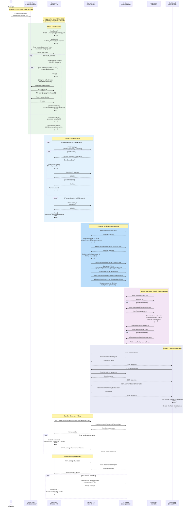

# End-to-End Data Pipeline

This document describes the complete data flow from Claude Code usage on a developer's machine to the dashboard visualization.

## Pipeline Diagram

## Phase 1: Data Collection (be-agent)

The agent runs as a background service, triggered every N minutes by the OS scheduler (launchd on macOS, systemd on Linux).

### Configuration Loading
1. Load `~/.ccusage-agent/config.json` for server URL, email, sync interval, batch sizes
2. Discover Claude paths automatically:
   - `~/.claude/projects` (native Claude Code)
   - `~/.config/claude/projects` (alternative location)
   - `~/.ccs/instances/*/projects` (CCS multi-instance setups)
   - Any extra custom paths from config
3. Load `~/.ccusage-agent/state.json` for file offsets and last sync timestamp

### Incremental File Reading
For each `.jsonl` file discovered via glob pattern:

| Condition | Action |
|-----------|--------|
| No offset in state (new file) | Read entire file from byte 0 |
| Size == offset AND fingerprint matches | Skip (most common path, zero I/O) |
| Size == offset AND fingerprint mismatch | File replaced at same path, reset to 0, re-read all |
| Size > offset AND fingerprint matches | Read from stored offset (append-only, incremental) |
| Size > offset AND fingerprint mismatch | Different file at same path, reset to 0, re-read all |
| Size < offset (truncated) | Reset to 0, re-read entire file |
| Force mode (`--force` flag) | Reset ALL offsets to {}, every file treated as new |

**Fingerprint**: SHA-256 hash of the first 512 bytes of each file. Detects file replacement even when the new file is the same size or larger.

### JSONL Line Processing
Each line is parsed as JSON and classified:
- **Usage entry** (has `message.usage`): Extract requestId, timestamp, model, token counts, costUSD, version
- **User prompt** (type == 'user' with string content): Extract uuid, sessionId, timestamp, project_path, cwd, content
- **Other lines**: Skipped (system messages, summaries, incomplete entries)

### Enrichment
- **Project discovery**: Unique `cwd` paths from JSONL entries are resolved via `git remote get-url origin` (with caching)
- **Cost calculation**: Entries without pre-calculated cost get costs computed from LiteLLM pricing data (fetched and cached for 24 hours)

## Phase 2: Data Push (be-agent to Lambda)

### Batching Strategy
- Usage entries: batched at 1000 per request
- Prompts: batched at 500 per request
- Projects: sent with the first batch

### Request Payload
Each batch includes: email, entries[], projects[], prompts[], hostname, agent_version, local_ip, public_ip

### Retry Logic
| Response | Action |
|----------|--------|
| 200 OK | Success, continue |
| 5xx / Network error | Retry with exponential backoff: 2^n x 1 second, maximum 3 attempts |
| 4xx (client error) | Fail immediately, no retry |

### State Persistence
After sync completes (success or partial failure):
- Save updated file offsets (byte position + SHA-256 fingerprint per file)
- Save last sync timestamp and total synced records
- Prune offsets for deleted files

## Phase 3: Server Processing (Lambda Sync Endpoint)

### Member Resolution
1. Read `members/index.json` with ETag
2. Look up member by email
3. If new: create UUID, add to registry
4. Update lastSyncAt, lastSync metadata (hostname, IPs, user agent, version)
5. Write registry back with ETag check (retry with backoff on conflict)

### Entry Deduplication
Entries are grouped by year-month, then for each month:
1. Load or create `raw/{memberId}/{year}-{month}.json`
2. For each entry, check if request_id already exists in that day's records
3. Skip duplicates, insert new entries into the appropriate DailyRecord
4. Update day-level totals and model breakdowns

### Write Operations
All performed after deduplication:
- `raw/{memberId}/{year}-{month}.json` - Updated raw data
- `aggregated/{memberId}/{year}-{month}.json` - Recomputed monthly aggregation
- `projects/{memberId}.json` - Merged project list (first/last seen tracking)
- `prompts/{memberId}/{year}-{month}.json` - Appended prompt records
- `sync-logs/{year}-{month}/{memberId}.json` - New sync log entry

## Phase 4: View Generation (Aggregator Lambda)

Runs hourly via EventBridge schedule (or on-demand via POST /api/admin/aggregate).

### Processing Strategy
- **Normal mode**: Read from `aggregated/` files (fast, uses pre-computed data)
- **Force mode**: Read from `raw/` files, recompute everything, backfill `aggregated/`
- **Change detection**: Only months with `lastUpdated` newer than previous aggregator run are included

### View Generation (bounded at 10 concurrent S3 operations)
For each member:
1. Fetch all 12 months of aggregations for current year (and previous year if applicable)
2. Read projects, prompt counts, and sync logs

Generate three view types:
- `views/dashboard.json` - Team totals, cost change %, daily trend (30 days), top 10 members, model distribution, recent 20 syncs
- `views/members.json` - All members with current/previous month comparison, sorted by cost
- `views/members/{memberId}/{year}.json` - 12-month breakdown with daily usage, model/project breakdowns, project list, prompt counts

Update `meta/last-processed.json` with processing timestamp and statistics.

## Phase 5: Dashboard Display

### Data Fetching
- TanStack Query with 5-minute stale time and 30-minute garbage collection
- Automatic deduplication of concurrent requests via query keys
- Retry: 3 attempts for 5xx errors, no retry for 4xx

### Response Adaptation
An adapter layer transparently handles differences between Lambda API format (identified by `generatedAt` field) and legacy PostgreSQL format, decoupling the frontend from backend changes.

### Rendering
- Recharts library for all chart visualizations
- Four chart types: line chart (cost trends), pie chart (model distribution), treemap (member/model costs), stacked bar chart (daily model usage)
- Calendar heatmap for activity visualization
- Responsive design with mobile-first Tailwind utilities
