# API Reference

All endpoints are served through API Gateway at `https://{api-id}.execute-api.ap-southeast-1.amazonaws.com`. Most endpoints are public; only `GET /api/auth/me` requires a Bearer token.

## API Routes Overview

## Sync API

### POST /api/sync
**Purpose**: Receive usage data from be-agent

**Request Body**:
| Field | Type | Required | Description |
|-------|------|----------|-------------|
| email | string | Yes | Member email address |
| name | string | No | Display name |
| entries | SyncRequestEntry[] | Yes | Usage records |
| projects | SyncRequestProject[] | No | Project tracking data |
| prompts | SyncRequestPrompt[] | No | Prompt audit records |
| hostname | string | No | Device hostname |
| agent_version | string | No | Agent version string |
| local_ip | string | No | Device local IP |
| public_ip | string | No | Device public IP |

**Response**: `{ success: true, inserted: number, skipped: number, memberId: string }`

**Processing**: Validates schema, resolves/creates member (ETag concurrency), deduplicates by request_id, stores raw + aggregated + projects + prompts + sync-logs to S3.

## Dashboard API

### GET /api/dashboard
**Purpose**: Team-wide summary statistics (pre-computed from `views/dashboard.json`)

**Response**: Summary (totalCost, members, avgCost), costChangePercent, dailyTrend (30 days), topMembers (10), modelDistribution, recentSyncs (20)

### GET /api/dashboard/model-distribution
**Purpose**: Model usage breakdown (subset of dashboard)

**Response**: Array of { model, costUsd, percentage }

### GET /api/dashboard/meta
**Purpose**: Aggregator processing metadata

**Response**: { lastProcessedAt, lastProcessingDurationMs, membersProcessed, viewsGenerated }

## Members API

### GET /api/members
**Purpose**: Member list with month-over-month comparison (pre-computed from `views/members.json`)

**Response**: teamTotals, members[] with currentMonth/previousMonth stats and costChangePercent

### GET /api/members/:id
**Purpose**: Member yearly detail (pre-computed from `views/members/{id}/{year}.json`)

**Query Parameters**: `year` (number, default: current year, range: 2024 to current+1)

**Response**: Member info, 12 monthly breakdowns (totals, dailyUsage, dailyModelUsage, modelBreakdown, projectBreakdown), recentSyncs, projects, promptStats

### GET /api/members/:id/raw
**Purpose**: Raw usage records for detailed inspection

**Query Parameters**: `year`, `month` (defaults to current)

**Response**: Records keyed by date, each with totals, model breakdown, and individual entries

## Agent API

### GET /api/agent/version
**Purpose**: Latest agent release info with presigned download URL

**Response**: `{ version, filename, downloadUrl }` (downloadUrl is a 10-minute presigned S3 URL)

### GET /api/agent/commands
**Purpose**: Poll pending admin commands

**Query Parameters**: `email` (required)

**Response**: `{ commands: [{ id, type, payload, createdAt, status }] }` (filtered to pending only)

### POST /api/agent/commands/:commandId/ack
**Purpose**: Acknowledge command execution

**Request Body**: `{ email, status: 'acked'|'failed', result? }`

**Response**: `{ success: true }`

## Admin API

### POST /api/admin/aggregate
**Purpose**: Trigger aggregator Lambda

**Query Parameters**: `force` (boolean) - if true, rebuild from raw data

**Response**: Processing stats including membersProcessed, viewsGenerated, durationMs

### GET /api/admin/status
**Purpose**: System configuration info

**Response**: `{ environment, bucket, region, aggregatorFunction }`

### POST /api/admin/commands
**Purpose**: Create command for an agent

**Request Body**: `{ email, type, payload?, created_by? }`

**Command Types**: revoke-token, force-sync, update-config, custom

### GET /api/admin/commands/:memberId
**Purpose**: View command history for a member

## Auth API

### POST /api/auth/login
**Purpose**: Authenticate with credentials

**Request Body**: `{ email, password }`

**Response**: `{ accessToken (60min JWT), refreshToken (20day JWT), user: { email, name, role } }`

### POST /api/auth/refresh
**Purpose**: Exchange refresh token for new token pair

**Request Body**: `{ refreshToken }`

**Response**: New `{ accessToken, refreshToken }` pair

### POST /api/auth/logout
**Purpose**: Server-side logout (no-op, client clears tokens)

### GET /api/auth/me (Protected)
**Purpose**: Get current user from JWT

**Headers**: `Authorization: Bearer {accessToken}`

**Response**: `{ user: { email, name, role } }`

## Register API (Ephemeral)

In-memory store that persists across warm Lambda invocations but resets on cold start.

### GET /api/register
List all items

### PUT /api/register
Replace entire list

### GET /api/register/link?email=...
Get link for email

### POST /api/register/update
Update item by data field
