# Agent Lifecycle

The be-agent is a Node.js CLI tool that manages the full lifecycle of usage data collection on developer machines.

## Lifecycle Diagram

## Setup Phase

### Initial Installation
The agent is distributed as a `.tgz` tarball. The server URL is baked in at build time via tsup's environment injection, making the `--server` flag optional during setup.

### Configuration
Setup creates `~/.ccusage-agent/config.json` with:
- server_url (from built-in or --server flag)
- email (required)
- sync_interval_minutes (default: 5)
- max_batch_size (default: 1000)
- retry_attempts (default: 3)
- extra_claude_paths (optional custom paths)
- prompt_sync_interval_hours (default: 24)

### Path Discovery
Automatically finds Claude Code data directories:
1. `~/.config/claude/projects` (native, preferred)
2. `~/.claude/projects` (native, alternative)
3. `~/.ccs/instances/*/projects` (CCS multi-instance setups)
4. Any extra paths from config

### OS Service Installation
- **macOS**: Creates `~/Library/LaunchAgents/com.ccusage.agent.plist` (launchd)
  - RunAtLoad: starts on login
  - StartInterval: runs every N seconds
- **Linux**: Creates `~/.config/systemd/user/ccusage-agent.service` + timer
  - User-level service (no root required)
  - Timer triggers every N minutes

## Sync Cycle

Runs automatically via OS scheduler or manually via `ccusage-agent sync`.

### Step 1: Load Configuration
Load config from disk, discover Claude paths at runtime.

### Step 2: Load State
Load state from `~/.ccusage-agent/state.json`:
- file_offsets: per-file byte position + SHA-256 fingerprint
- last_sync_timestamp
- total_synced_records
- last_prompt_sync_timestamp
- JWT tokens (access_token, refresh_token)

### Step 3: Collect Data
For each `.jsonl` file in discovered paths:
1. Prune stale offsets (deleted files removed from state)
2. Check file against stored offset + fingerprint
3. Read only new bytes (or full file if new/replaced/truncated)
4. Parse each JSONL line for usage entries and prompts
5. Collect unique `cwd` paths for project discovery
6. Resolve git remotes via `git remote get-url origin` (cached)
7. Calculate costs via LiteLLM pricing (cached 24h)

### Step 4: Push Data
If new data exists:
1. Get device's public IP (best-effort, 3-second timeout)
2. Batch entries at 1000 per request, prompts at 500 per request
3. Send POST /api/sync with email, entries, projects, prompts, hostname, IPs
4. Handle responses: 200 → success, 5xx → retry with exponential backoff, 4xx → fail

### Step 5: Save State
Update file offsets with new byte positions and fingerprints. Record sync timestamp and counts.

### Step 6: Poll Commands
Check for admin commands via GET /api/agent/commands?email=...
Execute any pending commands and ACK back.

## Manual Sync

`ccusage-agent sync` runs a single sync cycle immediately.

`ccusage-agent sync --force` resets all file offsets to empty, causing every file to be re-read from the beginning. Useful for recovering from corrupted state or ensuring completeness.

## Update Flow

`ccusage-agent update` performs self-update:

1. GET /api/agent/version → returns latest version + presigned download URL
2. Compare remote version against local version (semver comparison)
3. If newer: download `.tgz` via presigned S3 URL (10-minute expiry)
4. Run `npm install -g ./downloaded.tgz`
5. Re-run setup to update OS service configuration
6. Run sync --force to catch any data that may have been missed

`ccusage-agent update --force` skips version comparison and always re-downloads.

## Command Execution

The agent polls for commands during each sync cycle:

| Command Type | Action |
|-------------|--------|
| revoke-token | Delete stored JWT credentials from state |
| force-sync | Flag next cycle to run with all offsets reset |
| update-config | Merge provided payload into config.json |
| custom | Log and acknowledge |

After execution, the agent sends POST /api/agent/commands/:id/ack with status (acked/failed) and optional result message.

## State Management

### v1 to v2 Migration
The agent migrated from tracking individual request IDs (v1) to per-file byte offsets (v2). During migration:
1. Detect v1 state (no version field or version != 2)
2. Build initial offsets from current file sizes (existing data assumed synced)
3. Write migrated state immediately to prevent re-migration

### File Offset Tracking
Each file tracks three values:
- **byteOffset**: Position of last read byte (resume reading from here)
- **lastModified**: ISO timestamp of file mtime when last read
- **fingerprint**: SHA-256 hash of first 512 bytes (detects file replacement)

## CLI Commands Summary

| Command | Purpose |
|---------|---------|
| `ccusage-agent setup --email X` | Initial setup with config + OS service |
| `ccusage-agent sync` | Run one sync cycle |
| `ccusage-agent sync --force` | Full re-read of all files |
| `ccusage-agent status` | Show config, daemon status, sync state |
| `ccusage-agent update` | Auto-update from S3 releases |
| `ccusage-agent update --force` | Force re-download |
| `ccusage-agent uninstall` | Remove OS auto-start service |
