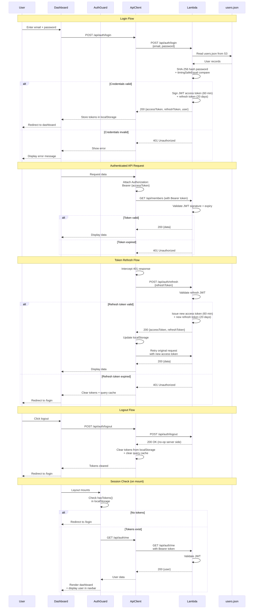

# Dashboard Architecture

The dashboard is a Next.js 15 single-page application using React 19, deployed as a static export to S3 + CloudFront.

## Component Architecture

## Technology Stack

| Category | Technology |
|----------|-----------|
| Framework | Next.js 15.1 (App Router, static export) |
| UI Library | React 19 |
| Language | TypeScript 5.7 |
| Styling | Tailwind CSS 4 |
| UI Components | Radix UI primitives |
| Charts | Recharts 2.15 |
| Server State | TanStack Query 5 |
| UI State | Zustand 5 |
| Forms | react-hook-form + Zod validation |
| Icons | lucide-react |
| 3D Graphics | Three.js + @react-three/fiber |

## Page Structure

### Dashboard Page (`/`)
Team usage overview with four stat cards (Total Cost, Total Tokens, Active Members, Avg Cost/Member). Charts section shows daily cost trend (line chart) and toggles between member cost treemap and model distribution pie chart.

### Members Page (`/members`)
Compact stats bar with team metrics. Three view modes switchable via toggle:
- **Ranking**: Ordered list with medal badges for top 3, progress bars showing relative usage
- **Cards**: Grid layout of member cards with last sync info
- **Chart**: Treemap visualization of member cost distribution

Clicking a member opens a slide-over detail panel (DataSheet) with:
- Year-to-date stats
- Monthly selector with charts (daily trend, model distribution, daily model usage by token type)
- Usage heatmap calendar
- Models used tag list

Supports shareable URLs: `/members?detail=X` auto-opens the detail panel for member X.

### Reports Page (`/reports`)
Placeholder with daily and monthly report card options. Export functionality planned.

### Playground (`/playground/*`)
Three.js experimental visualizations: city scene, mascot, usage meter, planets, podium ranking, token rain.

## Authentication Flow

### Token Management
- Access token (60-minute expiry) stored in localStorage as `ccusage-access-token`
- Refresh token (20-day expiry) stored as `ccusage-refresh-token`
- Automatic token refresh on 401 responses (deduplicates concurrent refresh attempts)
- AuthGuard component wraps all dashboard routes, redirecting to `/login` if no tokens

### Login
Email + password form with Zod schema validation. On success, stores JWT tokens and navigates to dashboard. On failure, displays error message.

### Session
`useSession()` hook calls GET /api/auth/me on mount (only if tokens exist). User info displayed in navbar with role badge.

## State Management

### Server State (TanStack Query)
| Query Key | Endpoint | Stale Time |
|-----------|----------|-----------|
| dashboard.stats | GET /api/dashboard | 5 minutes |
| dashboard.modelDistribution | GET /api/dashboard/model-distribution | 5 minutes |
| members.list | GET /api/members | 5 minutes |
| members.detail(id, year) | GET /api/members/:id | 5 minutes |
| auth.session | GET /api/auth/me | 5 minutes |

Configuration: 30-minute garbage collection, no refetch on window focus, 3 retries for 5xx errors only.

### UI State (Zustand)
- `sidebarOpen`: Sidebar collapsed/expanded (persisted to localStorage)
- `dateRange`: Optional date range filter (not persisted)

## API Integration

### Client Architecture
Custom `ApiClient` class handles:
- Automatic Bearer token attachment
- Query parameter serialization
- 401 detection and automatic token refresh
- Custom `ApiError` class with status detection helpers (isUnauthorized, isForbidden, isNotFound, isServerError)

### Dual API Support
The adapter layer transparently handles two API formats:
- **Lambda API** (current): Detected by `generatedAt` field in response
- **Legacy PostgreSQL API** (deprecated): Normalized with number coercion

Adapter functions: `adaptDashboardResponse()`, `adaptMembersResponse()`, `adaptMemberDetailResponse()`

## Chart Components

| Chart | Type | Library | Data Source |
|-------|------|---------|------------|
| Usage Trend | Line chart | Recharts | Daily cost points |
| Model Distribution | Donut pie chart | Recharts | Model cost breakdown |
| Cost Treemap | Treemap | Recharts | Member or model hierarchical costs |
| Daily Model Usage | Stacked bar chart | Recharts | Daily per-model token usage |
| Usage Heatmap | Calendar grid | Custom | Daily activity with color intensity |

**Model Colors**: Opus (#8b5cf6 purple), Sonnet (#3b82f6 blue), Haiku (#10b981 green)

## Layout Structure

### Root Layout
- Global fonts (Inter for body, JetBrains Mono for code)
- Theme anti-FOUC script (prevents flash of wrong theme)
- QueryClient + ThemeProvider wrappers

### Dashboard Layout
- AuthGuard wrapper (token check + redirect)
- Collapsible sidebar with navigation (Dashboard, Members, Reports, Playground, Settings)
- Navbar with user info, logout button, theme toggle

### Auth Layout
- Centered card layout for login form

## Responsive Design
- Mobile-first Tailwind utilities throughout
- Stats bar supports hideOnMobile and hideOnTablet props
- Sidebar auto-collapses on smaller screens
- All charts use ResponsiveContainer for fluid sizing
- Semantic HTML with ARIA labels for accessibility
