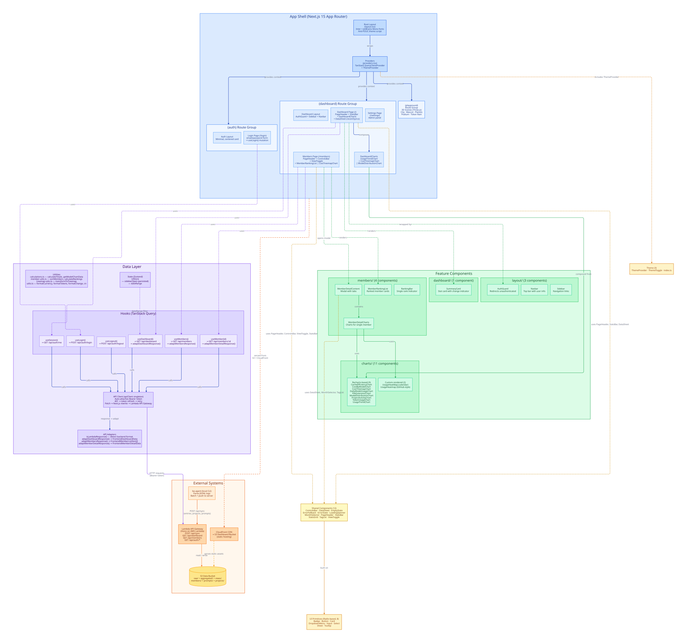
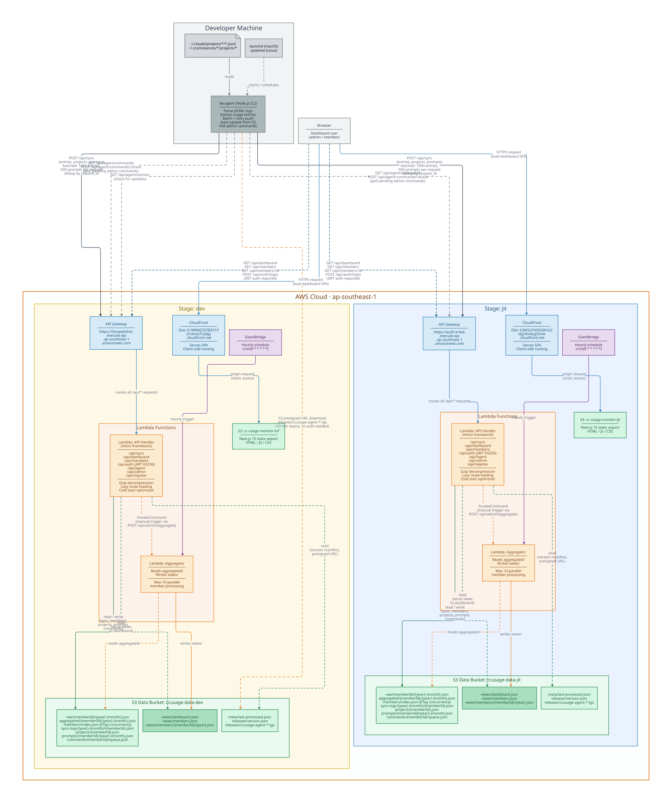
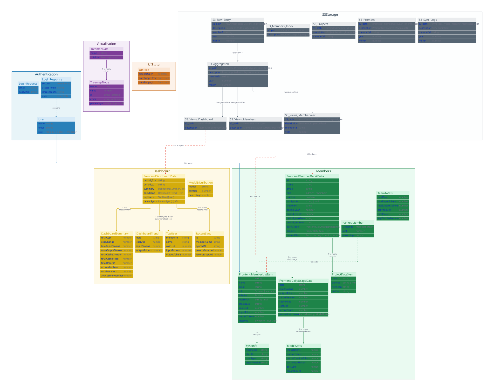
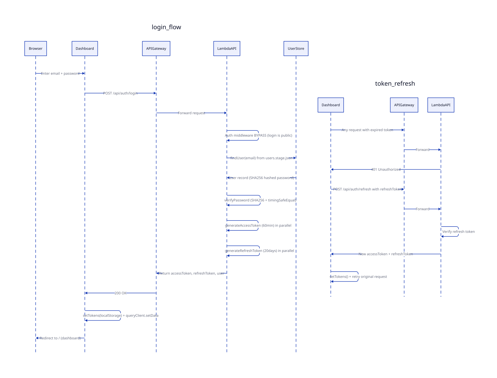
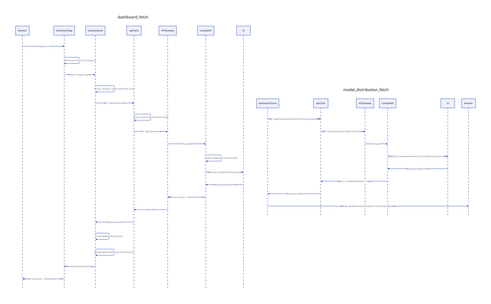
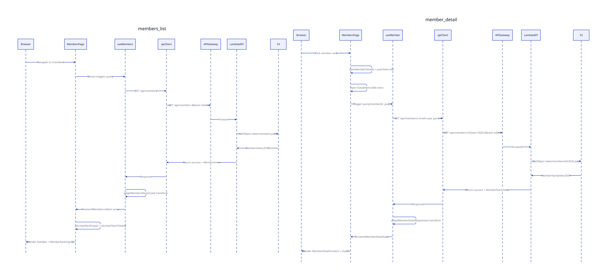
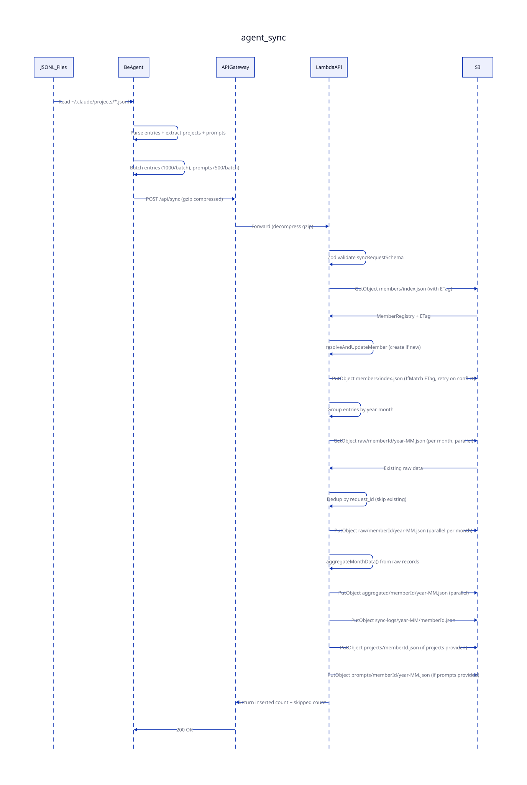
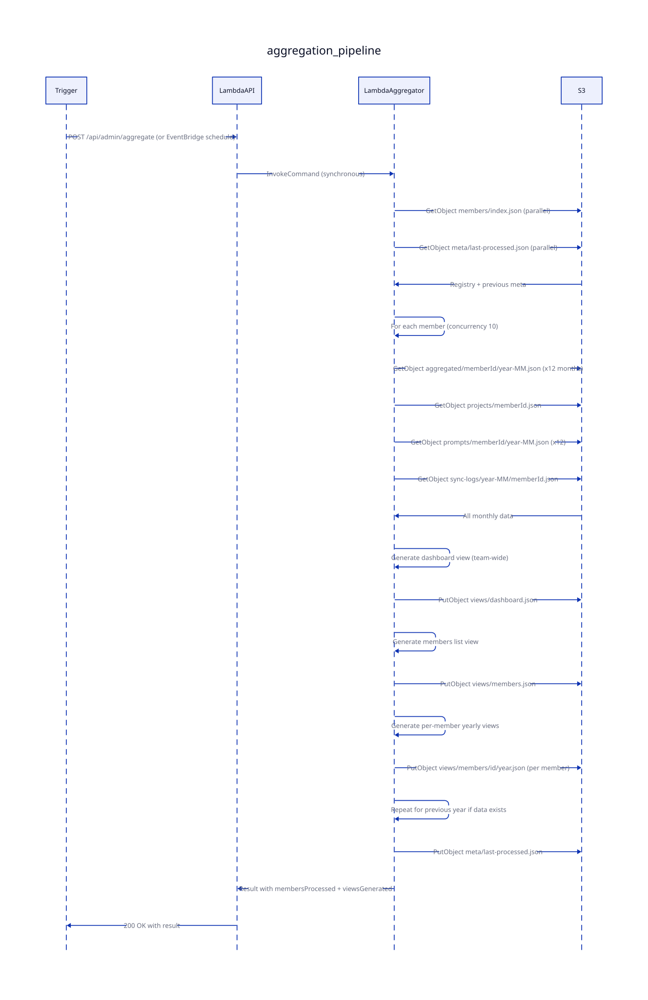
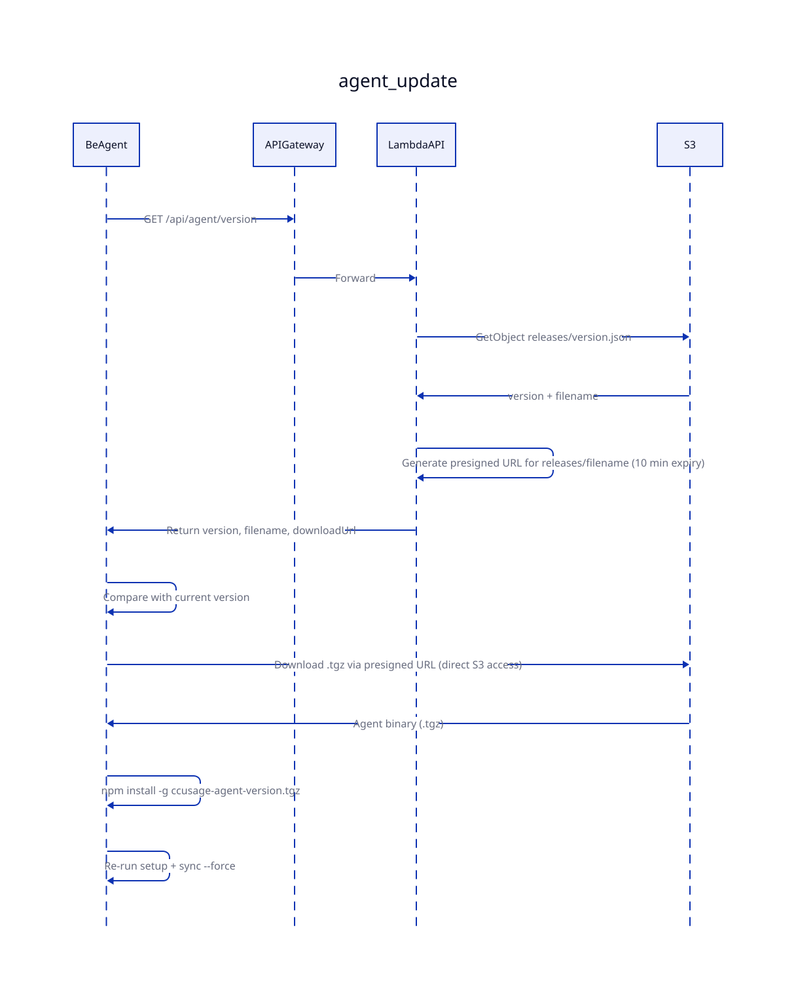
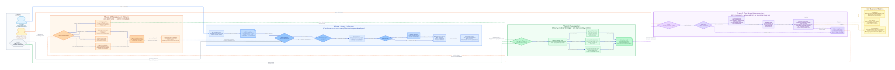

# CCUsage Monitor — Dashboard Widget Components (Exhaustive Scan)

> Exhaustive documentation of the Next.js 15 dashboard SPA: all widget components, data layer, API contracts, sequence diagrams, and business flow.
>
> Generated: 2026-04-10

---

## Table of Contents

1. [Overview Architecture](#1-overview-architecture)
2. [Infrastructure](#2-infrastructure)
3. [Entity-Relationship Diagram](#3-entity-relationship-diagram)
4. [Component Inventory](#4-component-inventory)
5. [Data Layer](#5-data-layer)
6. [API Contracts](#6-api-contracts)
7. [Sequence Diagrams](#7-sequence-diagrams)
8. [Business Flow](#8-business-flow)
9. [Diagram Index](#9-diagram-index)

---

## 1. Overview Architecture



The CCUsage Monitor dashboard is a **Next.js 15 static export SPA** hosted on AWS CloudFront. It follows a layered component architecture with 78 source files.

### Tech Stack

| Layer | Technology |
|-------|-----------|
| Framework | Next.js 15 (App Router, static export) |
| UI Primitives | Radix UI (Dialog, Select, Tooltip, DropdownMenu) |
| Styling | Tailwind CSS 4 + CVA (class-variance-authority) |
| Charts | Recharts 2.15 (BarChart, LineChart, PieChart, AreaChart, Treemap) + Custom calendar heatmaps |
| Server State | TanStack Query 5 (5min stale, 30min GC, retry on 5xx only) |
| Client State | Zustand 5 (persisted sidebar toggle) |
| Forms | react-hook-form 7 + Zod 3 |
| 3D Scenes | Three.js 0.182 + React Three Fiber 9 (playground only) |
| HTTP Client | Custom ApiClient singleton with JWT auto-refresh |
| Icons | Lucide React |

### Component Hierarchy

```
RootLayout
  Providers (QueryClient + ThemeProvider)
    (auth) AuthLayout
      LoginPage — email/password form (react-hook-form + zod)
    (dashboard) DashboardLayout
      AuthGuard — redirects if !hasTokens()
      Sidebar — collapsible nav (Zustand persisted)
      Navbar — user info + ThemeToggle + logout
      main#main-content
        DashboardPage (/)
          PageHeader
          StatsGrid (4 stat cards)
          DashboardCharts
            UsageTrendChart (LineChart)
            ViewToggle (treemap | pie)
            CostTreemapChart OR ModelDistributionChart
        MembersPage (/members)
          PageHeader
          StatsBar (team totals)
          ControlsBar (ViewToggle + sort Select)
          MemberRankingList + RankingBar  OR  CostTreemapChart
          DataSheet (slide-over panel)
            MemberDetailContent
              StatsBar (YTD)
              TagList (models used)
              MemberDetailCharts
                UsageHeatMap (monthly calendar)
                UsageTrendChart
                ModelDistributionChart
                DailyModelUsageChart
                FileExtensionChart
                ProjectActivityChart (admin only)
        SettingsPage (/settings) — placeholder
    (playground) — 3D scenes (Three.js)
```

### Layer Architecture

| Layer | Components | Count | Responsibility |
|-------|-----------|-------|---------------|
| **Pages** | App Router pages | 6 | Route handling, data fetching, composition |
| **Feature Components** | charts/, members/, dashboard/ | 16 | Domain-specific visualization and interaction |
| **Shared Components** | shared/ | 12 | Reusable patterns (headers, bars, loaders, toggles) |
| **UI Primitives** | ui/ | 8 | Radix-based low-level components |
| **Theme** | theme/ | 3 | Dark/light/system theme management |
| **Data Layer** | hooks/, lib/, stores/ | 13 | API communication, state management, utilities |
| **Types** | types/ | 2 | TypeScript interfaces |

---

## 2. Infrastructure



### AWS Resources (Region: ap-southeast-1)

| Resource | Dev Stage | Jit Stage |
|----------|-----------|-----------|
| Lambda API URL | `5kvqadz4mc.execute-api...` | `eu9i1zr4x6.execute-api...` |
| S3 Data Bucket | `ccusage-data-dev` | `ccusage-data-jit` |
| S3 Dashboard Bucket | `cc-usage-monitor-tvf` | `cc-usage-monitor-jit` |
| CloudFront Domain | `d1ohuii7czj4jp.cloudfront.net` | `dg2i6v0xgt3mw.cloudfront.net` |

### Three-Layer S3 Architecture

| Layer | Path Pattern | Purpose | Writer |
|-------|-------------|---------|--------|
| Raw | `raw/{memberId}/{year}-{month}.json` | Source of truth entries | Sync endpoint |
| Aggregated | `aggregated/{memberId}/{year}-{month}.json` | Pre-computed summaries | Sync endpoint |
| Views | `views/dashboard.json`, `views/members.json`, `views/members/{id}/{year}.json` | Dashboard-ready JSON | Aggregator Lambda |

Each layer can be rebuilt from the one above: `raw/ -> aggregated/ -> views/`

### Lambda Functions (per stage)

| Function | Trigger | Responsibility |
|----------|---------|---------------|
| `ccusage-monitor-{stage}-api` | API Gateway | HTTP routing, JWT auth, sync, serve views |
| `ccusage-monitor-{stage}-aggregator` | EventBridge (hourly) + manual | Read aggregated -> generate views |

---

## 3. Entity-Relationship Diagram



### Domain Model Summary

#### Authentication Domain
- **User** — `{name, email, role: 'admin'|'agent'|'member'}`, stored in stage-specific JSON, SHA256 hashed passwords
- **JWT Tokens** — HS256, access (60min), refresh (20 days), payload: `{email, name, role, type, iat, exp}`

#### Dashboard Domain
- **FrontendDashboardData** — period, summary (10 metrics), dailyTrend[], topUsers[], recentSyncs[]
- **DashboardSummary** — totalCost, costChange, totalInput/OutputTokens, totalCacheCreation/Read, totalRecords, activeMembers, totalMembers, avgCostPerMember

#### Member Domain
- **FrontendMemberListItem** — id, name, email, role, isActive, lastSyncAt, createdAt, costUsd, inputTokens, outputTokens, lastSync (hostname, clientIp, userAgent, agentVersion)
- **FrontendMemberDetailData** — member info + period + dailyUsage[] + projects[] + promptStats
- **FrontendDailyUsageData** — date, tokens (in/out/cache), costUsd, recordCount, modelBreakdown: Record<model, ModelStats>
- **ModelStats** — inputTokens, outputTokens, cacheCreationTokens, cacheReadTokens, costUsd, recordCount
- **ProjectDataItem** — path, gitRepo, firstSeen, lastSeen
- **RankedMember** — extends member with rank (1-indexed) + percentage (relative to max)
- **TeamTotals** — totalCost, totalInput/OutputTokens, activeCount, totalCount, avgCostPerMember

#### Visualization Domain
- **TreemapData** — `{name: 'root', children: TreemapNode[]}`
- **TreemapNode** — name, value, id?, email?, percentage?

#### S3 Storage (Backend Types)
- **RawMonthlyData** (`raw/`) — memberId, year, month, lastUpdated, records: Record<date, DailyRecord>
- **DailyRecord** — date, updatedAt, totals, models: Record<model, ModelStats>, entries: UsageEntry[]
- **UsageEntry** — requestId, timestamp, model, projectPath, sessionId, tokens (in/out/cache), costUsd, claudeVersion, fileExtensions
- **MonthAggregation** (`aggregated/`) — totals, dailyUsage[], dailyModelUsage[], modelBreakdown{}, projectBreakdown{}, extensionBreakdown{}
- **MemberRegistry** (`members/index.json`) — version, lastUpdated, members: Record<memberId, MemberInfo>
- **MemberInfo** — id, name, email, role, isActive, createdAt, updatedAt, lastSyncAt, lastSync

---

## 4. Component Inventory

### 4.1 Chart Components (11)

| Component | File | Chart Type | Height | Key Data Fields | State |
|-----------|------|-----------|--------|-----------------|-------|
| `CacheEfficiencyChart` | `charts/cache-efficiency-chart.tsx` | Recharts AreaChart (stacked) | 250px | date, cacheCreationTokens, cacheReadTokens | None |
| `CostByModelChart` | `charts/cost-by-model-chart.tsx` | Recharts BarChart (horizontal) | 200px | model, costUsd | None |
| `CostTreemapChart` | `charts/cost-treemap-chart.tsx` | Recharts Treemap | 300px | TreemapNode (name, value, percentage) | None |
| `DailyModelUsageChart` | `charts/daily-model-usage-chart.tsx` | Recharts BarChart (stacked) | 300px | date, models[].model/inputTokens/outputTokens | `tokenType: input\|output\|both` |
| `FileExtensionChart` | `charts/file-extension-chart.tsx` | Recharts BarChart (horizontal) | Dynamic | language, operationCount, percentage? | None |
| `ModelDistributionChart` | `charts/model-distribution-chart.tsx` | Recharts PieChart (donut) | 300px | model, costUsd, percentage | None |
| `ProjectActivityChart` | `charts/project-activity-chart.tsx` | Recharts BarChart (horizontal) | Dynamic | project, requestCount | None |
| `TokenUsageChart` | `charts/token-usage-chart.tsx` | Recharts BarChart (stacked) | 300px | date, inputTokens, outputTokens | None |
| `UsageHeatMap` | `charts/usage-heat-map.tsx` | Custom calendar grid | Dynamic | date, costUsd, inputTokens, outputTokens, recordCount | `metric: cost\|tokens\|requests` |
| `UsageHeatmap` | `charts/usage-heatmap.tsx` | Custom GitHub-style grid | Dynamic | date, costUsd | None |
| `UsageTrendChart` | `charts/usage-trend-chart.tsx` | Recharts LineChart | 300px | date, costUsd | None |

#### Chart Component Details

**CacheEfficiencyChart** — Two stacked areas showing cache creation vs read tokens over time. Header displays computed efficiency percentage (totalRead/totalCreation * 100). Colors: chart-3 (creation), chart-5 (read).

**CostByModelChart** — Horizontal bars ranked by model cost. Normalizes model names to "Opus", "Sonnet", "Haiku". Header shows total cost sum. 5-color palette cycling.

**CostTreemapChart** — Interactive treemap with custom content renderer. Supports 3 metrics (costUsd, inputTokens, outputTokens). Cell labels auto-truncate based on available width. Empty state handled. Click handler passes TreemapNode to parent.

**DailyModelUsageChart** — Stacked bars per day, one segment per AI model family. Select dropdown toggles between input/output/both tokens. Dynamic model discovery from data. Fixed colors: Opus=#8b5cf6, Sonnet=#3b82f6, Haiku=#10b981.

**FileExtensionChart** — Horizontal bars showing file language activity. "Conversation" entries rendered in muted color at 50% opacity. Bars fade with rank (6% per position). Dynamic height: 36px per row.

**ModelDistributionChart** — Donut pie chart with inline labels showing "Model (X%)". Model-specific colors with fallback to chart CSS variables. Labels use formatted short model names.

**ProjectActivityChart** — Horizontal bars for top 10 projects by request count. Path labels show last 2 segments (e.g., "my-org/my-app"). Bars fade 7% per rank position.

**TokenUsageChart** — Stacked vertical bars: input tokens below, output tokens on top (rounded top corners). Header shows total input/output counts.

**UsageHeatMap** — Monthly calendar grid (Mon-Sun columns). 6 heat levels with absolute thresholds for requests (0, <40, <100, <=300, <=1000, >1000) and relative for cost/tokens. Star badges (1-4 stars) for high-activity days (>2k/3k/4k/5k requests). Metric selector: Cost ($), Tokens, Requests.

**UsageHeatmap** — GitHub contribution graph spanning configurable months (default 12). Horizontal scroll, 10x10px cells. 5 heat levels (relative to max). Shows total cost + active day count in header.

**UsageTrendChart** — Simple monotone line chart of daily cost. No dot markers, active dot on hover.

#### Color Palette

| Context | Colors |
|---------|--------|
| Model-specific | Opus: `#8b5cf6` (violet), Sonnet: `#3b82f6` (blue), Haiku: `#10b981` (emerald) |
| Chart CSS vars | `hsl(var(--chart-1))` through `hsl(var(--chart-6))` |
| Heatmap levels | emerald-100 through emerald-600 (5 levels) + purple-600 (extreme) |
| Rankings | gold (#EAB308), silver (#9CA3AF), bronze (#D97706), primary/60 (others) |

### 4.2 Dashboard Composer: DashboardCharts

Located at `app/(dashboard)/dashboard-charts.tsx`, this component orchestrates chart rendering on the main dashboard page.

**Data sources:**
- `useDashboard()` -> dailyTrend for UsageTrendChart
- `useMembers()` -> member list for CostTreemapChart
- `useQuery(queryKeys.dashboard.modelDistribution())` -> model data for ModelDistributionChart

**Layout:** 2-column grid. Left: UsageTrendChart. Right: ViewToggle (treemap/pie) + conditional chart.

**State:** `chartView: 'treemap' | 'pie'` toggles between CostTreemapChart and ModelDistributionChart.

### 4.3 Member Components (4)

**MemberDetailCharts** (`members/member-detail-charts.tsx`)
- Props: memberId, selectedYear, selectedMonth, onYearChange, onMonthChange, projects?
- Fetches its own data via `useQuery(queryKeys.members.yearlyRaw(memberId, year))`
- Renders: UsageHeatMap, UsageTrendChart, ModelDistributionChart, DailyModelUsageChart, FileExtensionChart, ProjectActivityChart (admin-only)
- Internal logic: `normalizeModelFamily()` maps full model names to Opus/Sonnet/Haiku
- Year/month selection via inline button grids

**MemberDetailContent** (`members/member-detail-content.tsx`)
- Props: memberId
- Owns year/month state, delegates charting to MemberDetailCharts
- Uses `useMember(memberId)` for overview data
- Renders: StatsBar (YTD), TagList (models used), MemberDetailCharts

**MemberRankingList** (`members/member-ranking-list.tsx`)
- Props: members (RankedMember[]), sortField, onMemberClick?
- Renders ranked list with medals (top 3 emoji), names, formatted values, RankingBar
- `formatValue()` switches display format based on sortField
- `getBarColor()` maps rank to color (gold/silver/bronze/primary)

**RankingBar** (`members/ranking-bar.tsx`)
- Props: percentage, className?, barClassName?
- Accessible progress bar (`role="progressbar"`, aria attributes)
- Width clamped to 0-100%

### 4.4 Layout Components (3)

**AuthGuard** — `useEffect` checks `hasTokens()` from localStorage. Redirects to `/login` via `router.replace` if false. Shows "Loading..." until check completes.

**Navbar** — Uses `useSession()` for user info, `useLogout()` mutation for sign-out. Renders app title, user name + role badge, ThemeToggle, logout button.

**Sidebar** — Collapsible left navigation (w-16 collapsed, w-64 expanded). State from Zustand `useUIStore.sidebarOpen` (persisted to localStorage). Routes: Dashboard (/), Members (/members), Playground (/playground), Settings (/settings). Active route detection via `usePathname()`.

### 4.5 Shared Components (12)

| Component | Key Props | Role |
|-----------|----------|------|
| `ControlsBar` | left, right slots | Flexbox toolbar wrapper for page controls |
| `DataSheet` | open, onClose, title, size (sm/md/lg/xl/full) | Right slide-over panel wrapping Radix Sheet |
| `EmptyState` | message, icon, action | Centered "No data" placeholder |
| `ErrorFallback` | error (Error), onRetry | Card-wrapped error; maps ApiError status to messages |
| `ErrorState` | message, onRetry | Inline error with retry button |
| `LoadingSpinner` | size (sm/md/lg) | Animated border spinner + `PageLoader` full-page variant |
| `MonthSelector` | year, month, callbacks | 4-column month grid with year navigation |
| `PageHeader` | title, description, backHref, actions | Standardized page heading with optional back link |
| `StatsBar` | stats: StatItem[] | Compact inline label:value pairs with responsive hiding |
| `StatsGrid` | stats: StatCardItem[], columns (2/3/4) | Grid of stat cards with change trend indicators |
| `TagList` | items: string[] | Badge chip list for model names |
| `ViewToggle` | options, value, onChange, size | Segmented control (`role="tablist"`) for view switching |

### 4.6 UI Primitives (8)

All are thin wrappers around Radix UI with Tailwind CSS styling:

| Component | Base Library | Variants |
|-----------|-------------|----------|
| `Badge` | HTMLDivElement + CVA | default, secondary, destructive, outline |
| `Button` | HTMLButtonElement + CVA + Radix Slot | 6 variants (default, destructive, outline, secondary, ghost, link) x 4 sizes (default, sm, lg, icon). Supports `asChild` polymorphism. |
| `Card` | HTMLDivElement | Card, CardHeader, CardTitle, CardDescription, CardContent, CardFooter |
| `DropdownMenu` | @radix-ui/react-dropdown-menu | Root, Trigger, Content (portal), Item (with inset) |
| `Input` | HTMLInputElement | Standard text input with focus ring |
| `Select` | @radix-ui/react-select | Full select with portal, scroll buttons, check indicator |
| `Sheet` | @radix-ui/react-dialog | Slide-over panel (top/bottom/left/right) with overlay + close button |
| `Tooltip` | @radix-ui/react-tooltip | Provider, Root, Trigger, Content (portal) with animations |

### 4.7 Theme System (3)

**ThemeProvider** — React context wrapping entire app. Stores theme in localStorage (`ccusage-theme`). Supports light/dark/system. Inline script in RootLayout prevents FOUC. Listens to `prefers-color-scheme` media query for system mode.

**ThemeToggle** — Dropdown menu (Moon/Sun/Monitor icons) triggering `setTheme()`. Shows Moon when dark, Sun when light.

### 4.8 App Pages (6)

| Route | Page | Auth | Components Used |
|-------|------|------|----------------|
| `/login` | LoginPage | Public | Card, Input, Button, react-hook-form + zod validation |
| `/` | DashboardPage | Required | PageHeader, StatsGrid (4 cards), DashboardCharts |
| `/members` | MembersPage | Required | PageHeader, StatsBar, ControlsBar, ViewToggle, MemberRankingList OR CostTreemapChart, DataSheet + MemberDetailContent |
| `/settings` | SettingsPage | Required | PageHeader only (placeholder) |
| `/playground/*` | Playground scenes | Required | Three.js 3D scenes (city, mascot, planets, podium, tokens, meter) |
| Error/404 | Error boundaries | N/A | Card-based error display with retry |

---

## 5. Data Layer

### 5.1 Hooks (TanStack Query)

| Hook | Query Key | Endpoint | Returns | Stale Time |
|------|----------|----------|---------|-----------|
| `useSession()` | `['auth', 'session']` | `GET /api/auth/me` | `User {name, email, role}` | 5 min |
| `useLogin()` | Mutation | `POST /api/auth/login` | `LoginResponse` | N/A |
| `useLogout()` | Mutation | `POST /api/auth/logout` | void | N/A |
| `useDashboard(range?)` | `['dashboard', 'stats', range]` | `GET /api/dashboard` | `FrontendDashboardData` | 5 min |
| `useMembers(filters?)` | `['members', 'list', filters]` | `GET /api/members` | `FrontendMemberListItem[]` | 5 min |
| `useMember(id, year?)` | `['members', 'detail', id, year]` | `GET /api/members/:id?year=` | `FrontendMemberDetailData` | 5 min |
| `useMemberUsage(id, range?)` | `['members', 'detail', id, 'usage', range]` | `GET /api/members/:id/usage` | `MemberUsageRecord[]` | 5 min |

### 5.2 API Client (`lib/api-client.ts`)

`ApiClient` singleton — custom fetch wrapper with JWT auto-refresh:

1. **Token attachment**: Every request reads `ccusage-access-token` from localStorage, adds `Authorization: Bearer <token>` header (skippable via `skipAuth: true`)
2. **401 handling**: On unauthorized response, calls `tryRefreshToken()` (deduplicates concurrent refresh calls via module-level promise)
3. **Token refresh**: `POST /api/auth/refresh` with refreshToken. On success: stores new pair, retries original request. On failure: clears tokens, redirects to `/login`
4. **Error class**: `ApiError extends Error` with `status`, `isUnauthorized`, `isForbidden`, `isNotFound`, `isServerError` getters
5. **TanStack retry**: 3 retries on 5xx only (no retry on 4xx)

### 5.3 API Adapters (`lib/api-adapters.ts`)

Dual-format support bridges Lambda (S3-backed) and legacy (PostgreSQL) backends:

| Function | Detection | Transformation |
|---------|----------|---------------|
| `isLambdaResponse(data)` | Checks for `generatedAt` field | Returns boolean |
| `adaptDashboardResponse()` | Lambda -> Frontend | Computes date range, maps topMembers->topUsers, generates synthetic sync IDs |
| `adaptMembersResponse()` | Lambda -> Frontend | Uses currentMonth costs, sets `createdAt=generatedAt`, `lastSync=null` |
| `adaptMemberDetailResponse()` | Lambda -> Frontend | Selects month from yearly data, converts modelBreakdown array->map |

### 5.4 Utilities

| Module | Key Functions |
|--------|-------------|
| `utils.ts` | `cn()` (class merge), `formatCurrency()` (USD 2-4 decimals), `formatTokens()` (M/K suffix), `formatChange()` (signed %), `formatRelativeTime()` (human time) |
| `calculations.ts` | `calculateTotals(dailyUsage[])` -> UsageTotals, `getModelChartData(totals)` -> sorted model array, `getModelsUsed(totals)` -> string[] |
| `member-utils.ts` | `sortMembers()`, `calculateRankings()` (rank+percentage), `calculateTeamTotals()`, `getRankDisplay()` (medal emoji) |
| `treemap-utils.ts` | `transformToTreemap(items, metric)` -> TreemapData, `getTreemapColor(index)`, `generateTreemapColors(count)` |
| `query-keys.ts` | Structured query key factory: `queryKeys.dashboard.*`, `queryKeys.members.*`, `queryKeys.auth.*` |

### 5.5 Zustand Store (`stores/ui-store.ts`)

```typescript
interface UIStore {
  sidebarOpen: boolean          // persisted (localStorage key: 'ccusage-ui')
  dateRange: UIDateRange | null // in-memory only (Date objects, not serialized)
  toggleSidebar(): void
  setSidebarOpen(open: boolean): void
  setDateRange(range: UIDateRange | null): void
}
```

---

## 6. API Contracts

### 6.1 Authentication

| Endpoint | Auth | Request | Response |
|----------|------|---------|----------|
| `POST /api/auth/login` | Public | `{email, password}` | `{success, accessToken, refreshToken, user: {email, name, role}}` |
| `POST /api/auth/refresh` | Public | `{refreshToken}` | `{success, accessToken, refreshToken}` |
| `POST /api/auth/logout` | JWT | None | `{success: true}` |
| `GET /api/auth/me` | JWT | None | `{success, user: {email, name, role}}` |

JWT: HS256, secret from `JWT_SECRET` env var. Users loaded from `data/users.{stage}.json` (SHA256 hashed passwords, timing-safe comparison).

### 6.2 Dashboard

| Endpoint | Auth | S3 Source | Key Response Fields |
|----------|------|-----------|-------------------|
| `GET /api/dashboard` | JWT | `views/dashboard.json` | summary, costChangePercent, dailyTrend[], topMembers[], modelDistribution[], recentSyncs[] |
| `GET /api/dashboard/model-distribution` | JWT | `views/dashboard.json` | modelDistribution[] subset |
| `GET /api/dashboard/meta` | JWT | `meta/last-processed.json` | lastProcessedAt, durationMs, membersProcessed, viewsGenerated[] |

### 6.3 Members

| Endpoint | Auth | S3 Source | Key Response Fields |
|----------|------|-----------|-------------------|
| `GET /api/members` | JWT | `views/members.json` | teamTotals, members[] (with currentMonth/previousMonth/costChangePercent) |
| `GET /api/members/:id?year=` | JWT | `views/members/{id}/{year}.json` | member, year, months{1..12} (totals, dailyUsage, dailyModelUsage, modelBreakdown, projectBreakdown, extensionBreakdown), recentSyncs, projects, promptStats |
| `GET /api/members/:id/raw?year=&month=` | JWT | `raw/{id}/{year}-{month}.json` | records: Record<date, DailyRecord>, totalEntries |

### 6.4 Sync (Agent -> Server, Public)

**`POST /api/sync`** — Receives batched usage data from be-agent.

Request body:
```typescript
{
  email: string               // required, identifies member
  entries: SyncRequestEntry[] // usage records (batched at 1000/request)
  projects?: SyncRequestProject[]
  prompts?: SyncRequestPrompt[] // batched at 500/request
  hostname?: string
  agent_version?: string
}
```

Processing: Validates -> resolves member (ETag-safe registry update) -> groups entries by year-month -> deduplicates by request_id -> writes raw/ + aggregated/ in parallel per month -> saves projects, prompts, sync-logs.

Response: `{success, inserted, skipped, memberId}`

### 6.5 Agent (Public)

| Endpoint | Purpose |
|----------|---------|
| `GET /api/agent/version` | Latest version + S3 presigned download URL (10min expiry) |
| `GET /api/agent/commands?email=` | Poll pending commands |
| `POST /api/agent/commands/:id/ack` | Acknowledge command `{email, status: 'acked'\|'failed', result?}` |

### 6.6 Admin (No Auth Required)

| Endpoint | Purpose |
|----------|---------|
| `POST /api/admin/aggregate?force=` | Trigger aggregation (`force=true` rebuilds from raw/) |
| `GET /api/admin/status` | Environment, bucket, region info |
| `POST /api/admin/commands` | Create command for agent `{email, type, payload?}` |
| `GET /api/admin/commands/:memberId` | View all commands for member |
| `DELETE /api/admin/month/current` | Delete current month raw + aggregated + views for all members |

### Auth Middleware Rules

Public (no JWT): `/api/auth/login`, `/api/auth/refresh`, `/api/sync`, `/api/agent/*`, `/api/admin/*`, `/api/register/*`

Protected (JWT required): All other `/api/*` routes.

---

## 7. Sequence Diagrams

### 7.1 Login Authentication Flow


**Flow:** Browser enters credentials -> POST /api/auth/login -> SHA256 password verification -> generate JWT pair (access 60min + refresh 20 days) -> store tokens in localStorage -> redirect to dashboard.

**Token Refresh:** On any 401 response -> POST /api/auth/refresh with refreshToken -> receive new token pair -> retry original request. If refresh fails -> clear tokens -> redirect to /login.

### 7.2 Dashboard Data Fetch Flow


**Flow:** AuthGuard verifies tokens -> useDashboard hook triggers TanStack Query -> apiClient attaches JWT -> Lambda reads views/dashboard.json from S3 -> response passes through isLambdaResponse() detection -> adaptDashboardResponse() transforms to FrontendDashboardData -> renders StatsGrid + charts.

**Parallel:** DashboardCharts also fetches model-distribution endpoint + useMembers() for treemap data.

### 7.3 Members List and Detail Flow


**List:** useMembers() -> GET /api/members -> views/members.json -> adaptMembersResponse() -> calculateRankings() + calculateTeamTotals() -> render StatsBar + MemberRankingList.

**Detail:** Click member -> open DataSheet -> useMember(id, year) -> GET /api/members/:id?year= -> views/members/{id}/{year}.json -> adaptMemberDetailResponse() -> MemberDetailContent renders charts.

### 7.4 Agent Data Sync Flow


**Flow:** be-agent reads JSONL files -> parses entries -> batches at 1000/request -> POST /api/sync (gzip) -> validate with Zod -> ETag-safe member registry update -> group by year-month -> parallel per-month: read existing raw, dedup by request_id, write raw/ + aggregated/ -> save projects, prompts, sync-logs -> return inserted/skipped counts.

### 7.5 Aggregation Pipeline Flow


**Flow:** EventBridge or admin trigger -> InvokeCommand to aggregator Lambda -> read member registry + previous meta -> for each member (concurrency 10): read 12 months aggregated + projects + prompts + sync-logs -> generate views/dashboard.json (team-wide) -> generate views/members.json (member list) -> generate views/members/{id}/{year}.json (per-member yearly) -> repeat for previous year -> write meta/last-processed.json.

### 7.6 Agent Auto-Update Flow


**Flow:** be-agent polls GET /api/agent/version -> Lambda reads releases/version.json -> generates presigned URL for .tgz file -> agent compares versions -> downloads via presigned URL -> npm install -g -> re-runs setup + sync --force.

---

## 8. Business Flow



### Phase 1: Data Collection (Continuous)
Developer uses Claude Code for AI-assisted coding -> Claude writes JSONL logs -> be-agent daemon (launchd/systemd) parses logs on interval -> batches and pushes to server -> server deduplicates and stores raw data -> pre-computes monthly aggregations inline.

### Phase 2: Aggregation (Hourly + On-Demand)
EventBridge triggers Lambda aggregator hourly -> reads pre-aggregated monthly data for all members -> generates 3 view types: team dashboard, member list (with month-over-month comparison), per-member yearly detail -> writes to S3 views/.

### Phase 3: Dashboard Consumption (On-Demand)
Admin logs in (JWT auth) -> Dashboard page shows team cost overview, daily trend chart, cost distribution (treemap or pie) -> Members page shows ranked list, team totals, click-to-detail slide-over with heatmaps, model breakdowns, project/file activity.

### Phase 4: Management Actions
Admin triggers manual aggregation -> sends commands to agents (revoke-token, force-sync) -> agent auto-updates from S3 -> admin can reset current month data.

### Key Business Metrics

| Metric | Visualization | Scope |
|--------|--------------|-------|
| Total Cost (USD) | StatsGrid card, UsageTrendChart | Team, Member, Day |
| Token Usage | StatsGrid card, TokenUsageChart | Input/Output/Cache |
| Model Distribution | ModelDistributionChart (donut), DailyModelUsageChart (stacked bars) | Opus/Sonnet/Haiku |
| Project Activity | ProjectActivityChart (horizontal bars) | Top 10 by requests |
| File Language Activity | FileExtensionChart (horizontal bars) | By operation count |
| Cache Efficiency | CacheEfficiencyChart (stacked area) | Read/Creation ratio |
| Usage Intensity | UsageHeatMap (calendar), UsageHeatmap (GitHub-style) | Daily heatmap |
| Cost Change | StatsGrid change indicator | Month-over-month % |
| Member Rankings | MemberRankingList + RankingBar | Medals for top 3 |

---

## 9. Diagram Index

All diagrams are stored as D2 source files and compiled SVGs:

| Diagram | D2 Source | SVG Output |
|---------|----------|-----------|
| Overview Architecture | [`diagrams/d2/overview-architecture.d2`](./diagrams/d2/overview-architecture.d2) | [`diagrams/svg/overview-architecture.svg`](./diagrams/svg/overview-architecture.svg) |
| Infrastructure | [`diagrams/d2/infrastructure.d2`](./diagrams/d2/infrastructure.d2) | [`diagrams/svg/infrastructure.svg`](./diagrams/svg/infrastructure.svg) |
| ERD | [`diagrams/d2/erd.d2`](./diagrams/d2/erd.d2) | [`diagrams/svg/erd.svg`](./diagrams/svg/erd.svg) |
| Login Sequence | [`diagrams/d2/sequence-login.d2`](./diagrams/d2/sequence-login.d2) | [`diagrams/svg/sequence-login.svg`](./diagrams/svg/sequence-login.svg) |
| Dashboard Fetch Sequence | [`diagrams/d2/sequence-dashboard-fetch.d2`](./diagrams/d2/sequence-dashboard-fetch.d2) | [`diagrams/svg/sequence-dashboard-fetch.svg`](./diagrams/svg/sequence-dashboard-fetch.svg) |
| Members List Sequence | [`diagrams/d2/sequence-members-list.d2`](./diagrams/d2/sequence-members-list.d2) | [`diagrams/svg/sequence-members-list.svg`](./diagrams/svg/sequence-members-list.svg) |
| Agent Sync Sequence | [`diagrams/d2/sequence-agent-sync.d2`](./diagrams/d2/sequence-agent-sync.d2) | [`diagrams/svg/sequence-agent-sync.svg`](./diagrams/svg/sequence-agent-sync.svg) |
| Aggregation Sequence | [`diagrams/d2/sequence-aggregation.d2`](./diagrams/d2/sequence-aggregation.d2) | [`diagrams/svg/sequence-aggregation.svg`](./diagrams/svg/sequence-aggregation.svg) |
| Agent Update Sequence | [`diagrams/d2/sequence-agent-update.d2`](./diagrams/d2/sequence-agent-update.d2) | [`diagrams/svg/sequence-agent-update.svg`](./diagrams/svg/sequence-agent-update.svg) |
| Business Flow | [`diagrams/d2/business-flow.d2`](./diagrams/d2/business-flow.d2) | [`diagrams/svg/business-flow.svg`](./diagrams/svg/business-flow.svg) |
