# Data Flow Documentation

## End-to-End Data Flow


<details>
<summary>View Mermaid Source</summary>

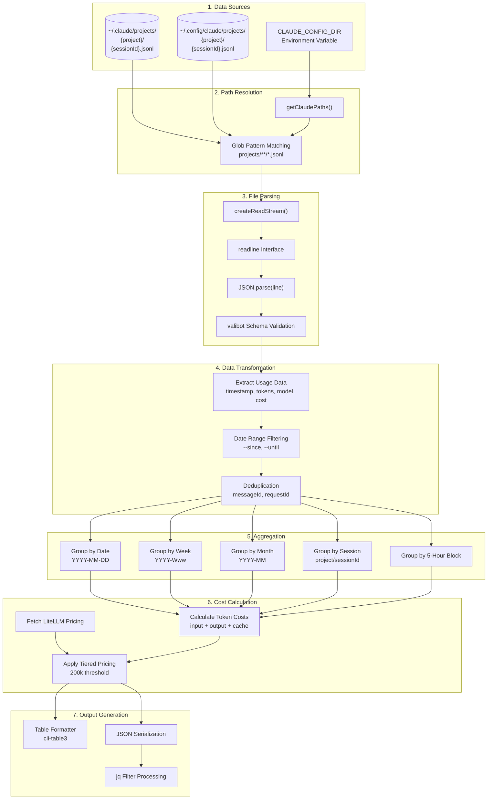

</details>

## JSONL Entry Structure

### Input Data Schema


<details>
<summary>View Mermaid Source</summary>

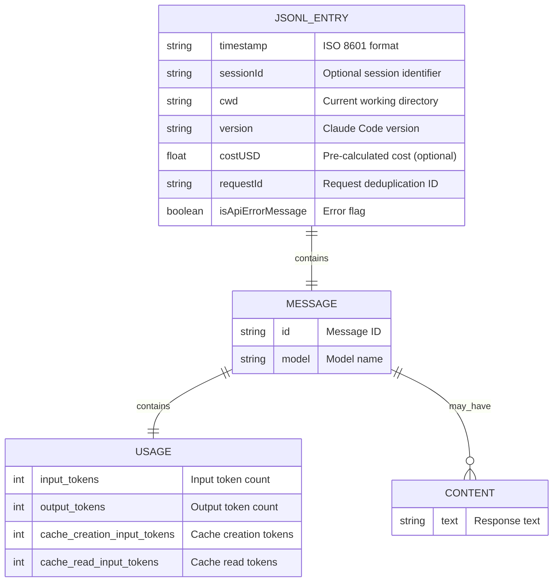

</details>

### Sample JSONL Entry

```json
{
  "timestamp": "2026-01-26T10:30:00.000Z",
  "sessionId": "abc123",
  "cwd": "/Users/dev/project",
  "version": "1.0.5",
  "message": {
    "id": "msg_001",
    "model": "claude-sonnet-4-20250514",
    "usage": {
      "input_tokens": 1500,
      "output_tokens": 800,
      "cache_creation_input_tokens": 500,
      "cache_read_input_tokens": 200
    }
  },
  "costUSD": 0.0123,
  "requestId": "req_xyz"
}
```

## Aggregated Output Schemas

### Daily Usage Schema


<details>
<summary>View Mermaid Source</summary>

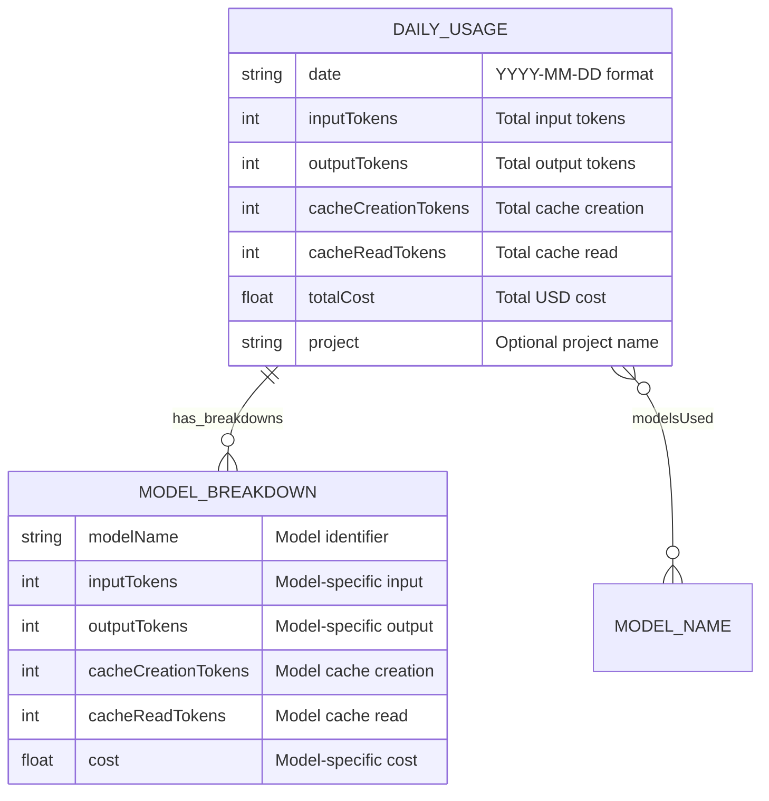

</details>

### Session Usage Schema


<details>
<summary>View Mermaid Source</summary>

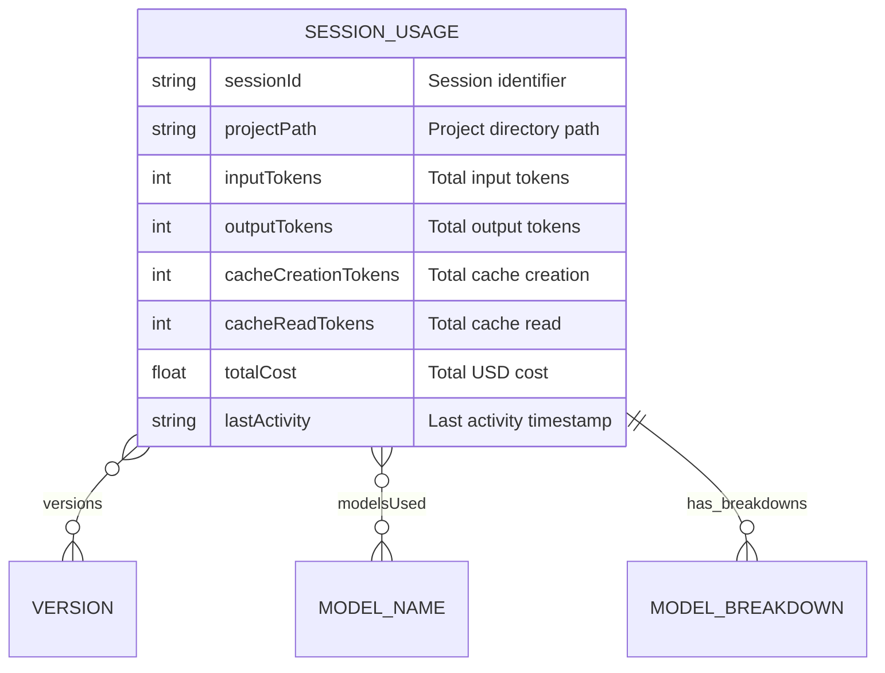

</details>

### Session Block Schema


<details>
<summary>View Mermaid Source</summary>

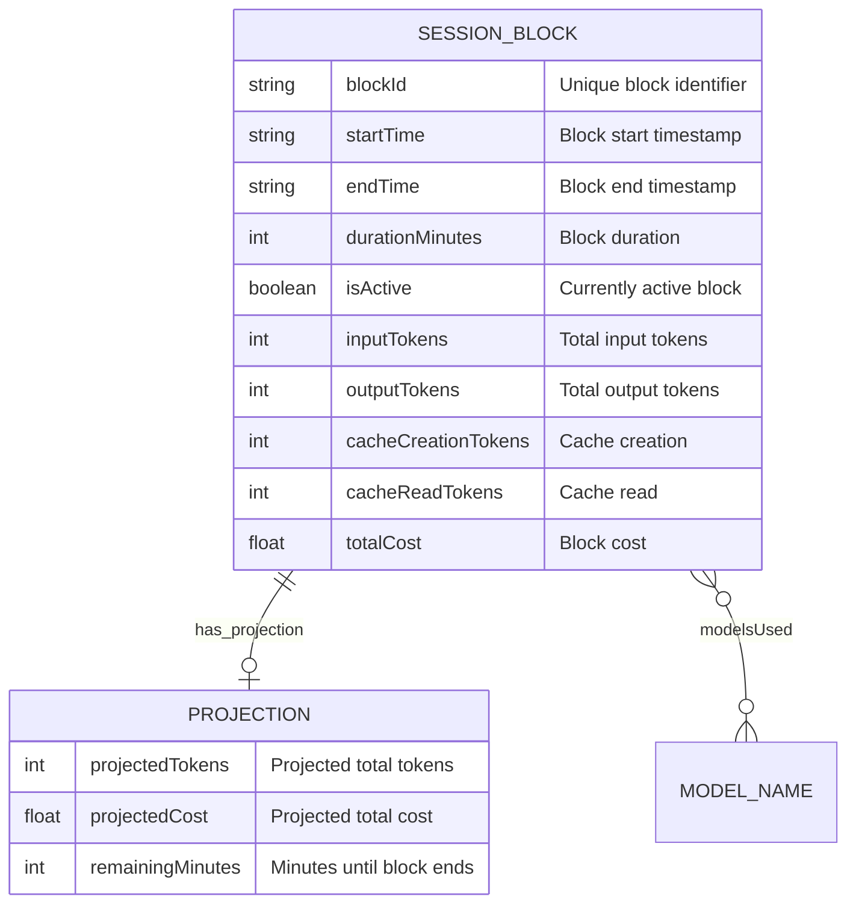

</details>

## Pricing Data Flow


<details>
<summary>View Mermaid Source</summary>

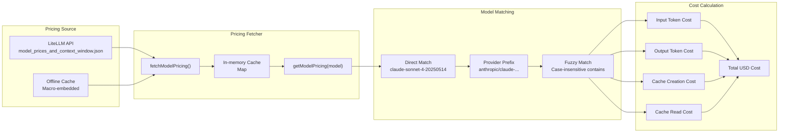

</details>

## 5-Hour Block Detection Flow


<details>
<summary>View Mermaid Source</summary>

```mermaid
flowchart TD
    START[Raw Usage Entries] --> SORT[Sort by Timestamp]
    SORT --> FIRST[Create First Block<br/>Start = First Entry Time]

    FIRST --> LOOP{Next Entry?}

    LOOP -->|No| FINALIZE[Finalize All Blocks]
    LOOP -->|Yes| CHECK{Entry within 5 hours<br/>of block start?}

    CHECK -->|Yes| ADD[Add to Current Block]
    ADD --> ACCUM[Accumulate Tokens]
    ACCUM --> LOOP

    CHECK -->|No| CLOSE[Close Current Block]
    CLOSE --> NEW[Start New Block<br/>Start = Entry Time]
    NEW --> ADD_NEW[Add Entry to New Block]
    ADD_NEW --> LOOP

    FINALIZE --> ACTIVE{Current time within<br/>5 hours of last block?}

    ACTIVE -->|Yes| MARK[Mark as Active Block]
    ACTIVE -->|No| INACTIVE[All Blocks Complete]

    MARK --> PROJECT[Calculate Projections]
    PROJECT --> OUTPUT[Output: SessionBlock[]]
    INACTIVE --> OUTPUT
```

</details>

## Output Format Flow


<details>
<summary>View Mermaid Source</summary>

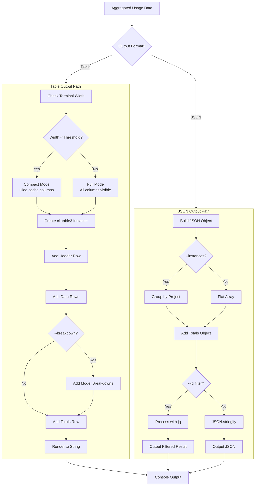

</details>
