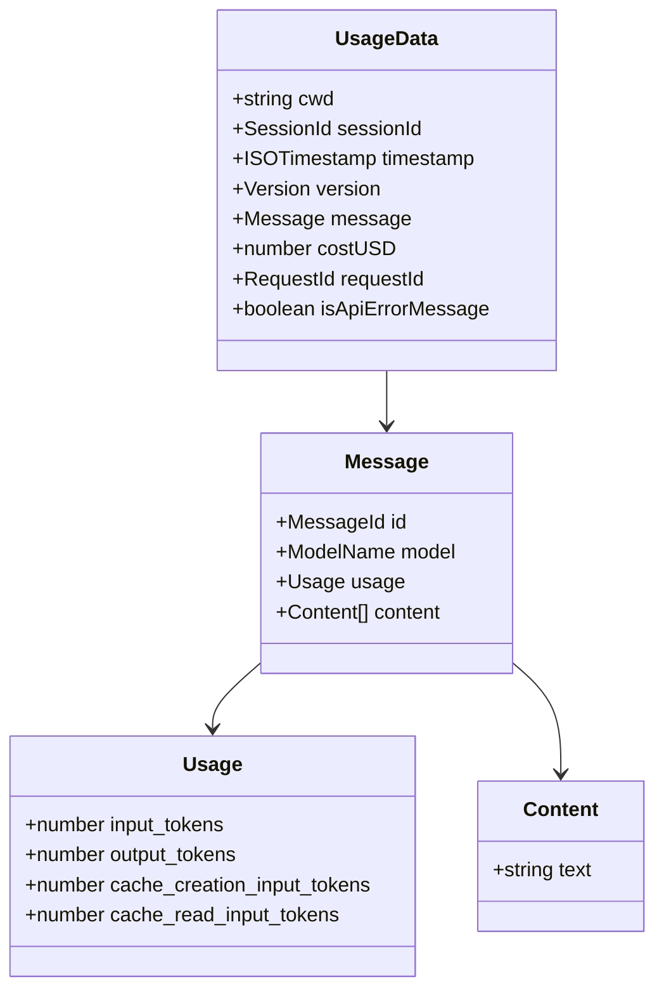
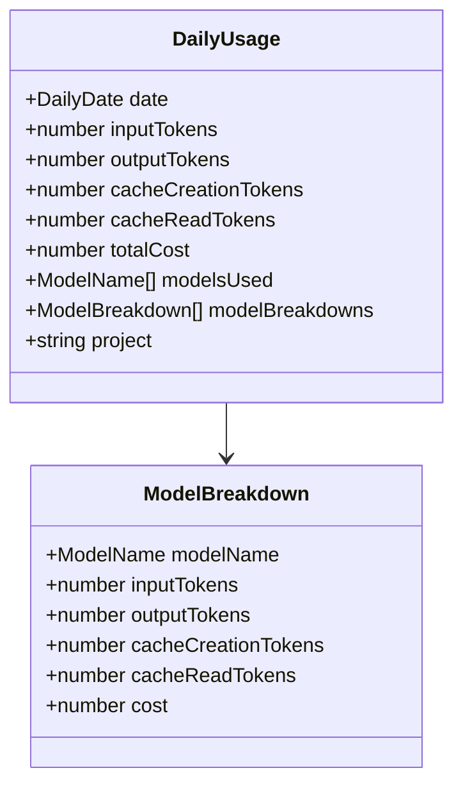
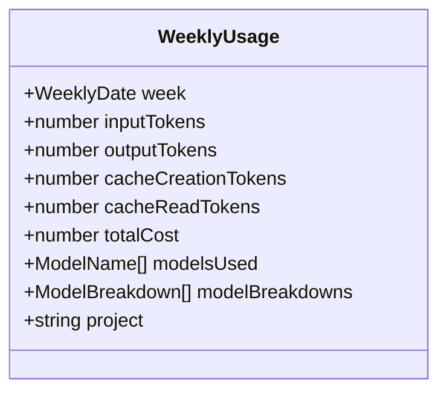
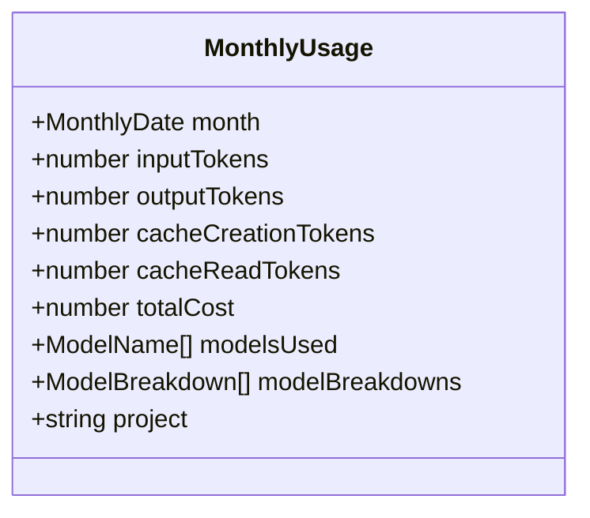
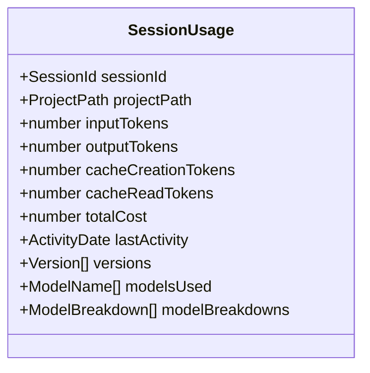
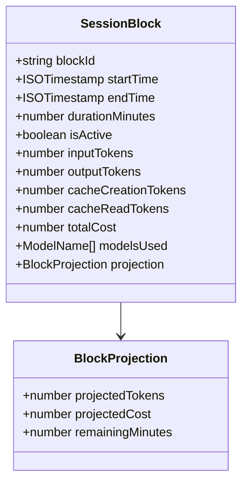
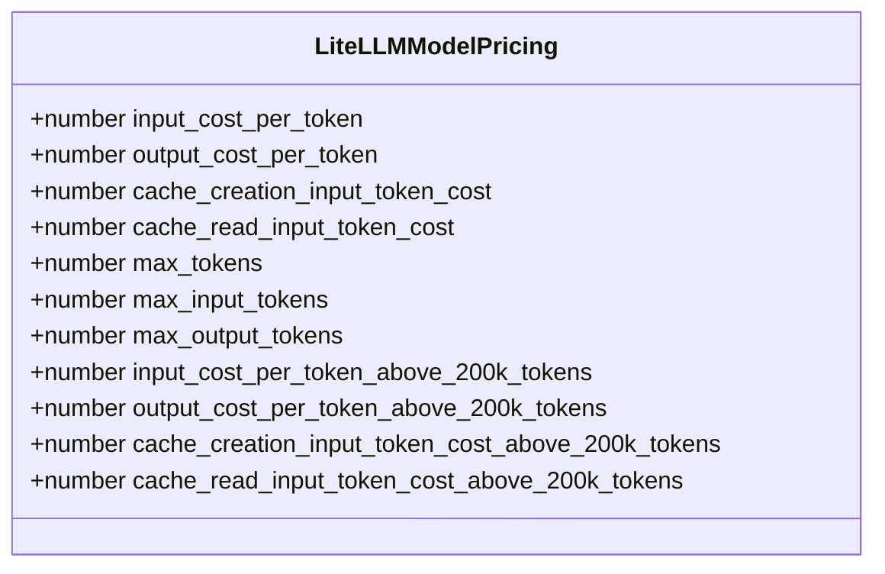
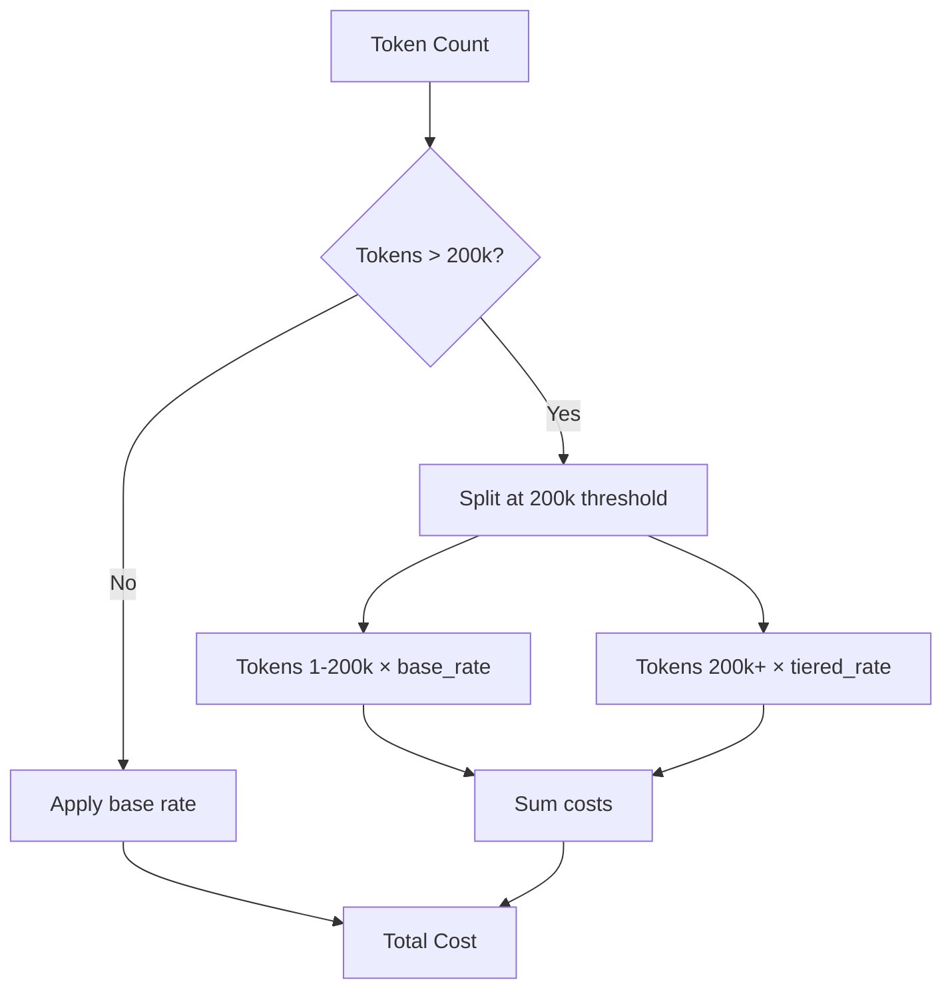
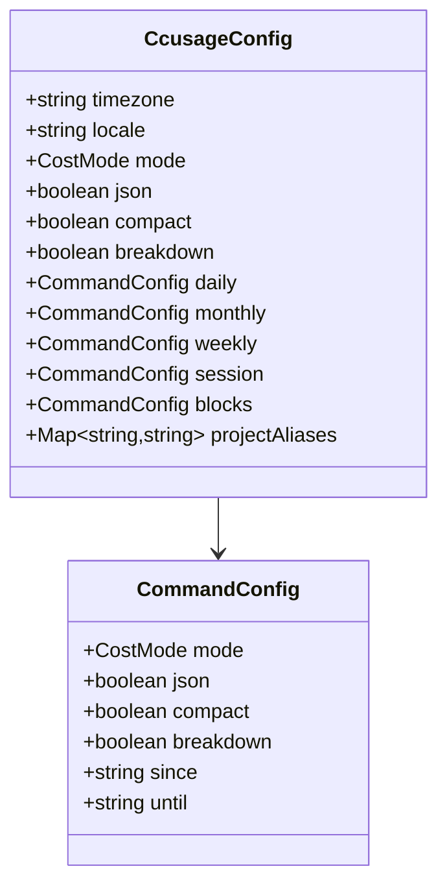

# Data Models

## Schema Definitions

### Core Schemas (Valibot)

All schemas use Valibot for runtime validation with branded types for type safety.

## Input Data Schemas

### Usage Data Entry

The primary schema for parsing JSONL entries from Claude data files.



### Branded Types

```typescript
// Type-safe branded types using Valibot
type SessionId = string & { readonly __brand: 'SessionId' };
type ISOTimestamp = string & { readonly __brand: 'ISOTimestamp' };
type Version = string & { readonly __brand: 'Version' };
type MessageId = string & { readonly __brand: 'MessageId' };
type ModelName = string & { readonly __brand: 'ModelName' };
type RequestId = string & { readonly __brand: 'RequestId' };
type ProjectPath = string & { readonly __brand: 'ProjectPath' };

// Date format types
type DailyDate = string & { readonly __brand: 'DailyDate' };     // YYYY-MM-DD
type WeeklyDate = string & { readonly __brand: 'WeeklyDate' };   // YYYY-Www
type MonthlyDate = string & { readonly __brand: 'MonthlyDate' }; // YYYY-MM
type ActivityDate = string & { readonly __brand: 'ActivityDate' };
```

---

## Aggregated Data Schemas

### Daily Usage



### Weekly Usage



### Monthly Usage



### Session Usage



### Session Block



---

## Pricing Schemas

### LiteLLM Model Pricing



### Tiered Pricing Calculation



---

## Configuration Schema

### Config File Schema



### Cost Mode Enum

```typescript
type CostMode = 'auto' | 'calculate' | 'display';
```

---

## Token Aggregation Types

### Token Counts

```typescript
interface AggregatedTokenCounts {
  inputTokens: number;
  outputTokens: number;
  cacheCreationTokens: number;
  cacheReadTokens: number;
}
```

### Token Totals (with Cost)

```typescript
interface TokenTotals extends AggregatedTokenCounts {
  totalCost: number;
}
```

### Complete Totals Object

```typescript
interface TotalsObject extends TokenTotals {
  totalTokens: number;  // Sum of all token types
}
```

---

## File System Data Structure

### Claude Data Directory

```
~/.claude/projects/
└── {project-name}/
    └── {session-id}.jsonl

~/.config/claude/projects/
└── {project-name}/
    └── {session-id}.jsonl
```

### JSONL File Format

Each line is a JSON object:

```json
{"timestamp":"2026-01-26T10:00:00Z","sessionId":"abc123","message":{"usage":{"input_tokens":100}}}
{"timestamp":"2026-01-26T10:01:00Z","sessionId":"abc123","message":{"usage":{"input_tokens":150}}}
```

---

## Model Name Patterns

### Claude Models

```
claude-{variant}-{version}-{date}

Examples:
- claude-sonnet-4-20250514
- claude-opus-4-20250514
- claude-3-5-sonnet-20241022
```

### Provider Prefixes

When matching against LiteLLM pricing:

```
anthropic/claude-sonnet-4-20250514
claude-sonnet-4-20250514
claude-4-sonnet-20250514
```

---

## Validation Rules

### Timestamp Validation

- Must be valid ISO 8601 format
- Future timestamps are allowed
- Timezone info optional

### Token Count Validation

- Must be non-negative integers
- Missing values default to 0
- Schema allows optional cache tokens

### Cost Validation

- Must be non-negative number
- Can be undefined (will be calculated)
- Pre-calculated costs take priority in `auto` mode
