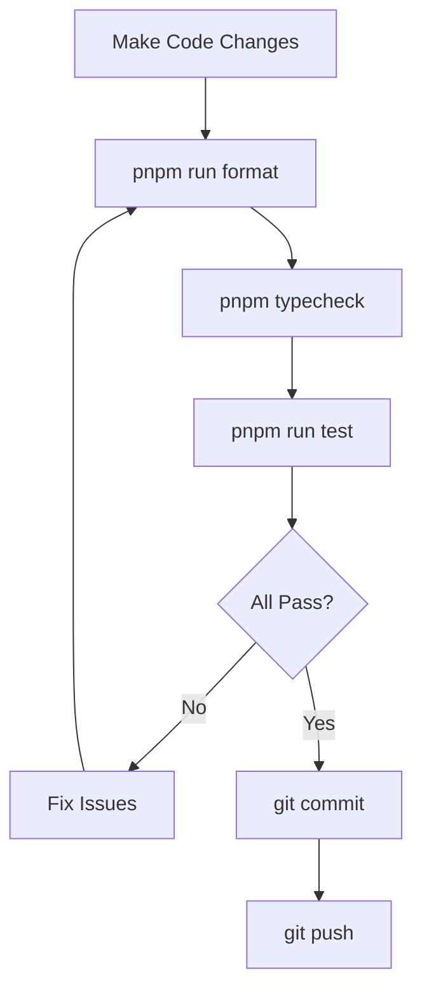
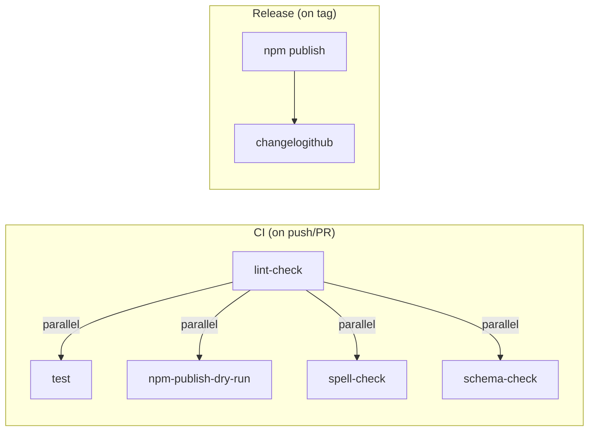

# Development Guide

## Prerequisites

| Requirement | Version |
|-------------|---------|
| Node.js | ≥ 20.19.4 |
| pnpm | 10.24.0 |
| Bun (optional) | ≥ 1.3.2 |

## Getting Started

### 1. Clone and Install

```bash
# Clone the repository
git clone <repository-url>
cd ccusage-monitor/ccusage

# Install dependencies
pnpm install
```

### 2. Development Commands

```bash
# Run the CLI directly
pnpm run start daily
pnpm run start monthly
pnpm run start session
pnpm run start blocks

# With flags
pnpm run start daily --json
pnpm run start blocks --active
pnpm run start daily --since 2026-01-01 --until 2026-01-31
```

### 3. Quality Checks

```bash
# Run all tests
pnpm run test

# Type checking
pnpm typecheck

# Linting
pnpm run lint

# Format code
pnpm run format
```

## Development Workflow



<details>
<summary>View Mermaid Source</summary>



</details>

## Project Structure for Development

### Adding a New CLI Command

1. Create command file in `apps/ccusage/src/commands/`:

```typescript
// apps/ccusage/src/commands/new-command.ts
import { define } from 'gunshi';
import { sharedCommandConfig } from '../_shared-args.ts';

export const newCommand = define({
  name: 'new-command',
  description: 'Description of new command',
  ...sharedCommandConfig,
  args: {
    ...sharedCommandConfig.args,
    // Add custom args here
  },
  async run(ctx) {
    // Implementation here
  },
});
```

2. Register in command router:

```typescript
// apps/ccusage/src/commands/index.ts
import { newCommand } from './new-command.ts';

export const subCommandUnion = [
  // ... existing commands
  ['new-command', newCommand],
] as const;
```

### Adding a New MCP Tool

1. Create tool handler:

```typescript
// apps/mcp/src/new-tool.ts
import { z } from 'zod';

export const newToolSchema = z.object({
  // Define parameters
});

export async function getNewToolData(params: z.infer<typeof newToolSchema>) {
  // Implementation
  return { /* result */ };
}
```

2. Register in MCP server:

```typescript
// apps/mcp/src/mcp.ts
server.registerTool(
  'new-tool',
  {
    description: 'Description',
    inputSchema: newToolShape,
  },
  async (args) => {
    const params = newToolSchema.parse(args);
    const result = await getNewToolData(params);
    return {
      content: [{ type: 'text', text: JSON.stringify(result, null, 2) }],
    };
  },
);
```

## Testing Patterns

### In-Source Testing

Tests live alongside implementation:

```typescript
// src/calculate-cost.ts
export function calculateTotals(data) {
  // Implementation
}

// Tests at bottom of same file
if (import.meta.vitest != null) {
  describe('calculateTotals', () => {
    it('should aggregate daily usage data', () => {
      const data = [/* test data */];
      const result = calculateTotals(data);
      expect(result.inputTokens).toBe(300);
    });
  });
}
```

### Test Fixtures

Use `fs-fixture` for file system tests:

```typescript
import { createFixture } from 'fs-fixture';

it('should load JSONL files', async () => {
  using fixture = await createFixture({
    'projects/test/session.jsonl': JSON.stringify({
      timestamp: '2026-01-26T10:00:00Z',
      message: { usage: { input_tokens: 100 } },
    }),
  });

  const data = await loadData(fixture.path);
  expect(data.length).toBe(1);
});
```

## Error Handling Pattern

Use `@praha/byethrow` Result type:

```typescript
import { Result } from '@praha/byethrow';

// Wrapping operations that may throw
const parseResult = Result.try({
  try: () => JSON.parse(jsonString),
  catch: (error) => new Error('Failed to parse JSON', { cause: error }),
});

// Checking results
if (Result.isFailure(parseResult)) {
  logger.error(parseResult.error.message);
  return;
}

const data = parseResult.value;

// Chaining operations
const result = await Result.pipe(
  fetchData(),
  Result.andThen(validateData),
  Result.map(transformData),
  Result.orElse(handleError),
);
```

## Code Style Guidelines

### Import Conventions

```typescript
// Use .ts extensions for local imports
import { logger } from './logger.ts';
import { calculateTotals } from '../calculate-cost.ts';

// Package imports without extension
import { Result } from '@praha/byethrow';
import * as v from 'valibot';
```

### Naming Conventions

| Type | Convention | Example |
|------|------------|---------|
| Variables | camelCase | `usageData`, `modelName` |
| Types/Interfaces | PascalCase | `UsageData`, `ModelBreakdown` |
| Constants | UPPER_SNAKE_CASE | `DEFAULT_LOCALE` |
| Internal files | Underscore prefix | `_types.ts`, `_utils.ts` |

### Export Rules

- Only export what's used by other modules
- Internal helpers should not be exported
- Use named exports (not default)

## Building and Releasing

### Build

```bash
# Build all packages
pnpm run build

# Build specific package
cd apps/ccusage && pnpm run build
```

### Release

```bash
# Full release workflow
pnpm run release
# Runs: lint → typecheck → test → build → version bump
```

## Environment Variables

| Variable | Purpose | Default |
|----------|---------|---------|
| `CLAUDE_CONFIG_DIR` | Custom Claude data path | Auto-detect |
| `LOG_LEVEL` | Logging verbosity (0-5) | 3 (info) |
| `TZ` | Timezone for tests | UTC |

## Debugging

### Log Levels

```bash
# Silent (only errors)
LOG_LEVEL=0 pnpm run start daily

# Debug output
LOG_LEVEL=4 pnpm run start daily

# Trace (verbose)
LOG_LEVEL=5 pnpm run start daily
```

### Debug Flag

```bash
# Show mismatch debugging
pnpm run start daily --debug

# With sample count
pnpm run start daily --debug --debug-samples 5
```

## Test Fixtures

### Statusline Test Data

Test fixtures for the statusline command are located in `apps/ccusage/test/`:

| File | Model | Purpose |
|------|-------|---------|
| `statusline-test.json` | claude-sonnet-4 | Default test data |
| `statusline-test-sonnet4.json` | claude-sonnet-4 | Sonnet 4 specific |
| `statusline-test-opus4.json` | claude-opus-4 | Opus 4 specific |
| `statusline-test-sonnet41.json` | claude-sonnet-4.1 | Sonnet 4.1 specific |

### Test Fixture Structure

```json
{
  "session_id": "73cc9f9a-2775-4418-beec-bc36b62a1c6f",
  "transcript_path": "/path/to/session.jsonl",
  "cwd": "/project/path",
  "model": {
    "id": "claude-sonnet-4-20250514",
    "display_name": "Sonnet 4"
  },
  "version": "1.0.88",
  "cost": {
    "total_cost_usd": 0.056266,
    "total_duration_ms": 164055
  },
  "context_window": {
    "total_input_tokens": 42500,
    "total_output_tokens": 3200,
    "context_window_size": 200000
  },
  "exceeds_200k_tokens": false
}
```

### Running Statusline Tests

```bash
# Default test data
pnpm run test:statusline

# All model variants
pnpm run test:statusline:all

# Specific models
pnpm run test:statusline:sonnet4
pnpm run test:statusline:opus4
pnpm run test:statusline:sonnet41
```

---

## CI/CD Pipelines

### GitHub Actions Workflows



<details>
<summary>View Mermaid Source</summary>



</details>

### CI Workflow (`ci.yaml`)

Runs on every push and pull request:

| Job | Purpose | Commands |
|-----|---------|----------|
| `lint-check` | Lint and typecheck | `pnpm lint && pnpm typecheck` |
| `test` | Run all tests | `pnpm run test` |
| `npm-publish-dry-run` | Verify publishable | `pnpm pkg-pr-new publish` |
| `spell-check` | Check for typos | `typos --config ./typos.toml` |
| `schema-check` | Verify schemas up-to-date | `pnpm run generate:schema` |

### Release Workflow (`release.yaml`)

Runs on tag push (e.g., `v18.0.5`):

| Job | Purpose | Commands |
|-----|---------|----------|
| `npm` | Publish to npm | `pnpm publish --provenance` |
| `release` | Create GitHub release | `pnpm changelogithub` |

### Environment Setup

All CI jobs use Nix for reproducible environments:

```yaml
- uses: ./.github/actions/setup-nix
- run: nix develop --command pnpm <command>
```

### Test Environment Requirements

```yaml
# Create Claude directories for tests
- name: Create default Claude directories for tests
  run: |
    mkdir -p $HOME/.claude/projects
    mkdir -p $HOME/.config/claude/projects
```

---

## MCP Server Development

### Local Testing

```bash
# Start HTTP server
cd apps/mcp
pnpm run start -- --type http --port 8080

# Test with curl
curl -X POST http://localhost:8080/mcp \
  -H "Content-Type: application/json" \
  -d '{"method": "tools/call", "params": {"name": "daily"}}'
```

### Claude Desktop Integration

Add to Claude Desktop MCP config:

```json
{
  "mcpServers": {
    "ccusage": {
      "command": "npx",
      "args": ["@ccusage/mcp@latest"]
    }
  }
}
```
