# ccusage-monitor Project Documentation

> **Generated:** 2026-01-26 | **Scan Level:** Exhaustive | **Project Type:** CLI Monorepo

## Quick Reference

| Attribute | Value |
|-----------|-------|
| **Repository Type** | Monorepo (pnpm workspaces) |
| **Primary Language** | TypeScript |
| **Project Type** | CLI Tool Suite |
| **Version** | 18.0.5 |
| **Package Manager** | pnpm 10.24.0 |
| **Runtime** | Node.js ≥20.19.4, Bun ≥1.3.2 |

## Project Purpose

**ccusage** is a comprehensive usage analysis tool for AI coding assistants. It monitors and tracks token usage and costs across multiple platforms:

- **Claude Code** (primary) - Anthropic's AI coding assistant
- **Codex** - OpenAI's coding assistant
- **OpenCode** - Alternative AI coding platform
- **Amp** - CLI usage tracking
- **Pi-agent** - Pi platform usage

## Architecture Overview



<details>
<summary>View Mermaid Source</summary>

```mermaid
graph TB
    subgraph "User Layer"
        CLI[CLI Interface]
        MCP[MCP Server]
        LIB[Library API]
    end

    subgraph "Application Layer"
        CCUSAGE[ccusage App]
        CODEX[codex App]
        OPENCODE[opencode App]
        AMP[amp App]
        PI[pi App]
        MCPAPP[mcp App]
    end

    subgraph "Shared Packages"
        INTERNAL[@ccusage/internal]
        TERMINAL[@ccusage/terminal]
    end

    subgraph "Data Sources"
        CLAUDE_DATA[~/.claude/projects/]
        CONFIG_DATA[~/.config/claude/projects/]
        CODEX_DATA[~/.codex/sessions/]
        OPENCODE_DATA[~/.local/share/opencode/]
    end

    subgraph "External Services"
        LITELLM[LiteLLM Pricing API]
    end

    CLI --> CCUSAGE
    CLI --> CODEX
    CLI --> OPENCODE
    CLI --> AMP
    CLI --> PI
    MCP --> MCPAPP
    LIB --> CCUSAGE

    CCUSAGE --> INTERNAL
    CCUSAGE --> TERMINAL
    CODEX --> INTERNAL
    CODEX --> TERMINAL
    OPENCODE --> INTERNAL
    MCPAPP --> CCUSAGE
    MCPAPP --> CODEX

    CCUSAGE --> CLAUDE_DATA
    CCUSAGE --> CONFIG_DATA
    CODEX --> CODEX_DATA
    OPENCODE --> OPENCODE_DATA

    INTERNAL --> LITELLM
```

</details>

## Generated Documentation

### Core Documentation

- [Project Overview](./project-overview.md) - Executive summary and project purpose
- [Architecture](./architecture.md) - Detailed system architecture and patterns
- [Source Tree Analysis](./source-tree-analysis.md) - Directory structure with annotations
- [Data Flow](./data-flow.md) - How data moves through the system

### Technical Guides

- [Development Guide](./development-guide.md) - Setup and development workflow
- [API Contracts](./api-contracts.md) - CLI commands and MCP tools
- [Data Models](./data-models.md) - Schema definitions and data structures

### Diagrams

- [Sequence Diagrams](./sequence-diagrams.md) - Interaction flows
- [Activity Diagrams](./activity-diagrams.md) - Process workflows

## Monorepo Structure

```
ccusage/
├── apps/                    # 6 application packages
│   ├── ccusage/            # Main Claude Code analyzer
│   ├── codex/              # OpenAI Codex analyzer
│   ├── opencode/           # OpenCode analyzer
│   ├── amp/                # Amp CLI analyzer
│   ├── pi/                 # Pi-agent analyzer
│   └── mcp/                # MCP server
├── packages/               # 2 shared packages
│   ├── internal/           # Pricing, logging, formatting
│   └── terminal/           # Table and UI utilities
└── docs/                   # VitePress documentation
```

## Getting Started

```bash
# Install dependencies
pnpm install

# Run daily usage report
pnpm run start daily

# Run with JSON output
pnpm run start daily --json

# Show 5-hour billing blocks
pnpm run start blocks --active
```

## Technology Stack Summary

| Category | Technology |
|----------|------------|
| **CLI Framework** | Gunshi |
| **Validation** | Valibot, Zod |
| **Error Handling** | @praha/byethrow |
| **Testing** | Vitest |
| **Build** | tsdown |
| **MCP** | @modelcontextprotocol/sdk |
| **HTTP** | Hono |
