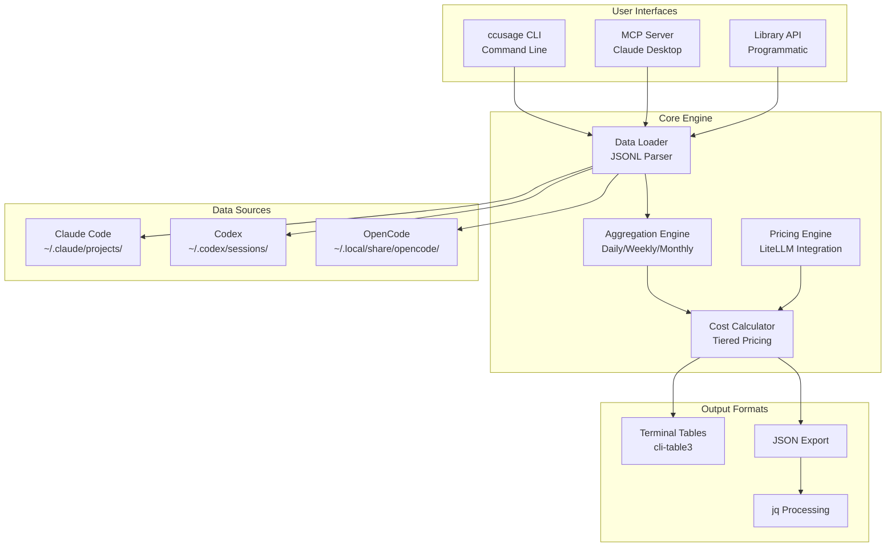
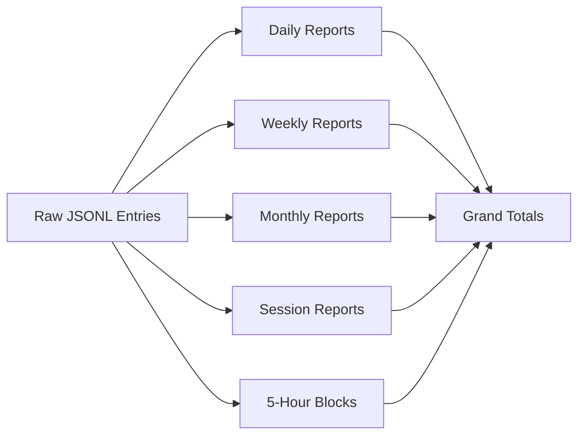

# Project Overview

## Executive Summary

**ccusage** is a comprehensive, lightning-fast CLI tool for monitoring and analyzing token usage and costs across multiple AI coding assistants. Built as a TypeScript monorepo, it provides real-time insights into API consumption patterns for Claude Code, OpenAI Codex, OpenCode, and other AI development platforms.

## Problem Statement

AI coding assistants consume tokens that translate to real costs. Developers need visibility into:

- **Daily/Weekly/Monthly usage patterns** - How much am I using?
- **Cost tracking** - How much am I spending?
- **Session analysis** - Which projects consume the most tokens?
- **Billing block awareness** - Claude's 5-hour billing cycles require special tracking

## Solution

ccusage provides:

1. **Multi-platform Support** - Single tool for Claude, Codex, OpenCode, Amp, and Pi-agent
2. **Multiple Report Types** - Daily, weekly, monthly, session, and 5-hour billing blocks
3. **Real-time Pricing** - LiteLLM integration for accurate cost calculation
4. **MCP Integration** - Access usage data directly in Claude Desktop
5. **Library API** - Embed usage tracking in your own tools

## System Overview Diagram

View Mermaid Source

## Key Features

### 1. Multi-Temporal Aggregation

View Mermaid Source

### 2. Tiered Pricing Support

Claude models use tiered pricing at 200k tokens:
- Tokens 1-200k: Base rate
- Tokens 200k+: Higher rate

ccusage accurately calculates costs with proper threshold handling.

### 3. Model Breakdown

Track usage by individual AI model:
- `claude-sonnet-4-20250514`
- `claude-opus-4-20250514`
- Model-specific costs and token counts

### 4. Cache Token Tracking

Separate tracking for:
- Input tokens
- Output tokens
- Cache creation tokens
- Cache read tokens

## Target Users

1. **Individual Developers** - Track personal AI assistant usage
2. **Development Teams** - Monitor team-wide consumption
3. **Cost-Conscious Users** - Optimize AI spending
4. **Power Users** - Integrate via MCP or library API

## Project Scope

### In Scope

- Token usage aggregation from local files
- Cost calculation using LiteLLM pricing
- Multiple output formats (table, JSON)
- MCP server for Claude Desktop integration
- Multi-platform support (Claude, Codex, OpenCode, etc.)

### Out of Scope

- Direct API access to AI providers
- Usage prediction/forecasting
- Budget alerting
- Cloud sync/backup

## Success Metrics

- **Accuracy** - Cost calculations match provider billing
- **Performance** - Fast startup, efficient file parsing
- **Usability** - Intuitive CLI with sensible defaults
- **Extensibility** - Easy to add new platforms/reports
