# Sequence Diagrams

## CLI Command Execution Sequence

### Daily Report Command Flow

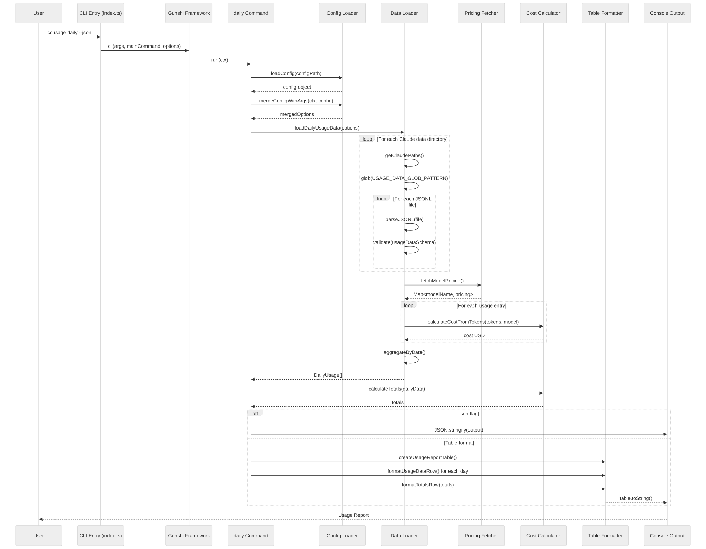

View Mermaid Source

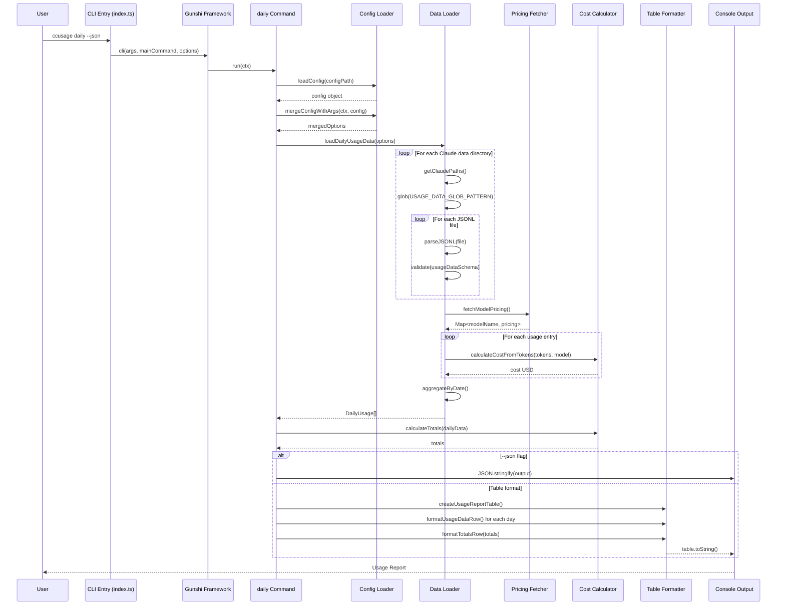

## Data Loading Sequence

### JSONL File Parsing Flow

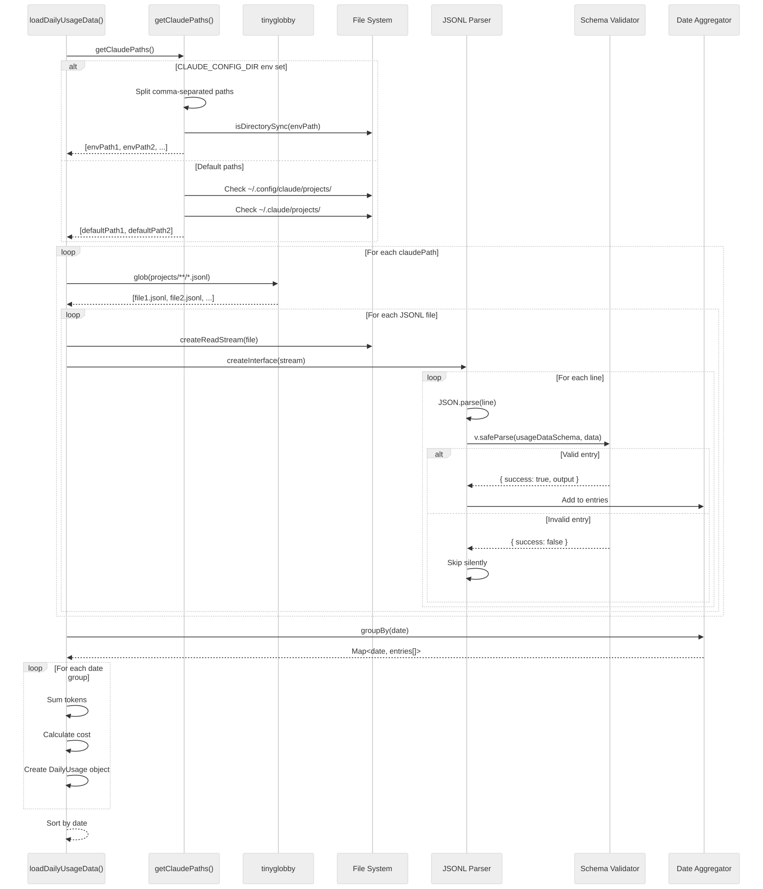

View Mermaid Source

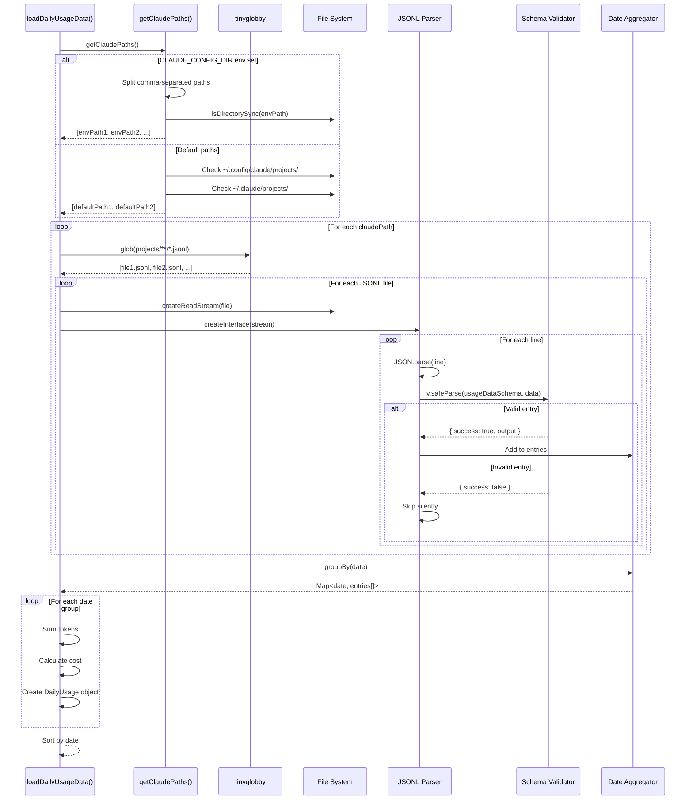

## Cost Calculation Sequence

### Token-Based Cost Calculation

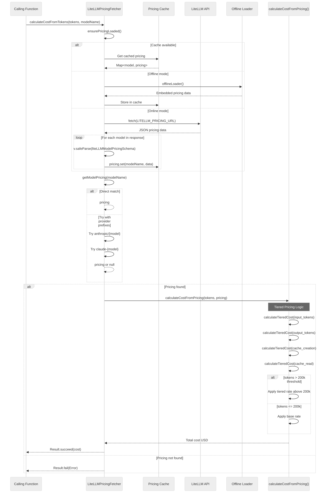

View Mermaid Source

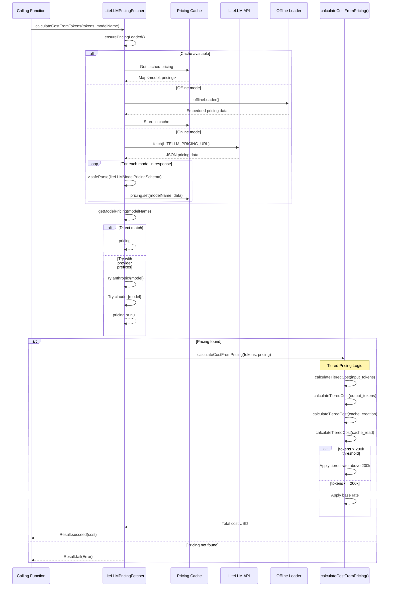

## MCP Server Request Sequence

### MCP Tool Invocation Flow

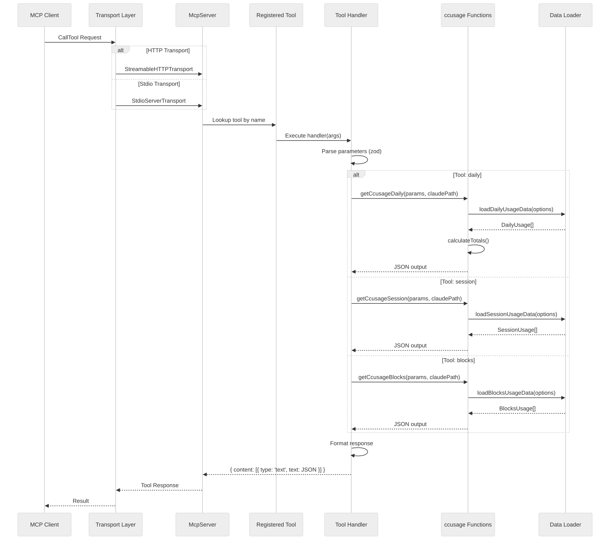

View Mermaid Source

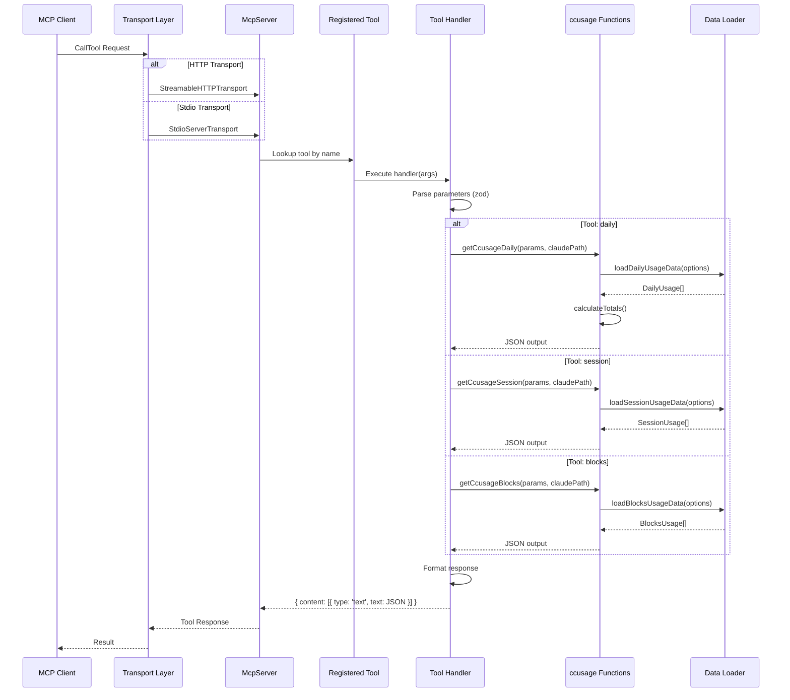

## Configuration Loading Sequence

### Config File Resolution

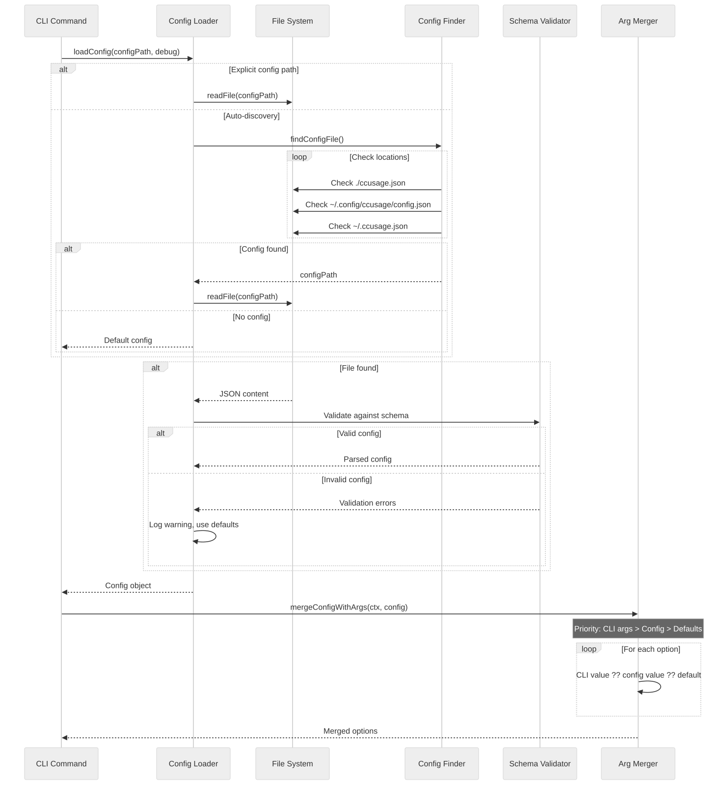

View Mermaid Source

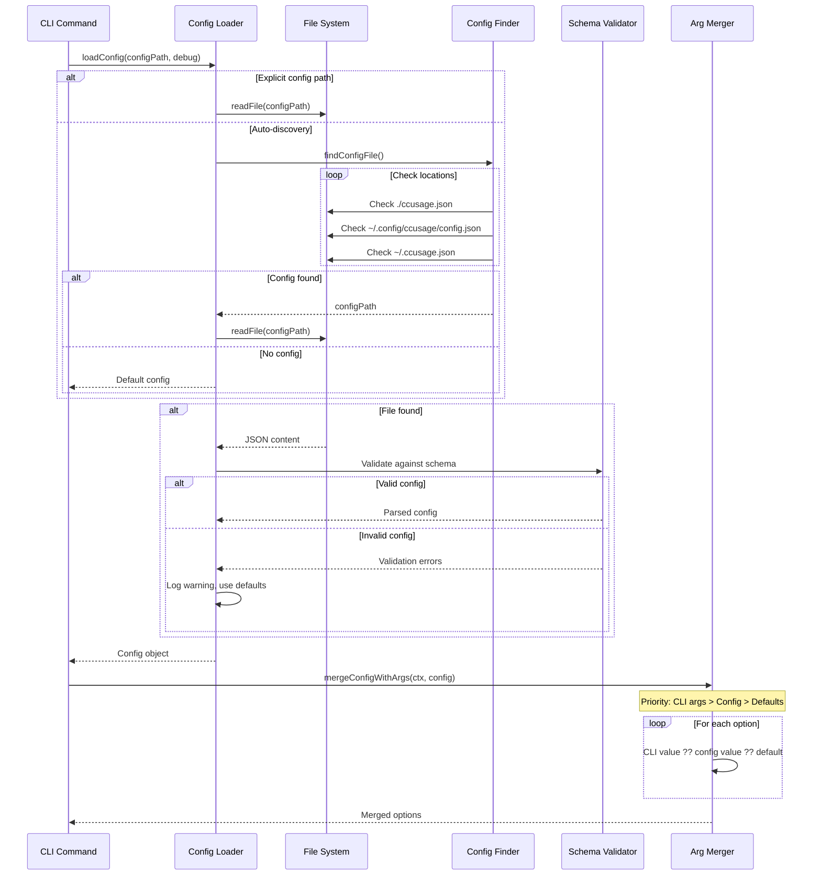

## 5-Hour Billing Block Detection Sequence

### Session Block Identification

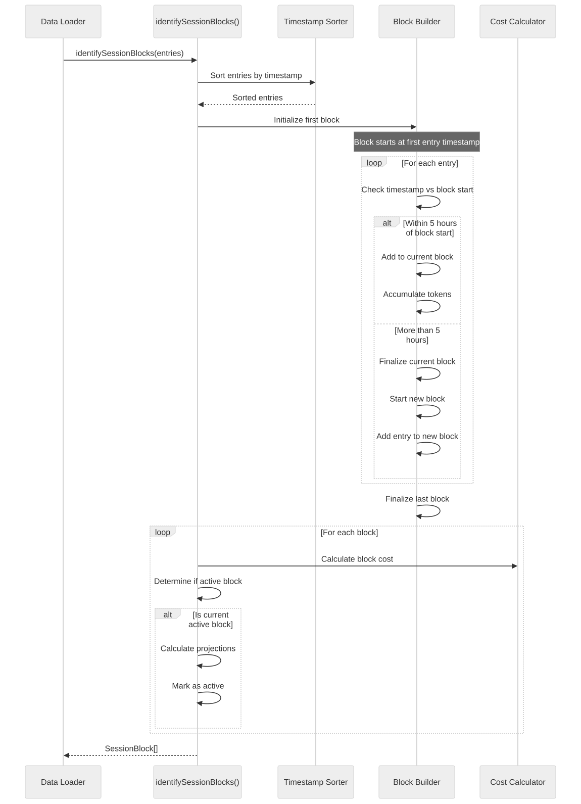

View Mermaid Source

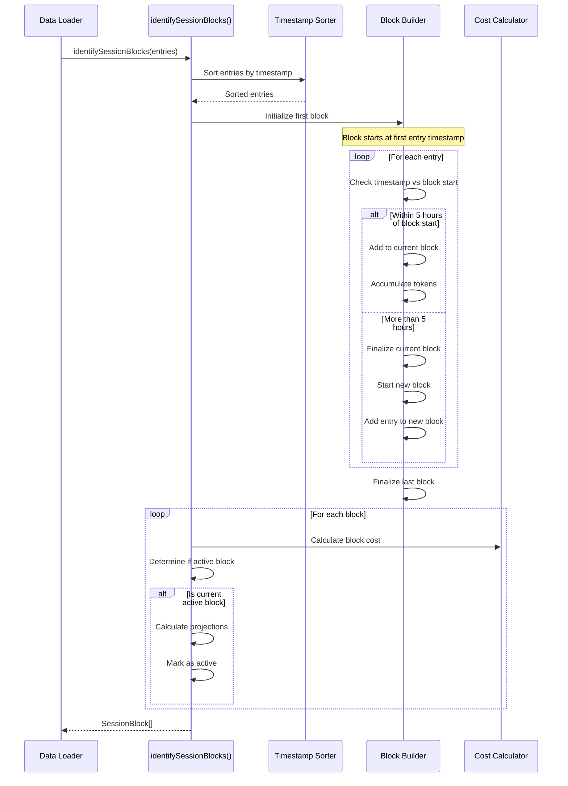

