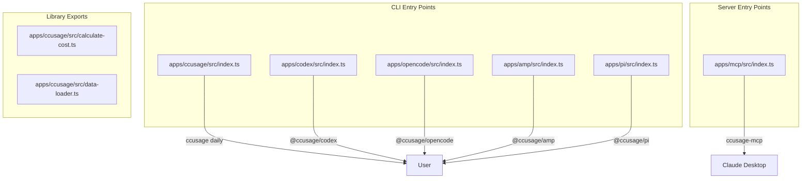

# Source Tree Analysis

## Complete Directory Structure

```
ccusage-monitor/
├── ccusage/                          # Main monorepo root
│   ├── package.json                  # Root manifest (v18.0.5)
│   ├── pnpm-workspace.yaml           # Workspace configuration
│   ├── pnpm-lock.yaml               # Dependency lock file
│   ├── tsconfig.json                 # Root TypeScript config
│   ├── eslint.config.js              # ESLint configuration
│   ├── ccusage.example.json          # Example config file
│   ├── .mcp.json                     # MCP servers configuration
│   ├── flake.nix                     # Nix development environment
│   │
│   ├── apps/                         # ─── Application Packages ───
│   │   │
│   │   ├── ccusage/                  # 📊 Main Claude Code Analyzer
│   │   │   ├── package.json          # CLI package manifest
│   │   │   ├── CLAUDE.md             # AI development guidelines
│   │   │   ├── README.md             # Package documentation
│   │   │   └── src/
│   │   │       ├── index.ts          # Entry point (executable)
│   │   │       ├── data-loader.ts    # 📁 JSONL parser (139KB)
│   │   │       ├── calculate-cost.ts # Token aggregation
│   │   │       ├── logger.ts         # Logging interface
│   │   │       ├── debug.ts          # Debug utilities
│   │   │       ├── config-schema.json
│   │   │       │
│   │   │       ├── commands/         # CLI Subcommands
│   │   │       │   ├── index.ts      # Command router
│   │   │       │   ├── daily.ts      # Daily reports
│   │   │       │   ├── weekly.ts     # Weekly reports
│   │   │       │   ├── monthly.ts    # Monthly reports
│   │   │       │   ├── session.ts    # Session reports
│   │   │       │   ├── blocks.ts     # 5-hour billing blocks
│   │   │       │   └── statusline.ts # Compact status (Beta)
│   │   │       │
│   │   │       └── _*.ts             # Internal utilities
│   │   │           ├── _types.ts          # Type definitions
│   │   │           ├── _consts.ts         # Constants
│   │   │           ├── _utils.ts          # Utilities
│   │   │           ├── _date-utils.ts     # Date formatting
│   │   │           ├── _token-utils.ts    # Token helpers
│   │   │           ├── _session-blocks.ts # Block detection
│   │   │           ├── _config-loader-tokens.ts
│   │   │           ├── _daily-grouping.ts
│   │   │           ├── _project-names.ts
│   │   │           ├── _pricing-fetcher.ts
│   │   │           ├── _shared-args.ts
│   │   │           ├── _jq-processor.ts
│   │   │           ├── _json-output-types.ts
│   │   │           └── _macro.ts
│   │   │
│   │   ├── codex/                    # 📈 OpenAI Codex Analyzer
│   │   │   ├── package.json
│   │   │   ├── CLAUDE.md
│   │   │   └── src/
│   │   │       ├── index.ts          # Entry point
│   │   │       ├── data-loader.ts    # Codex JSONL parser
│   │   │       ├── pricing.ts        # Codex pricing
│   │   │       ├── daily-report.ts
│   │   │       ├── monthly-report.ts
│   │   │       ├── session-report.ts
│   │   │       └── commands/
│   │   │
│   │   ├── opencode/                 # 🔧 OpenCode Analyzer
│   │   │   ├── package.json
│   │   │   ├── CLAUDE.md
│   │   │   └── src/
│   │   │       ├── index.ts
│   │   │       ├── data-loader.ts
│   │   │       ├── cost-utils.ts
│   │   │       └── commands/
│   │   │
│   │   ├── amp/                      # ⚡ Amp CLI Analyzer
│   │   │   ├── package.json
│   │   │   └── src/
│   │   │       ├── index.ts
│   │   │       ├── data-loader.ts
│   │   │       ├── pricing.ts
│   │   │       └── commands/
│   │   │
│   │   ├── pi/                       # 🥧 Pi-agent Analyzer
│   │   │   ├── package.json
│   │   │   └── src/
│   │   │       ├── index.ts
│   │   │       ├── data-loader.ts
│   │   │       └── commands/
│   │   │
│   │   └── mcp/                      # 🔌 MCP Server
│   │       ├── package.json
│   │       ├── CLAUDE.md
│   │       └── src/
│   │           ├── index.ts          # Server exports
│   │           ├── mcp.ts            # MCP implementation (26KB)
│   │           ├── command.ts        # Command handling
│   │           ├── ccusage.ts        # ccusage integration
│   │           ├── codex.ts          # Codex integration
│   │           ├── cli-utils.ts
│   │           ├── mcp-utils.ts
│   │           └── consts.ts
│   │
│   ├── packages/                     # ─── Shared Packages ───
│   │   │
│   │   ├── internal/                 # 🔧 Internal Utilities
│   │   │   ├── package.json
│   │   │   ├── CLAUDE.md
│   │   │   └── src/
│   │   │       ├── pricing.ts        # LiteLLM pricing fetcher
│   │   │       ├── pricing-fetch-utils.ts
│   │   │       ├── logger.ts         # Logger factory
│   │   │       ├── format.ts         # Number formatting
│   │   │       └── constants.ts
│   │   │
│   │   └── terminal/                 # 💻 Terminal Utilities
│   │       ├── package.json
│   │       ├── CLAUDE.md
│   │       └── src/
│   │           ├── table.ts          # Table formatting (37KB)
│   │           └── utils.ts          # Terminal utilities (10KB)
│   │
│   ├── docs/                         # ─── Documentation ───
│   │   ├── package.json
│   │   ├── CLAUDE.md
│   │   ├── index.md                  # Homepage
│   │   ├── update-api-index.ts       # API docs generator
│   │   ├── typedoc.config.ts
│   │   ├── wrangler.jsonc            # Cloudflare config
│   │   │
│   │   ├── guide/                    # User Guides (27 files)
│   │   │   ├── index.md
│   │   │   ├── installation.md
│   │   │   ├── getting-started.md
│   │   │   ├── configuration.md
│   │   │   ├── daily-reports.md
│   │   │   ├── weekly-reports.md
│   │   │   ├── monthly-reports.md
│   │   │   ├── session-reports.md
│   │   │   ├── blocks-reports.md
│   │   │   ├── statusline.md
│   │   │   ├── cli-options.md
│   │   │   ├── config-files.md
│   │   │   ├── json-output.md
│   │   │   ├── mcp-server.md
│   │   │   └── ... (more guides)
│   │   │
│   │   ├── .vitepress/               # VitePress Config
│   │   │   └── config.ts
│   │   │
│   │   └── public/                   # Static Assets
│   │       ├── logo.svg
│   │       ├── logo.png
│   │       ├── screenshot.png
│   │       └── ... (images)
│   │
│   ├── .claude/                      # Claude Code Config
│   │   ├── commands/
│   │   │   └── reduce-similarities.md
│   │   └── skills/
│   │       ├── byethrow/
│   │       └── use-gunshi-cli/
│   │
│   ├── .github/                      # GitHub Configuration
│   │   ├── workflows/                # CI/CD
│   │   └── renovate.json
│   │
│   └── .githooks/                    # Git Hooks
```

## Critical Directories Explained

### `/apps/ccusage/src/`
**Purpose:** Main CLI application source code

Key files:
- `index.ts` - Entry point, invokes Gunshi CLI
- `data-loader.ts` - Core JSONL parsing (largest file at 139KB)
- `commands/` - Six subcommand implementations

### `/apps/mcp/src/`
**Purpose:** MCP server for Claude Desktop integration

Key files:
- `mcp.ts` - McpServer instance with tool registration
- `ccusage.ts` - Adapters for ccusage data functions
- `codex.ts` - Adapters for Codex data functions

### `/packages/internal/src/`
**Purpose:** Shared utilities used by all apps

Key exports:
- `./pricing` - LiteLLMPricingFetcher class
- `./logger` - createLogger() factory
- `./format` - formatTokens(), formatCurrency()

### `/packages/terminal/src/`
**Purpose:** Terminal UI components

Key exports:
- `./table` - createUsageReportTable(), formatUsageDataRow()
- `./utils` - Terminal width detection, ANSI utilities

## Entry Points



## File Naming Conventions

| Pattern | Purpose | Example |
|---------|---------|---------|
| `_*.ts` | Internal/private modules | `_types.ts`, `_utils.ts` |
| `*.ts` | Public modules | `data-loader.ts` |
| `commands/*.ts` | CLI subcommands | `daily.ts`, `blocks.ts` |
| `CLAUDE.md` | AI development guidelines | Package-level guidance |
| `*.schema.json` | JSON schemas | `config-schema.json` |
