# Technical Design: Team Claude Code Usage Monitor

> **Version:** 1.0.0
> **Date:** 2026-01-26
> **Status:** Draft - Pending Review

---

## Table of Contents

1. [Executive Summary](#1-executive-summary)
2. [System Overview](#2-system-overview)
3. [Component Architecture](#3-component-architecture)
4. [Data Models](#4-data-models)
5. [API Design](#5-api-design)
6. [Agent Design](#6-agent-design)
7. [Authentication & Authorization](#7-authentication--authorization)
8. [Data Synchronization](#8-data-synchronization)
9. [Web Dashboard](#9-web-dashboard)
10. [Deployment Architecture](#10-deployment-architecture)
11. [Security Considerations](#11-security-considerations)
12. [Technology Stack](#12-technology-stack)

---

## 1. Executive Summary

### 1.1 Purpose

Build a centralized monitoring system to collect, store, and visualize Claude Code usage data from multiple team members. The system enables cost tracking, usage analysis, and team-wide reporting.

### 1.2 Goals

| Goal | Description |
|------|-------------|
| **Centralized Collection** | Aggregate usage data from all team members |
| **Real-time Monitoring** | Near real-time sync (5-minute intervals) |
| **Cost Visibility** | Track spending per member, project, model |
| **Self-Hosted** | Docker Compose deployment on single VPS |
| **Reuse Core Logic** | Leverage existing ccusage parsing code |

### 1.3 Non-Goals

- Mobile application
- Multi-tenant SaaS
- Real-time streaming (WebSocket)
- Budget alerting (Phase 2)

---

## 2. System Overview

### 2.1 High-Level Architecture



<details>
<summary>View Mermaid Source</summary>

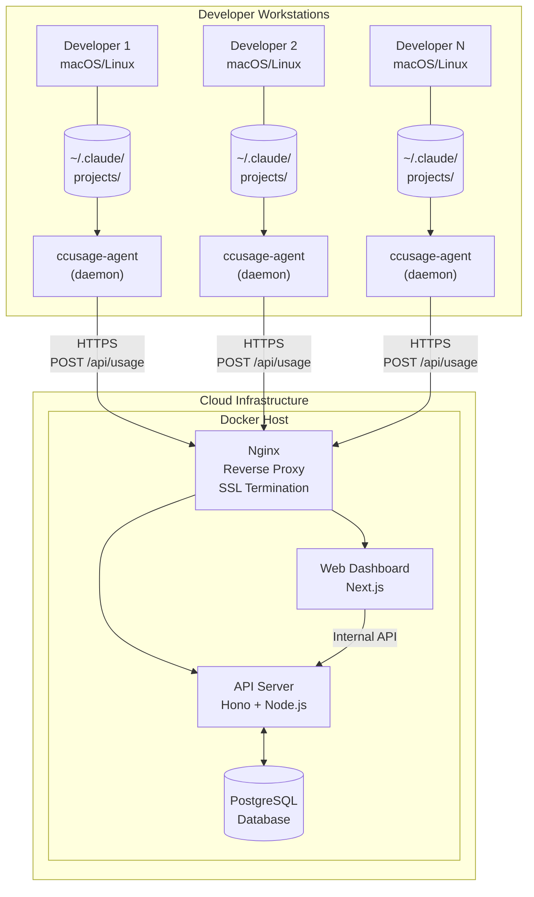
```mermaid
graph TB
    subgraph "Developer Workstations"
        DEV1["Developer 1<br/>macOS/Linux"]
        DEV2["Developer 2<br/>macOS/Linux"]
        DEV3["Developer N<br/>macOS/Linux"]

        CLAUDE1[("~/.claude/<br/>projects/")]
        CLAUDE2[("~/.claude/<br/>projects/")]
        CLAUDE3[("~/.claude/<br/>projects/")]

        AGENT1["ccusage-agent<br/>(daemon)"]
        AGENT2["ccusage-agent<br/>(daemon)"]
        AGENT3["ccusage-agent<br/>(daemon)"]
    end

    subgraph "Cloud Infrastructure"
        subgraph "Docker Host"
            NGINX["Nginx<br/>Reverse Proxy<br/>SSL Termination"]
            API["API Server<br/>Hono + Node.js"]
            WEB["Web Dashboard<br/>Next.js"]
            DB[("PostgreSQL<br/>Database")]
        end
    end

    DEV1 --- CLAUDE1
    DEV2 --- CLAUDE2
    DEV3 --- CLAUDE3

    CLAUDE1 --> AGENT1
    CLAUDE2 --> AGENT2
    CLAUDE3 --> AGENT3

    AGENT1 -->|"HTTPS<br/>POST /api/usage"| NGINX
    AGENT2 -->|"HTTPS<br/>POST /api/usage"| NGINX
    AGENT3 -->|"HTTPS<br/>POST /api/usage"| NGINX

    NGINX --> API
    NGINX --> WEB
    API <--> DB
    WEB -->|"Internal API"| API
```

</details>

### 2.2 Data Flow Overview



<details>
<summary>View Mermaid Source</summary>


```mermaid
flowchart LR
    subgraph "Source"
        JSONL["JSONL Files<br/>~/.claude/projects/**/*.jsonl"]
    end

    subgraph "Collection"
        PARSE["Parse &<br/>Validate"]
        DEDUP["Deduplicate<br/>(request_id)"]
        BATCH["Batch<br/>(max 1000)"]
    end

    subgraph "Transport"
        HTTPS["HTTPS POST<br/>+ API Key"]
    end

    subgraph "Storage"
        VALIDATE["Validate<br/>API Key"]
        ENRICH["Enrich with<br/>member_id"]
        INSERT["Upsert to<br/>PostgreSQL"]
    end

    subgraph "Presentation"
        AGG["Aggregate<br/>Queries"]
        RENDER["Render<br/>Dashboard"]
    end

    JSONL --> PARSE --> DEDUP --> BATCH --> HTTPS
    HTTPS --> VALIDATE --> ENRICH --> INSERT
    INSERT --> AGG --> RENDER
```

</details>

---

## 3. Component Architecture

### 3.1 Component Diagram



<details>
<summary>View Mermaid Source</summary>

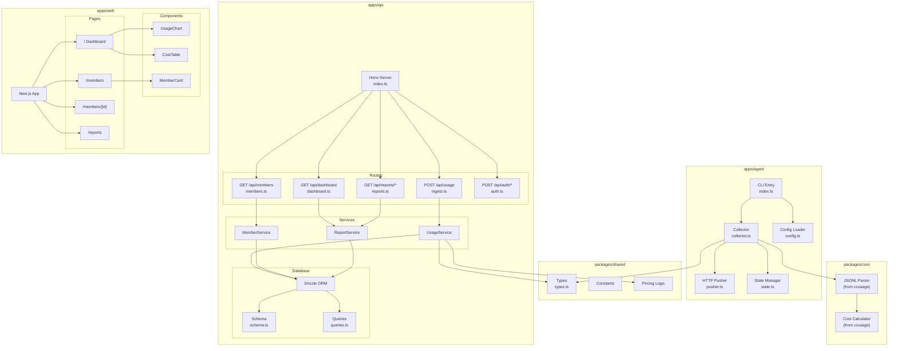
```mermaid
graph TB
    subgraph "apps/agent"
        AGENT_CLI["CLI Entry<br/>index.ts"]
        COLLECTOR["Collector<br/>collector.ts"]
        PUSHER["HTTP Pusher<br/>pusher.ts"]
        STATE["State Manager<br/>state.ts"]
        CONFIG["Config Loader<br/>config.ts"]
    end

    subgraph "apps/api"
        HONO["Hono Server<br/>index.ts"]

        subgraph "Routes"
            R_INGEST["POST /api/usage<br/>ingest.ts"]
            R_MEMBERS["GET /api/members<br/>members.ts"]
            R_DASHBOARD["GET /api/dashboard<br/>dashboard.ts"]
            R_REPORTS["GET /api/reports/*<br/>reports.ts"]
            R_AUTH["POST /api/auth/*<br/>auth.ts"]
        end

        subgraph "Services"
            S_USAGE["UsageService"]
            S_MEMBER["MemberService"]
            S_REPORT["ReportService"]
        end

        subgraph "Database"
            DRIZZLE["Drizzle ORM"]
            SCHEMA["Schema<br/>schema.ts"]
            QUERIES["Queries<br/>queries.ts"]
        end
    end

    subgraph "apps/web"
        NEXT["Next.js App"]

        subgraph "Pages"
            P_DASH["/ Dashboard"]
            P_MEMBERS["/members"]
            P_MEMBER["/members/[id]"]
            P_REPORTS["/reports"]
        end

        subgraph "Components"
            C_CHART["UsageChart"]
            C_TABLE["CostTable"]
            C_MEMBER["MemberCard"]
        end
    end

    subgraph "packages/shared"
        TYPES["Types<br/>types.ts"]
        CONSTANTS["Constants"]
        PRICING["Pricing Logic"]
    end

    subgraph "packages/core"
        PARSER["JSONL Parser<br/>(from ccusage)"]
        COST_CALC["Cost Calculator<br/>(from ccusage)"]
    end

    AGENT_CLI --> COLLECTOR
    AGENT_CLI --> CONFIG
    COLLECTOR --> PARSER
    COLLECTOR --> STATE
    COLLECTOR --> PUSHER

    HONO --> R_INGEST & R_MEMBERS & R_DASHBOARD & R_REPORTS & R_AUTH
    R_INGEST --> S_USAGE
    R_MEMBERS --> S_MEMBER
    R_DASHBOARD & R_REPORTS --> S_REPORT
    S_USAGE & S_MEMBER & S_REPORT --> DRIZZLE
    DRIZZLE --> SCHEMA & QUERIES

    NEXT --> P_DASH & P_MEMBERS & P_MEMBER & P_REPORTS
    P_DASH --> C_CHART & C_TABLE
    P_MEMBERS --> C_MEMBER

    COLLECTOR --> TYPES
    S_USAGE --> TYPES & PRICING
    PARSER --> COST_CALC
```

</details>

### 3.2 Package Dependencies



<details>
<summary>View Mermaid Source</summary>

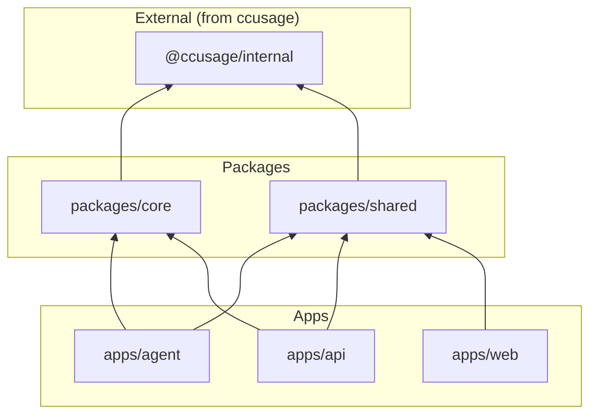
```mermaid
graph BT
    subgraph "Apps"
        AGENT["apps/agent"]
        API["apps/api"]
        WEB["apps/web"]
    end

    subgraph "Packages"
        SHARED["packages/shared"]
        CORE["packages/core"]
    end

    subgraph "External (from ccusage)"
        INTERNAL["@ccusage/internal"]
    end

    AGENT --> SHARED
    AGENT --> CORE
    API --> SHARED
    API --> CORE
    WEB --> SHARED

    CORE --> INTERNAL
    SHARED --> INTERNAL
```

</details>

---

## 4. Data Models

### 4.1 Entity Relationship Diagram



<details>
<summary>View Mermaid Source</summary>

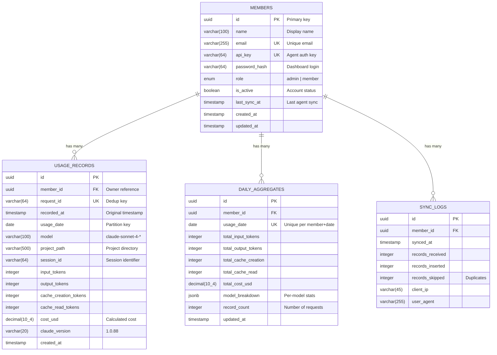
```mermaid
erDiagram
    MEMBERS {
        uuid id PK "Primary key"
        varchar(100) name "Display name"
        varchar(255) email UK "Unique email"
        varchar(64) api_key UK "Agent auth key"
        varchar(64) password_hash "Dashboard login"
        enum role "admin | member"
        boolean is_active "Account status"
        timestamp last_sync_at "Last agent sync"
        timestamp created_at
        timestamp updated_at
    }

    USAGE_RECORDS {
        uuid id PK
        uuid member_id FK "Owner reference"
        varchar(64) request_id UK "Dedup key"
        timestamp recorded_at "Original timestamp"
        date usage_date "Partition key"
        varchar(100) model "claude-sonnet-4-*"
        varchar(500) project_path "Project directory"
        varchar(64) session_id "Session identifier"
        integer input_tokens
        integer output_tokens
        integer cache_creation_tokens
        integer cache_read_tokens
        decimal(10_4) cost_usd "Calculated cost"
        varchar(20) claude_version "1.0.88"
        timestamp created_at
    }

    DAILY_AGGREGATES {
        uuid id PK
        uuid member_id FK
        date usage_date UK "Unique per member+date"
        integer total_input_tokens
        integer total_output_tokens
        integer total_cache_creation
        integer total_cache_read
        decimal(10_4) total_cost_usd
        jsonb model_breakdown "Per-model stats"
        integer record_count "Number of requests"
        timestamp updated_at
    }

    SYNC_LOGS {
        uuid id PK
        uuid member_id FK
        timestamp synced_at
        integer records_received
        integer records_inserted
        integer records_skipped "Duplicates"
        varchar(45) client_ip
        varchar(255) user_agent
    }

    MEMBERS ||--o{ USAGE_RECORDS : "has many"
    MEMBERS ||--o{ DAILY_AGGREGATES : "has many"
    MEMBERS ||--o{ SYNC_LOGS : "has many"
```

</details>

### 4.2 Usage Record Schema Detail



<details>
<summary>View Mermaid Source</summary>

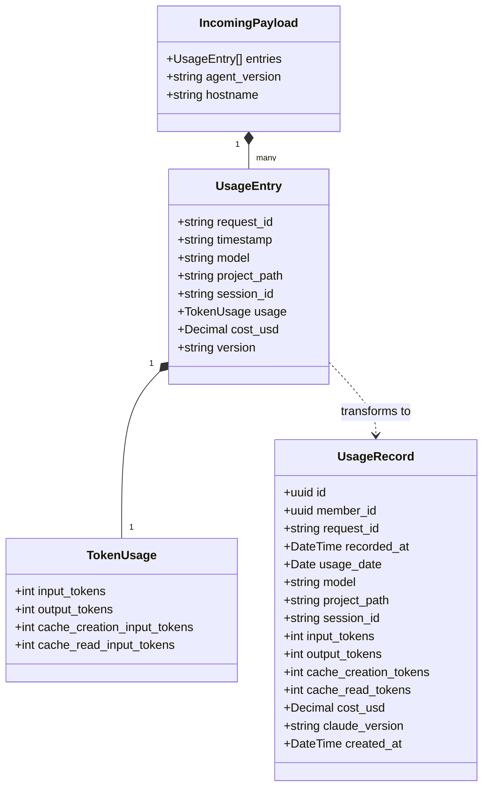
```mermaid
classDiagram
    class UsageRecord {
        +uuid id
        +uuid member_id
        +string request_id
        +DateTime recorded_at
        +Date usage_date
        +string model
        +string project_path
        +string session_id
        +int input_tokens
        +int output_tokens
        +int cache_creation_tokens
        +int cache_read_tokens
        +Decimal cost_usd
        +string claude_version
        +DateTime created_at
    }

    class IncomingPayload {
        +UsageEntry[] entries
        +string agent_version
        +string hostname
    }

    class UsageEntry {
        +string request_id
        +string timestamp
        +string model
        +string project_path
        +string session_id
        +TokenUsage usage
        +Decimal cost_usd
        +string version
    }

    class TokenUsage {
        +int input_tokens
        +int output_tokens
        +int cache_creation_input_tokens
        +int cache_read_input_tokens
    }

    IncomingPayload "1" *-- "many" UsageEntry
    UsageEntry "1" *-- "1" TokenUsage
    UsageEntry ..> UsageRecord : transforms to
```

</details>

---

## 5. API Design

### 5.1 API Endpoints Overview



<details>
<summary>View Mermaid Source</summary>

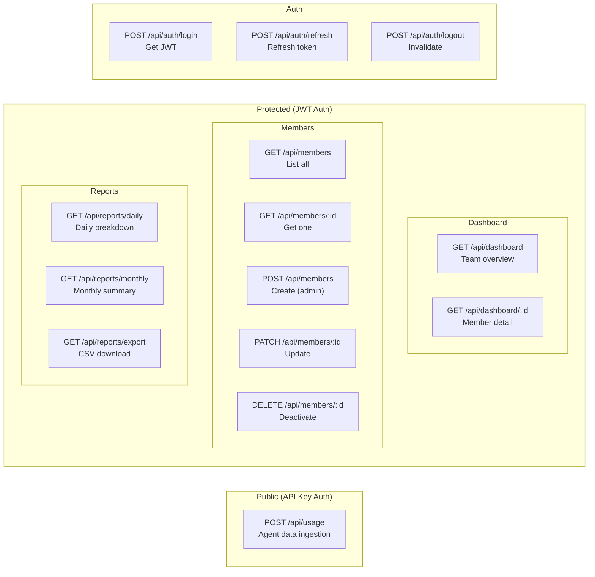
```mermaid
graph LR
    subgraph "Public (API Key Auth)"
        POST_USAGE["POST /api/usage<br/>Agent data ingestion"]
    end

    subgraph "Protected (JWT Auth)"
        subgraph "Dashboard"
            GET_DASH["GET /api/dashboard<br/>Team overview"]
            GET_DASH_MEMBER["GET /api/dashboard/:id<br/>Member detail"]
        end

        subgraph "Members"
            GET_MEMBERS["GET /api/members<br/>List all"]
            GET_MEMBER["GET /api/members/:id<br/>Get one"]
            POST_MEMBER["POST /api/members<br/>Create (admin)"]
            PATCH_MEMBER["PATCH /api/members/:id<br/>Update"]
            DELETE_MEMBER["DELETE /api/members/:id<br/>Deactivate"]
        end

        subgraph "Reports"
            GET_DAILY["GET /api/reports/daily<br/>Daily breakdown"]
            GET_MONTHLY["GET /api/reports/monthly<br/>Monthly summary"]
            GET_EXPORT["GET /api/reports/export<br/>CSV download"]
        end
    end

    subgraph "Auth"
        POST_LOGIN["POST /api/auth/login<br/>Get JWT"]
        POST_REFRESH["POST /api/auth/refresh<br/>Refresh token"]
        POST_LOGOUT["POST /api/auth/logout<br/>Invalidate"]
    end
```

</details>

### 5.2 Request/Response Flow

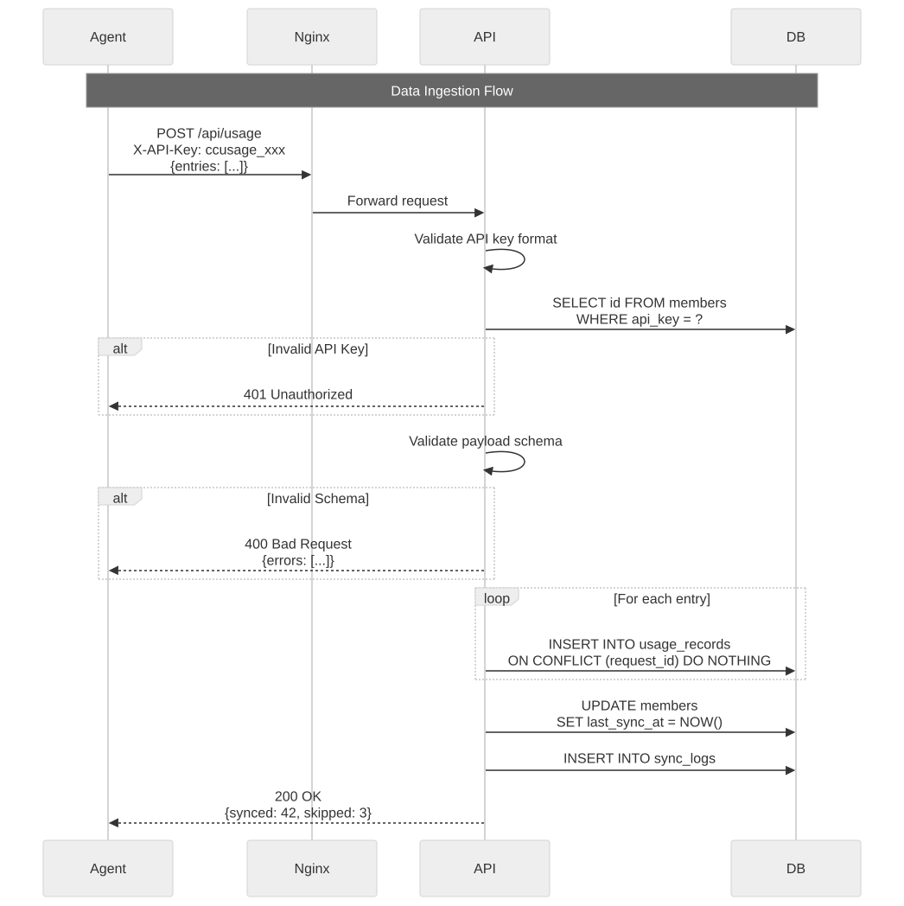

<details>
<summary>View Mermaid Source</summary>

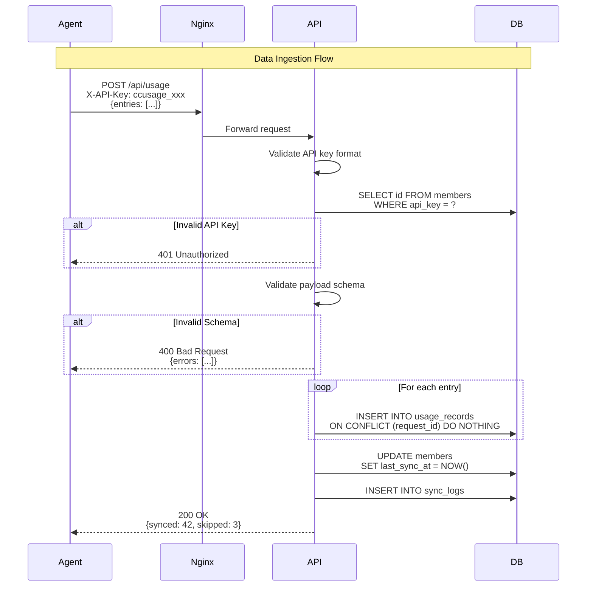
```mermaid
sequenceDiagram
    participant Agent
    participant Nginx
    participant API
    participant DB

    Note over Agent,DB: Data Ingestion Flow

    Agent->>Nginx: POST /api/usage<br/>X-API-Key: ccusage_xxx<br/>{entries: [...]}
    Nginx->>API: Forward request

    API->>API: Validate API key format
    API->>DB: SELECT id FROM members<br/>WHERE api_key = ?

    alt Invalid API Key
        API-->>Agent: 401 Unauthorized
    end

    API->>API: Validate payload schema

    alt Invalid Schema
        API-->>Agent: 400 Bad Request<br/>{errors: [...]}
    end

    loop For each entry
        API->>DB: INSERT INTO usage_records<br/>ON CONFLICT (request_id) DO NOTHING
    end

    API->>DB: UPDATE members<br/>SET last_sync_at = NOW()

    API->>DB: INSERT INTO sync_logs

    API-->>Agent: 200 OK<br/>{synced: 42, skipped: 3}
```

</details>

### 5.3 API Error Responses



<details>
<summary>View Mermaid Source</summary>

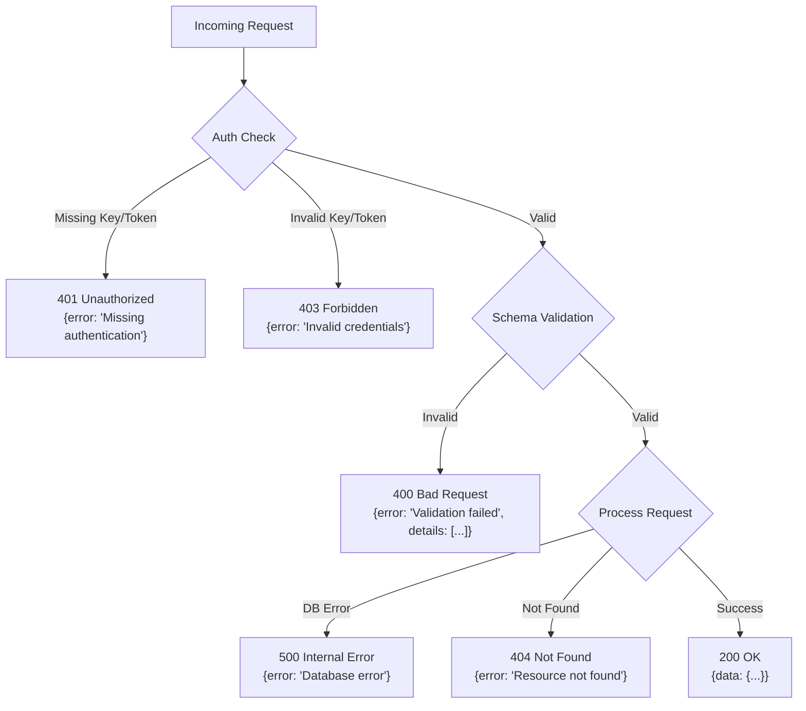
```mermaid
flowchart TD
    REQ[Incoming Request] --> AUTH{Auth Check}

    AUTH -->|Missing Key/Token| E401["401 Unauthorized<br/>{error: 'Missing authentication'}"]
    AUTH -->|Invalid Key/Token| E403["403 Forbidden<br/>{error: 'Invalid credentials'}"]
    AUTH -->|Valid| VALIDATE{Schema Validation}

    VALIDATE -->|Invalid| E400["400 Bad Request<br/>{error: 'Validation failed', details: [...]}"]
    VALIDATE -->|Valid| PROCESS{Process Request}

    PROCESS -->|DB Error| E500["500 Internal Error<br/>{error: 'Database error'}"]
    PROCESS -->|Not Found| E404["404 Not Found<br/>{error: 'Resource not found'}"]
    PROCESS -->|Success| S200["200 OK<br/>{data: {...}}"]
```

</details>

---

## 6. Agent Design

### 6.1 Agent Architecture



<details>
<summary>View Mermaid Source</summary>

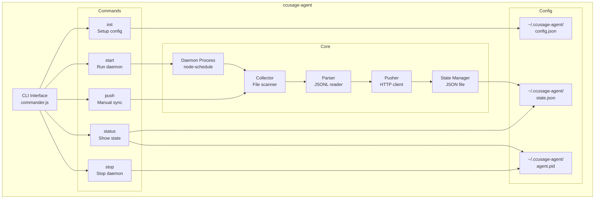
```mermaid
graph TB
    subgraph "ccusage-agent"
        CLI["CLI Interface<br/>commander.js"]

        subgraph "Commands"
            CMD_INIT["init<br/>Setup config"]
            CMD_START["start<br/>Run daemon"]
            CMD_PUSH["push<br/>Manual sync"]
            CMD_STATUS["status<br/>Show state"]
            CMD_STOP["stop<br/>Stop daemon"]
        end

        subgraph "Core"
            DAEMON["Daemon Process<br/>node-schedule"]
            COLLECTOR["Collector<br/>File scanner"]
            PARSER["Parser<br/>JSONL reader"]
            PUSHER["Pusher<br/>HTTP client"]
            STATE["State Manager<br/>JSON file"]
        end

        subgraph "Config"
            CONFIG_FILE["~/.ccusage-agent/<br/>config.json"]
            STATE_FILE["~/.ccusage-agent/<br/>state.json"]
            PID_FILE["~/.ccusage-agent/<br/>agent.pid"]
        end
    end

    CLI --> CMD_INIT & CMD_START & CMD_PUSH & CMD_STATUS & CMD_STOP

    CMD_INIT --> CONFIG_FILE
    CMD_START --> DAEMON
    CMD_PUSH --> COLLECTOR
    CMD_STATUS --> STATE_FILE & PID_FILE
    CMD_STOP --> PID_FILE

    DAEMON --> COLLECTOR
    COLLECTOR --> PARSER
    PARSER --> PUSHER
    PUSHER --> STATE
    STATE --> STATE_FILE
```

</details>

### 6.2 Agent Lifecycle



<details>
<summary>View Mermaid Source</summary>

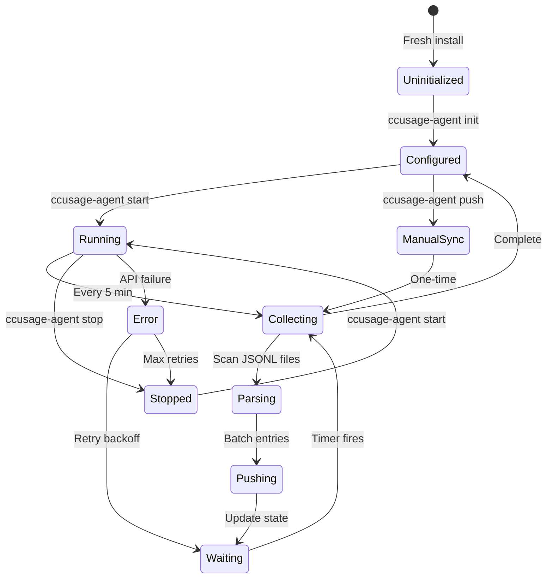
```mermaid
stateDiagram-v2
    [*] --> Uninitialized: Fresh install

    Uninitialized --> Configured: ccusage-agent init

    Configured --> Running: ccusage-agent start
    Configured --> ManualSync: ccusage-agent push

    Running --> Collecting: Every 5 min
    Collecting --> Parsing: Scan JSONL files
    Parsing --> Pushing: Batch entries
    Pushing --> Waiting: Update state
    Waiting --> Collecting: Timer fires

    Running --> Stopped: ccusage-agent stop
    Stopped --> Running: ccusage-agent start

    ManualSync --> Collecting: One-time
    Collecting --> Configured: Complete

    Running --> Error: API failure
    Error --> Waiting: Retry backoff
    Error --> Stopped: Max retries
```

</details>

### 6.3 Collection Algorithm



<details>
<summary>View Mermaid Source</summary>

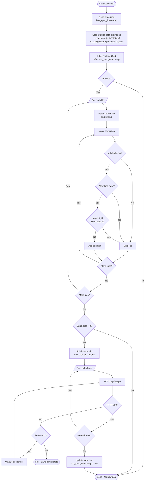
```mermaid
flowchart TD
    START([Start Collection]) --> READ_STATE[Read state.json<br/>last_sync_timestamp]

    READ_STATE --> SCAN[Scan Claude data directories<br/>~/.claude/projects/**/*.jsonl<br/>~/.config/claude/projects/**/*.jsonl]

    SCAN --> FILTER[Filter files modified<br/>after last_sync_timestamp]

    FILTER --> EMPTY{Any files?}
    EMPTY -->|No| DONE([Done - No new data])

    EMPTY -->|Yes| PARSE_LOOP[/For each file/]

    PARSE_LOOP --> READ_FILE[Read JSONL file<br/>line by line]
    READ_FILE --> PARSE_LINE[Parse JSON line]

    PARSE_LINE --> VALID{Valid schema?}
    VALID -->|No| SKIP[Skip line]
    VALID -->|Yes| CHECK_TIME{After last_sync?}

    CHECK_TIME -->|No| SKIP
    CHECK_TIME -->|Yes| DEDUP{request_id<br/>seen before?}

    DEDUP -->|Yes| SKIP
    DEDUP -->|No| ADD[Add to batch]

    SKIP --> NEXT{More lines?}
    ADD --> NEXT

    NEXT -->|Yes| PARSE_LINE
    NEXT -->|No| MORE_FILES{More files?}

    MORE_FILES -->|Yes| PARSE_LOOP
    MORE_FILES -->|No| BATCH_CHECK{Batch size > 0?}

    BATCH_CHECK -->|No| DONE
    BATCH_CHECK -->|Yes| CHUNK[Split into chunks<br/>max 1000 per request]

    CHUNK --> PUSH_LOOP[/For each chunk/]
    PUSH_LOOP --> PUSH[POST /api/usage]

    PUSH --> SUCCESS{HTTP 200?}
    SUCCESS -->|Yes| NEXT_CHUNK{More chunks?}
    SUCCESS -->|No| RETRY{Retries < 3?}

    RETRY -->|Yes| BACKOFF[Wait 2^n seconds]
    BACKOFF --> PUSH
    RETRY -->|No| FAIL([Fail - Save partial state])

    NEXT_CHUNK -->|Yes| PUSH_LOOP
    NEXT_CHUNK -->|No| UPDATE[Update state.json<br/>last_sync_timestamp = now]

    UPDATE --> DONE
```

</details>

---

## 7. Authentication & Authorization

### 7.1 Auth Flow Overview



<details>
<summary>View Mermaid Source</summary>

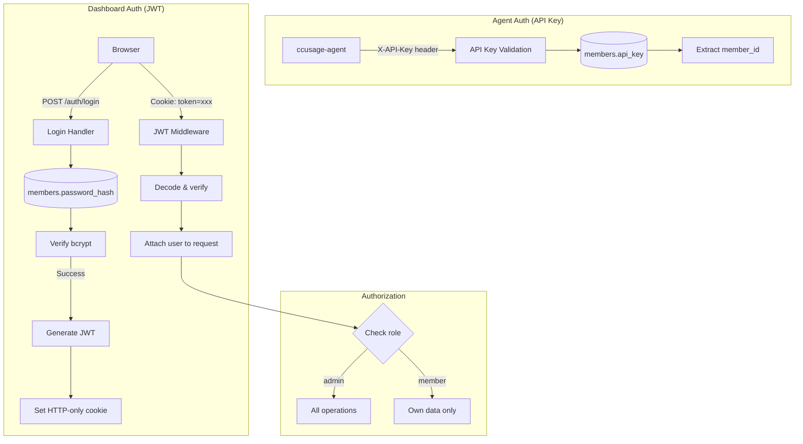
```mermaid
flowchart TB
    subgraph "Agent Auth (API Key)"
        AGENT[ccusage-agent] -->|X-API-Key header| API_AUTH[API Key Validation]
        API_AUTH --> DB_KEY[(members.api_key)]
        DB_KEY --> MEMBER_ID[Extract member_id]
    end

    subgraph "Dashboard Auth (JWT)"
        BROWSER[Browser] -->|POST /auth/login| LOGIN[Login Handler]
        LOGIN --> DB_PASS[(members.password_hash)]
        DB_PASS --> VERIFY[Verify bcrypt]
        VERIFY -->|Success| JWT_GEN[Generate JWT]
        JWT_GEN --> SET_COOKIE[Set HTTP-only cookie]

        BROWSER -->|Cookie: token=xxx| JWT_VERIFY[JWT Middleware]
        JWT_VERIFY --> DECODE[Decode & verify]
        DECODE --> ATTACH[Attach user to request]
    end

    subgraph "Authorization"
        ATTACH --> ROLE{Check role}
        ROLE -->|admin| ADMIN_OPS[All operations]
        ROLE -->|member| MEMBER_OPS[Own data only]
    end
```

</details>

### 7.2 API Key Structure



<details>
<summary>View Mermaid Source</summary>

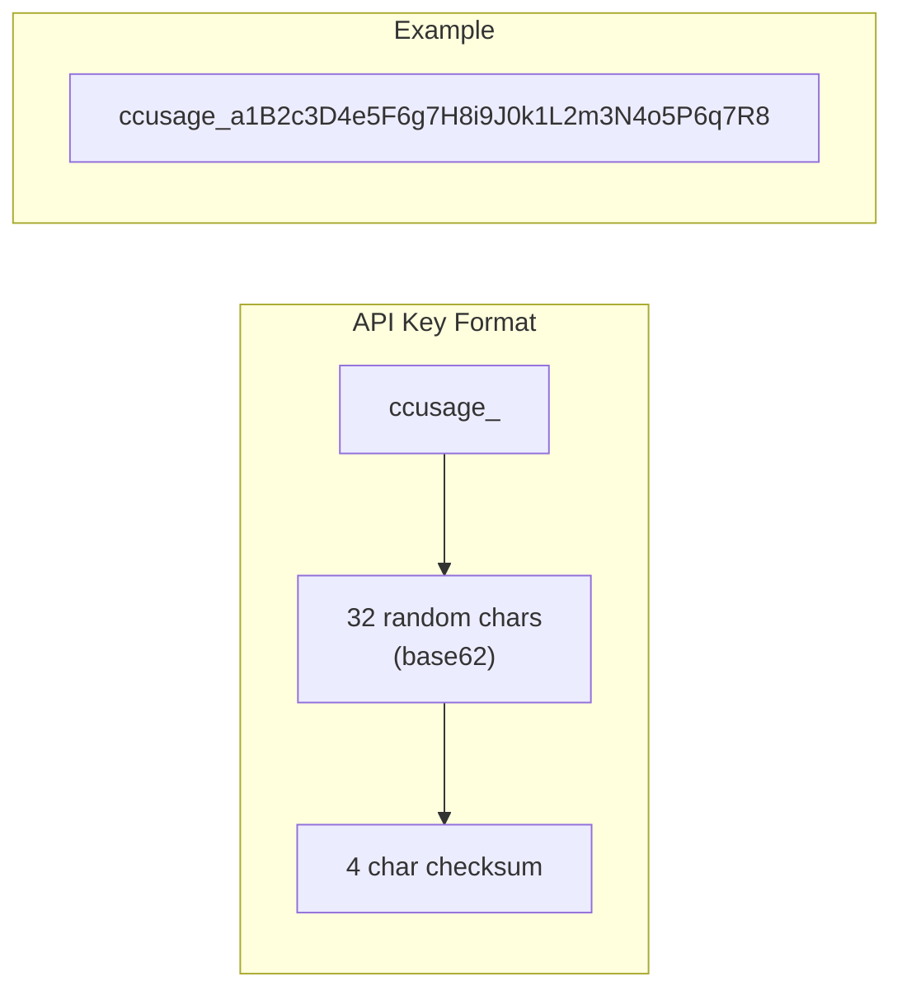
```mermaid
graph LR
    subgraph "API Key Format"
        PREFIX["ccusage_"]
        RANDOM["32 random chars<br/>(base62)"]
        CHECKSUM["4 char checksum"]
    end

    PREFIX --> RANDOM --> CHECKSUM

    subgraph "Example"
        EXAMPLE["ccusage_a1B2c3D4e5F6g7H8i9J0k1L2m3N4o5P6q7R8"]
    end
```

</details>

### 7.3 JWT Token Structure



<details>
<summary>View Mermaid Source</summary>

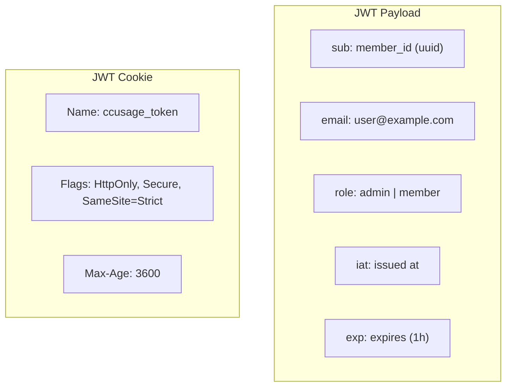
```mermaid
graph TB
    subgraph "JWT Payload"
        SUB["sub: member_id (uuid)"]
        EMAIL["email: user@example.com"]
        ROLE["role: admin | member"]
        IAT["iat: issued at"]
        EXP["exp: expires (1h)"]
    end

    subgraph "JWT Cookie"
        NAME["Name: ccusage_token"]
        FLAGS["Flags: HttpOnly, Secure, SameSite=Strict"]
        MAX_AGE["Max-Age: 3600"]
    end
```

</details>

---

## 8. Data Synchronization

### 8.1 Sync State Machine



<details>
<summary>View Mermaid Source</summary>

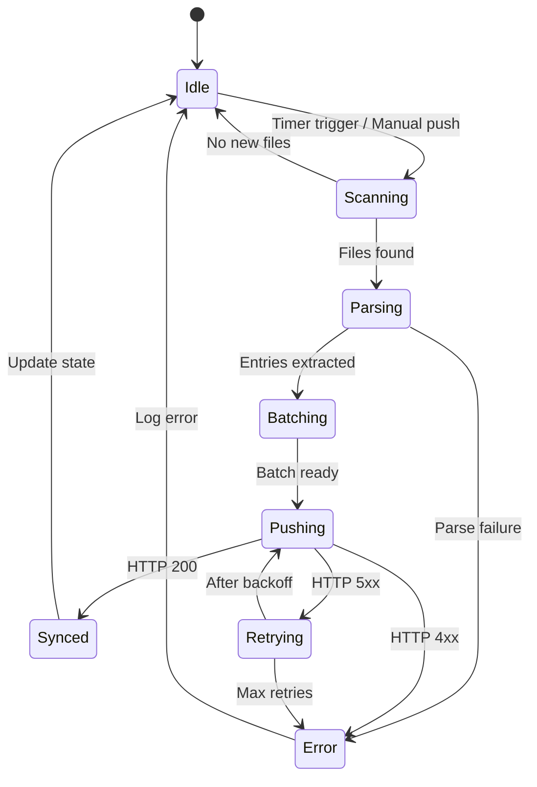
```mermaid
stateDiagram-v2
    [*] --> Idle

    Idle --> Scanning: Timer trigger / Manual push

    Scanning --> Parsing: Files found
    Scanning --> Idle: No new files

    Parsing --> Batching: Entries extracted
    Parsing --> Error: Parse failure

    Batching --> Pushing: Batch ready

    Pushing --> Synced: HTTP 200
    Pushing --> Retrying: HTTP 5xx
    Pushing --> Error: HTTP 4xx

    Retrying --> Pushing: After backoff
    Retrying --> Error: Max retries

    Synced --> Idle: Update state

    Error --> Idle: Log error
```

</details>

### 8.2 Conflict Resolution



<details>
<summary>View Mermaid Source</summary>

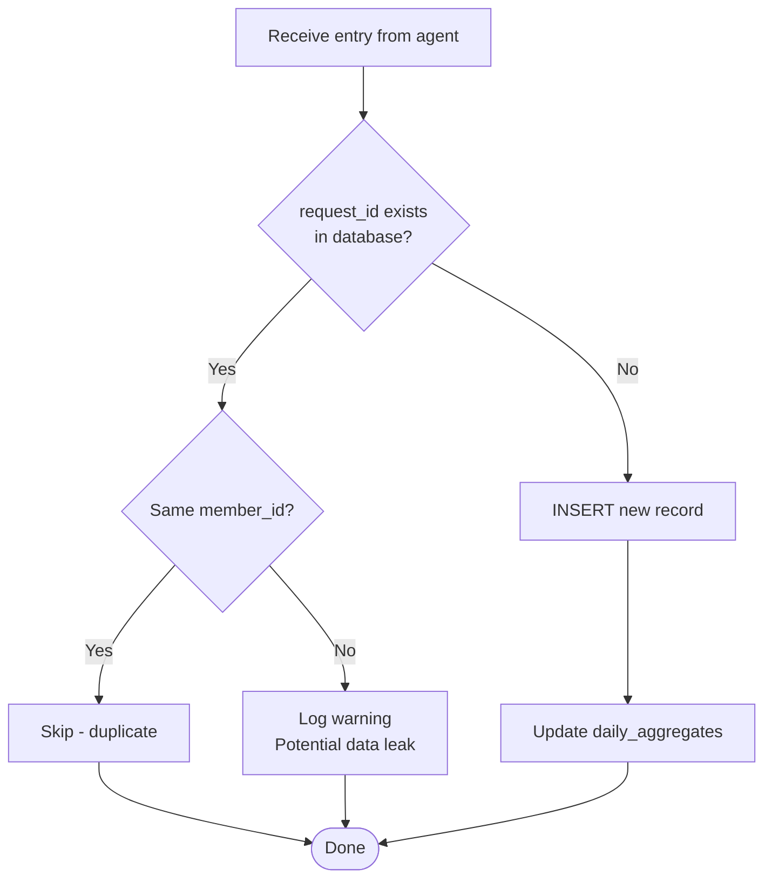
```mermaid
flowchart TD
    RECEIVE[Receive entry from agent] --> CHECK{request_id exists<br/>in database?}

    CHECK -->|No| INSERT[INSERT new record]
    CHECK -->|Yes| COMPARE{Same member_id?}

    COMPARE -->|Yes| SKIP[Skip - duplicate]
    COMPARE -->|No| LOG[Log warning<br/>Potential data leak]

    INSERT --> UPDATE_AGG[Update daily_aggregates]
    SKIP --> DONE([Done])
    LOG --> DONE
    UPDATE_AGG --> DONE
```

</details>

### 8.3 Backfill Strategy

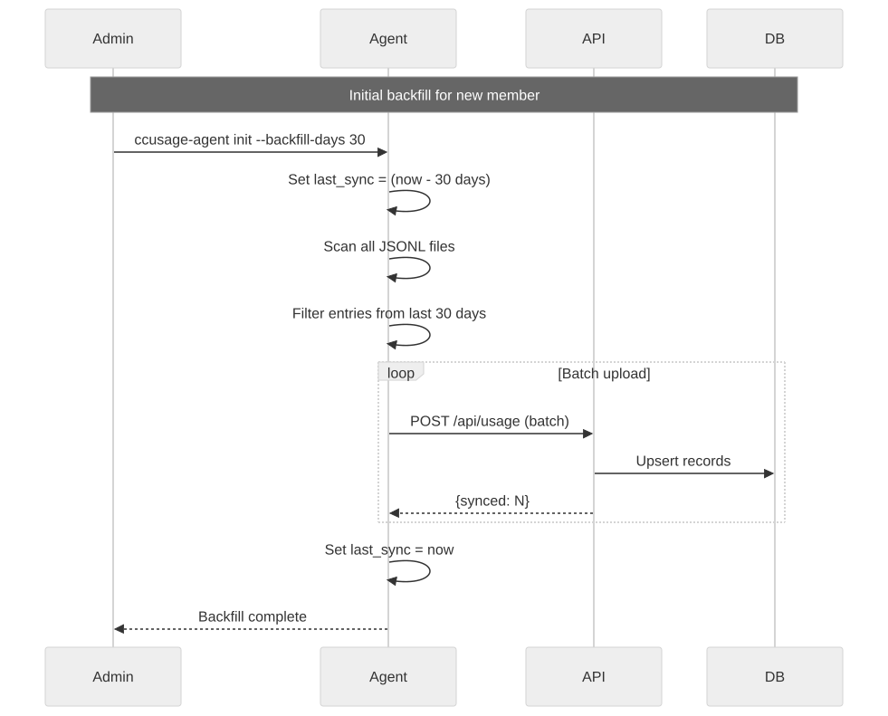

<details>
<summary>View Mermaid Source</summary>

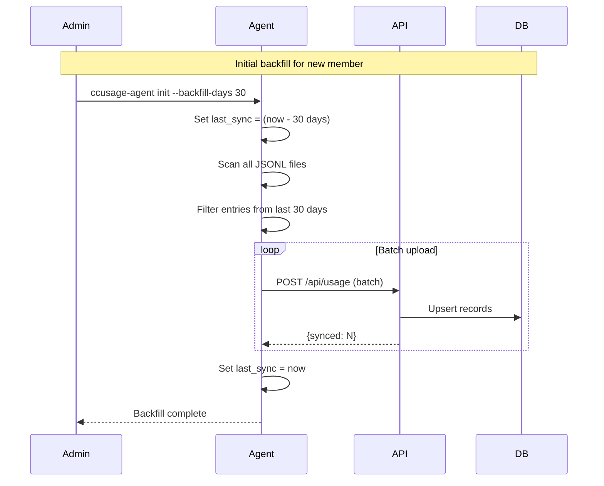
```mermaid
sequenceDiagram
    participant Admin
    participant Agent
    participant API
    participant DB

    Note over Admin,DB: Initial backfill for new member

    Admin->>Agent: ccusage-agent init --backfill-days 30
    Agent->>Agent: Set last_sync = (now - 30 days)

    Agent->>Agent: Scan all JSONL files
    Agent->>Agent: Filter entries from last 30 days

    loop Batch upload
        Agent->>API: POST /api/usage (batch)
        API->>DB: Upsert records
        API-->>Agent: {synced: N}
    end

    Agent->>Agent: Set last_sync = now
    Agent-->>Admin: Backfill complete
```

</details>

---

## 9. Web Dashboard

### 9.1 Page Structure



<details>
<summary>View Mermaid Source</summary>

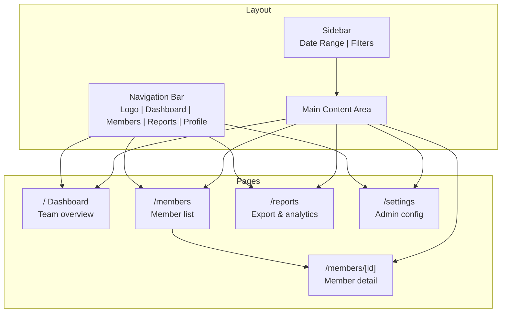
```mermaid
graph TB
    subgraph "Layout"
        NAV["Navigation Bar<br/>Logo | Dashboard | Members | Reports | Profile"]
        SIDEBAR["Sidebar<br/>Date Range | Filters"]
        MAIN["Main Content Area"]
    end

    subgraph "Pages"
        DASH["/ Dashboard<br/>Team overview"]
        MEMBERS["/members<br/>Member list"]
        MEMBER["/members/[id]<br/>Member detail"]
        REPORTS["/reports<br/>Export & analytics"]
        SETTINGS["/settings<br/>Admin config"]
    end

    NAV --> DASH
    NAV --> MEMBERS
    NAV --> REPORTS
    NAV --> SETTINGS

    MEMBERS --> MEMBER

    SIDEBAR --> MAIN
    MAIN --> DASH & MEMBERS & MEMBER & REPORTS & SETTINGS
```

</details>

### 9.2 Dashboard Components



<details>
<summary>View Mermaid Source</summary>

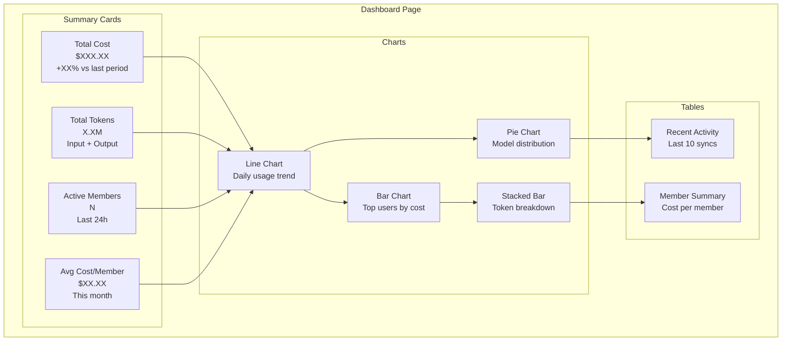
```mermaid
graph TB
    subgraph "Dashboard Page"
        subgraph "Summary Cards"
            CARD1["Total Cost<br/>$XXX.XX<br/>+XX% vs last period"]
            CARD2["Total Tokens<br/>X.XM<br/>Input + Output"]
            CARD3["Active Members<br/>N<br/>Last 24h"]
            CARD4["Avg Cost/Member<br/>$XX.XX<br/>This month"]
        end

        subgraph "Charts"
            CHART1["Line Chart<br/>Daily usage trend"]
            CHART2["Bar Chart<br/>Top users by cost"]
            CHART3["Pie Chart<br/>Model distribution"]
            CHART4["Stacked Bar<br/>Token breakdown"]
        end

        subgraph "Tables"
            TABLE1["Recent Activity<br/>Last 10 syncs"]
            TABLE2["Member Summary<br/>Cost per member"]
        end
    end

    CARD1 & CARD2 & CARD3 & CARD4 --> CHART1
    CHART1 --> CHART2 & CHART3
    CHART2 --> CHART4
    CHART3 --> TABLE1
    CHART4 --> TABLE2
```

</details>

### 9.3 Member Detail View



<details>
<summary>View Mermaid Source</summary>

```mermaid
graph TB
    subgraph "Member Detail Page"
        HEADER["Member Header<br/>Name | Email | Last Sync | Status"]

        subgraph "Stats"
            STAT1["This Month<br/>$XX.XX"]
            STAT2["Today<br/>$X.XX"]
            STAT3["Total Tokens<br/>X.XM"]
        end

        subgraph "Charts"
            TIMELINE["Daily Usage Timeline"]
            MODEL_PIE["Model Usage Pie"]
            PROJECT_BAR["Usage by Project"]
        end

        subgraph "Activity"
            SESSION_LIST["Recent Sessions<br/>With token counts"]
        end
    end

    HEADER --> STAT1 & STAT2 & STAT3
    STAT1 & STAT2 & STAT3 --> TIMELINE
    TIMELINE --> MODEL_PIE & PROJECT_BAR
    MODEL_PIE --> SESSION_LIST
    PROJECT_BAR --> SESSION_LIST
```

</details>

---

## 10. Deployment Architecture

### 10.1 Docker Compose Stack



<details>
<summary>View Mermaid Source</summary>

```mermaid
graph TB
    subgraph "Host Machine"
        subgraph "Docker Network: ccusage-net"
            NGINX["nginx:alpine<br/>:80, :443"]
            API["node:20-alpine<br/>apps/api<br/>:3000"]
            WEB["node:20-alpine<br/>apps/web<br/>:3001"]
            DB["postgres:16-alpine<br/>:5432"]
        end

        subgraph "Volumes"
            VOL_DB["pgdata<br/>/var/lib/postgresql/data"]
            VOL_CERTS["certs<br/>/etc/nginx/certs"]
            VOL_LOGS["logs<br/>/var/log/ccusage"]
        end
    end

    NGINX -->|proxy_pass| API
    NGINX -->|proxy_pass| WEB
    API --> DB

    DB --> VOL_DB
    NGINX --> VOL_CERTS
    API & WEB --> VOL_LOGS
```

</details>

### 10.2 Network Flow



<details>
<summary>View Mermaid Source</summary>

```mermaid
flowchart LR
    subgraph "Internet"
        AGENT["Agent<br/>Developer machine"]
        BROWSER["Browser<br/>Dashboard user"]
    end

    subgraph "Docker Host"
        NGINX["Nginx<br/>:443"]

        subgraph "Internal Network"
            API["API :3000"]
            WEB["Web :3001"]
            DB["PostgreSQL :5432"]
        end
    end

    AGENT -->|"HTTPS<br/>/api/*"| NGINX
    BROWSER -->|"HTTPS<br/>/*"| NGINX

    NGINX -->|"/api/*"| API
    NGINX -->|"/*"| WEB

    API --> DB
    WEB -->|"Server-side fetch"| API
```

</details>

### 10.3 Deployment Process



<details>
<summary>View Mermaid Source</summary>

```mermaid
flowchart TD
    START([Start Deployment]) --> PREP[Prepare environment<br/>.env file]

    PREP --> BUILD[Build Docker images<br/>docker compose build]

    BUILD --> MIGRATE[Run DB migrations<br/>docker compose run api migrate]

    MIGRATE --> UP[Start services<br/>docker compose up -d]

    UP --> HEALTH{Health check}

    HEALTH -->|Fail| LOGS[Check logs<br/>docker compose logs]
    LOGS --> FIX[Fix issues]
    FIX --> UP

    HEALTH -->|Pass| SSL[Setup SSL<br/>certbot]

    SSL --> NGINX_RELOAD[Reload Nginx]

    NGINX_RELOAD --> VERIFY[Verify endpoints<br/>curl https://...]

    VERIFY --> DONE([Deployment Complete])
```

</details>

---

## 11. Security Considerations

### 11.1 Security Architecture



<details>
<summary>View Mermaid Source</summary>

```mermaid
graph TB
    subgraph "Transport Security"
        TLS["TLS 1.3<br/>All external traffic"]
        CERT["Let's Encrypt<br/>Auto-renewal"]
    end

    subgraph "Authentication"
        API_KEY["API Keys<br/>Agent auth"]
        JWT["JWT Tokens<br/>Dashboard auth"]
        BCRYPT["bcrypt<br/>Password hashing"]
    end

    subgraph "Authorization"
        RBAC["Role-Based Access<br/>admin | member"]
        OWN_DATA["Data Isolation<br/>Members see own data only"]
    end

    subgraph "Data Protection"
        ENCRYPT["Encryption at rest<br/>PostgreSQL"]
        SANITIZE["Input sanitization<br/>SQL injection prevention"]
        RATE["Rate limiting<br/>API abuse prevention"]
    end

    subgraph "Infrastructure"
        FIREWALL["Firewall<br/>Only :443 exposed"]
        DOCKER["Container isolation<br/>Non-root users"]
        SECRETS["Secrets management<br/>.env not in git"]
    end

    TLS --> CERT
    API_KEY & JWT --> RBAC
    RBAC --> OWN_DATA
    ENCRYPT & SANITIZE & RATE --> FIREWALL
    FIREWALL --> DOCKER --> SECRETS
```

</details>

### 11.2 Threat Model



<details>
<summary>View Mermaid Source</summary>

```mermaid
flowchart TB
    subgraph "Threats"
        T1["API Key Leak"]
        T2["JWT Token Theft"]
        T3["SQL Injection"]
        T4["Data Exfiltration"]
        T5["Brute Force Login"]
    end

    subgraph "Mitigations"
        M1["Key rotation<br/>Revocation API"]
        M2["Short expiry<br/>HttpOnly cookies"]
        M3["Parameterized queries<br/>Drizzle ORM"]
        M4["Role-based access<br/>Audit logging"]
        M5["Rate limiting<br/>Account lockout"]
    end

    T1 --> M1
    T2 --> M2
    T3 --> M3
    T4 --> M4
    T5 --> M5
```

</details>

---

## 12. Technology Stack

### 12.1 Stack Overview



<details>
<summary>View Mermaid Source</summary>

```mermaid
graph TB
    subgraph "Frontend"
        NEXT["Next.js 15"]
        REACT["React 19"]
        TAILWIND["Tailwind CSS"]
        RECHARTS["Recharts"]
        TANSTACK["TanStack Query"]
    end

    subgraph "Backend"
        HONO["Hono"]
        NODE["Node.js 20"]
        DRIZZLE["Drizzle ORM"]
        ZOD["Zod"]
    end

    subgraph "Database"
        POSTGRES["PostgreSQL 16"]
    end

    subgraph "Infrastructure"
        DOCKER["Docker"]
        NGINX["Nginx"]
        CERTBOT["Certbot"]
    end

    subgraph "Agent"
        COMMANDER["Commander.js"]
        UNDICI["undici"]
        CHOKIDAR["chokidar"]
    end

    subgraph "Shared"
        CCUSAGE_INTERNAL["@ccusage/internal"]
        TYPESCRIPT["TypeScript 5.x"]
        PNPM["pnpm workspaces"]
    end

    NEXT --> REACT --> TAILWIND
    REACT --> RECHARTS & TANSTACK

    HONO --> NODE --> DRIZZLE --> ZOD
    DRIZZLE --> POSTGRES

    DOCKER --> NGINX --> CERTBOT

    COMMANDER --> UNDICI --> CHOKIDAR

    CCUSAGE_INTERNAL --> TYPESCRIPT --> PNPM
```

</details>

### 12.2 Dependency Matrix

| Component | Core Dependencies | Dev Dependencies |
|-----------|------------------|------------------|
| **agent** | commander, undici, chokidar, @ccusage/internal | typescript, tsup |
| **api** | hono, drizzle-orm, pg, zod, jose | typescript, vitest |
| **web** | next, react, recharts, @tanstack/react-query | typescript, tailwindcss |
| **shared** | zod | typescript |

---

## Appendix A: Configuration Files

### A.1 Agent Config (~/.ccusage-agent/config.json)

```json
{
  "server_url": "https://ccusage.example.com",
  "api_key": "ccusage_xxxxxxxxxxxxxxxxxxxx",
  "sync_interval_minutes": 5,
  "claude_paths": [
    "~/.claude/projects",
    "~/.config/claude/projects"
  ],
  "max_batch_size": 1000,
  "retry_attempts": 3
}
```

### A.2 Agent State (~/.ccusage-agent/state.json)

```json
{
  "last_sync_timestamp": "2026-01-26T10:30:00.000Z",
  "last_sync_records": 42,
  "total_synced_records": 1250,
  "seen_request_ids": ["req_xxx", "req_yyy"]
}
```

---

## Appendix B: API Request/Response Examples

### B.1 POST /api/usage

**Request:**
```json
{
  "entries": [
    {
      "request_id": "req_abc123",
      "timestamp": "2026-01-26T10:30:00.000Z",
      "model": "claude-sonnet-4-20250514",
      "project_path": "/Users/dev/myproject",
      "session_id": "sess_xyz",
      "usage": {
        "input_tokens": 1500,
        "output_tokens": 800,
        "cache_creation_input_tokens": 500,
        "cache_read_input_tokens": 200
      },
      "cost_usd": 0.0123,
      "version": "1.0.88"
    }
  ],
  "agent_version": "1.0.0",
  "hostname": "dev-macbook"
}
```

**Response:**
```json
{
  "success": true,
  "data": {
    "synced": 1,
    "skipped": 0,
    "sync_id": "sync_abc123"
  }
}
```

---

*End of Technical Design Document*
